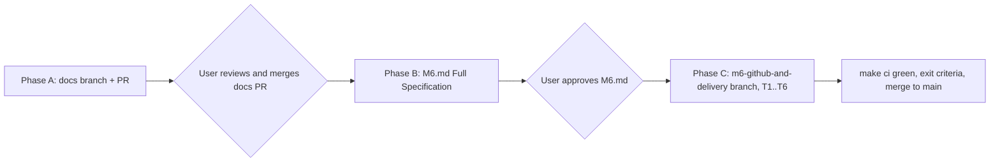
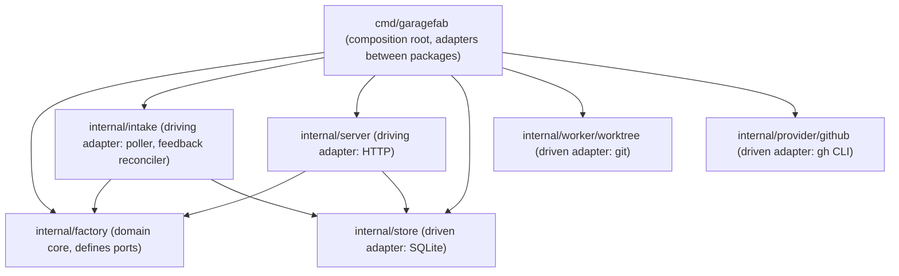
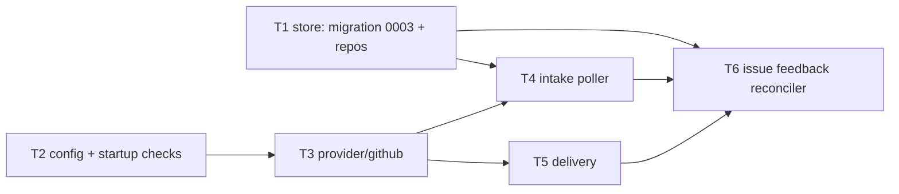

# Change Plan (Reviewed): Drop GitHub Projects v2, Use `gh` CLI, Re-scope M6

> **Document ID:** `PROJECT_DOCS/05_reviewd-change-plan-github-projects.md`
> **Status:** Approved by the user (2026-10-04), including decisions U1–U5 and P1–P5. The phase gates in §3 still apply: the docs PR must be merged and `M6.md` must be approved before coding.
> **Supersedes:** `PROJECT_DOCS/05_change-plan-github-projects.md`. Delete that file once this plan is accepted.
> **Audience:** AI coding agents and engineers who update the project documents and implement Milestone M6.
> **Date:** 2026-10-04

---

## 1. Mission Brief

Read this whole document before you touch any file. It tells you **what** changes, **in what order**, and **where you must stop and wait for the user**.

### 1.1 User decisions (binding)

| # | Decision | Consequence |
|---|----------|-------------|
| U1 | GitHub Projects v2 is removed completely | No GraphQL, no board mirror, no `project_number`, no `Status=01_Intent` trigger |
| U2 | Spike B (SB) is cancelled | No replacement spike. `gh` behavior is checked inside M6 with offline tests and one manual run |
| U3 | All GitHub operations use the GitHub CLI (`gh`) only | No PAT handling, no `net/http` GitHub client, no token config |
| U4 | M6 is re-scoped to GitHub Issues intake + PR delivery (plus intent-file intake, which was already in M6) | Smaller, clearer milestone |
| U5 | An issue without a valid `type:<work_type>` label creates **no job** and shows an intake error | Same behavior as today's `OQ-1` and `INT-2`. **There is no default work type** |

### 1.2 Can everything be done with `gh`? Yes.

| Need | `gh` command |
|------|--------------|
| List trigger issues | `gh issue list --repo R --label L --state open --limit 100 --json number,title,body,labels,url` |
| Comment on an issue | `gh issue comment N --repo R --body-file -` |
| Add or remove labels | `gh issue edit N --repo R --add-label A --remove-label B` |
| Make sure a label exists | `gh label create NAME --repo R --color C --description D --force` (idempotent) |
| Find an existing PR | `gh pr list --repo R --head BRANCH --state all --json number,url,state` |
| Create a PR | `gh pr create --repo R --base B --head BRANCH --title T --body-file -` |
| Check installation and auth | `gh --version`, `gh auth status --hostname github.com` |
| Anything else | `gh api ...` (escape hatch; avoid it unless a subcommand is missing) |

**The only exception is `git push`.** Pushing is a git operation, not a GitHub API call. It stays on system `git` with the user's own git credentials, exactly as `architecture.md` §12.2 already says. The docs should tell users they can run `gh auth setup-git` so that `git push` reuses their `gh` login.

---

## 2. Rationale

### 2.1 Why drop Projects v2
- **Duplicate board.** The embedded dashboard (M4) already shows stages, live logs, and gates.
- **Fragile API.** Projects v2 is GraphQL-only and needs project, field, and option node IDs. If someone renames a column or field, sync breaks.
- **Token problem.** Fine-grained PATs cannot access user-owned Projects. Solo developers would need a broad classic `repo` + `project` token.
- **Setup friction.** Before first use, the user would have to create a board, a `Type` field, and 7 status options.

### 2.2 Why `gh` only
- **No token configuration.** `gh auth login` (keyring) or `GH_TOKEN` / `GITHUB_TOKEN` in the environment is enough. Garagefab stores no token, so there is no `0600` check and no masking config.
- **Structured output.** `--json` gives stable JSON on stdout.
- **Same execution model as `git`.** `gh` runs through `os/exec` with a timeout and context cancellation, like `internal/worker/worktree` does for `git`.
- **Trade-off (accepted).** `gh` becomes a runtime dependency **only for projects that set `github.repo`**. Intent files and dashboard jobs still work without `gh`.

---

## 3. Mandatory Workflow (three phases, two user gates)

These phases follow `AGENTS.md` (Change control, Milestone branching discipline) and the Planning Gate in `milestones/M6.md`. **Do not merge or skip phases.**



### Phase A: Document change (own branch, own PR)
- Branch: `docs-gh-cli-drop-projects` (from `main`).
- Apply **every** edit in §5 of this plan. Commit this plan file and delete `05_change-plan-github-projects.md` in the same branch.
- Commit message example: `docs: drop GitHub Projects v2, use gh CLI, cancel SB, re-scope M6 (INT-3, GHB-1..5, DLV-1..6)`.
- **STOP.** Tell the user the PR is ready. Do not continue until the user merges it.

### Phase B: Detail M6 (planning gate)
- Rewrite `milestones/M6.md` to **Full Specification** level, using `milestones/M2.md` as the format standard and §6 of this plan as the content. Remove the "Planning Gate" warning only when this is done.
- This can be committed on a short docs branch, or as the first commit of the milestone branch, **but only after the user approves the content**.
- **STOP.** Present M6.md to the user and wait for explicit approval.

### Phase C: Implement M6
- Branch: `m6-github-and-delivery` (from `main`, after Phase A is merged).
- Implement T1..T6 in order (§6). Use one or more atomic commits per task, and reference requirement IDs in each commit message.
- Finish with `make ci` and the exit criteria (§6.8).

---

## 4. Target Architecture

### 4.1 Package roles and dependency direction



Arrows mean "imports". `factory` imports none of the other packages. It only declares interfaces, and `cmd/garagefab` passes in the concrete implementations.

### 4.2 Rules (existing rules plus one new rule)
1. `factory` never imports `store`, `worker`, `provider`, `server`, or `intake`. It never runs a binary and never contains SQL. **This means delivery orchestration lives in `factory`, but `git push` and `gh pr create` run behind ports.**
2. `store` owns all SQL. A new migration `0003_*.sql` is required (§6.1).
3. `worker` owns git. It gains `Push` (§6.5).
4. `intake` is an adapter. It reads and writes through `store` (the same way `server.handleCreateJob` creates jobs today, via `store.Jobs().CreateJob`) and calls a narrow interface for GitHub. It contains no pipeline logic.
5. **New rule 6:** `provider/github` imports none of `factory`, `store`, `server`, `worker`, or `intake`. It returns its own DTOs. `cmd/garagefab` contains small adapter types that map those DTOs to factory/intake port types. Enforce this rule in `internal/boundaries_test.go`, and add it to `AGENTS.md` and `architecture.md` §6 in Phase A.

### 4.3 Ports and interfaces

**`factory` (new or changed, in `internal/factory/types.go`):**

```go
// PullRequest is the factory's view of a pull request (DLV-1, DLV-2).
type PullRequest struct {
    Number int
    URL    string
    State  string // OPEN | CLOSED | MERGED
}

// PullRequestRequest carries everything needed to open a PR (DLV-1).
type PullRequestRequest struct {
    Repo, Base, Head, Title, Body string
}

// PullRequestProvider is the outbound port for PR creation (DLV-1, DLV-2, DLV-5: no merge method exists).
type PullRequestProvider interface {
    FindPullRequest(ctx context.Context, repo, head string) (*PullRequest, error) // nil, nil when none
    CreatePullRequest(ctx context.Context, req PullRequestRequest) (*PullRequest, error)
}

// WorktreeManager gains Push (DLV-1). git runs only in worker/worktree.
//   Push(ctx context.Context, worktreePath, remote, branch string) error

// ProjectConfig gains GitHub settings.
//   GitHub ProjectGitHub `yaml:"github"`  // Repo, PRIssueKeyword

// StoreTx gains:
//   UpdateJobPR(ctx context.Context, jobID int64, prURL string) error
```

**`intake` (declared inside `internal/intake`, consumer-side interface):**

```go
type IssueSource interface {
    ListTriggerIssues(ctx context.Context, repo, label string) ([]Issue, error)
}
type IssueFeedback interface {
    EnsureLabels(ctx context.Context, repo string, labels []LabelSpec) error
    SetLabels(ctx context.Context, repo string, number int, add, remove []string) error
    Comment(ctx context.Context, repo string, number int, body string) error
}
```

**`provider/github`:** `GHRunner` + `Client` (§6.3). `cmd/garagefab` adapts `Client` to `factory.PullRequestProvider`, `intake.IssueSource`, and `intake.IssueFeedback`.

---

## 5. Phase A: Exact Document Updates

Change **all** of the following. When a requirement ID is reworded, keep the same ID.

### 5.1 `AGENTS.md`
- Package Layout: `provider/github/  issues, Projects v2 mirror, PR creation` → `provider/github/  gh CLI adapter: issues, labels, comments, PR creation`.
- Import rules: add rule 6 (§4.2).
- Prerequisites: add "`gh` 2.x (only needed for projects that use GitHub)". Phase C pins the exact minimum version.

### 5.2 `PROJECT_DOCS/01_intent.md`
- Line ~62: "mirrored to GitHub Projects" → "mirrored to the GitHub issue as labels and comments".
- Line ~161: "Creating a GitHub Issue with `Status=01_Intent` in the linked GitHub Project" → "Opening a GitHub issue with the `garagefab` label and a `type:<work_type>` label".
- Lines ~265–266 (GitHub Integration): replace the Issues/Projects bullets with: issues as entry point (label trigger), issue feedback via labels and comments, PRs as output, all through the `gh` CLI.
- Lines ~277, ~289 (MVP scenarios): replace "`Status=01_Intent` (type: feature)" with "labels `garagefab` and `type:feature`".
- Line ~295: "except GitHub for issues/PRs/projects" → "except GitHub for issues and PRs".

### 5.3 `PROJECT_DOCS/02_architecture.md`
| Section | Change |
|---------|--------|
| §3 Decision Log | Add **D22**: *All GitHub operations use the `gh` CLI through `os/exec`, behind a `GHRunner` interface. Auth comes from `gh auth` or `GH_TOKEN`/`GITHUB_TOKEN`. Garagefab stores no GitHub token. `git push` stays on system git.* Add **D23**: *GitHub Projects v2 is removed. Intake uses an issue label trigger plus a `type:` label. Stage feedback uses mutually exclusive `garagefab:*` state labels and comments.* Mark **D9** and **D18** as "Superseded by D22/D23" (keep the rows). |
| §4 System overview diagram | Remove Project/GraphQL wording if present |
| §5 Technology Stack | GitHub row: `PAT + net/http` / `REST + GraphQL` → `gh CLI via os/exec` / `issues, labels, comments, PRs` |
| §6 Package layout | `provider/github/  issues, Projects v2 mirror, PR creation` → `gh CLI adapter`. Add rule 6 |
| §7 Source of truth | Remove "GitHub token reference" from the global config row |
| §8.1 IntakeSeen | "source, external id or file path, content hash" → "source, external ref (`owner/repo#n` or file path), content hash (informational only; uniqueness is per ref, INT-4)" |
| §8.3 Transitions | Keep `06 approves → 07/running (push + PR)` and `07/running → 07/done`. Add `07/running → 07/failed (Blocked)` |
| §12.1 Poller | (1) GitHub issues: only for projects with `github.repo`. Call `gh issue list` with `github.intake_label` (default `garagefab`). Read the work type from exactly one `type:<work_type>` label. **Missing, unknown, or multiple type labels → no job and an intake error.** (2) Intent files: unchanged. (3) **Issue feedback reconcile** (replaces "Status mirror"): for issue-sourced jobs whose (stage, status) changed since the last applied feedback, set state labels and post a comment. Failures never change job state |
| §12.2 Publishing | Push uses system `git` and the user's git credentials (recommend `gh auth setup-git`). PR creation uses `gh pr create`. Both happen only after Final Approval |
| §12.3 Tokens | Replace the whole section with **§12.3 Authentication**: Garagefab never reads, stores, or logs a GitHub token. `gh` uses its own login or `GH_TOKEN`/`GITHUB_TOKEN`. Agents get an allow-listed environment that does not include `GH_TOKEN`/`GITHUB_TOKEN`, and those names cannot be added through `env_passthrough`. Note: agents run on the same machine and could call `gh` themselves. This is covered by the existing "no agent sandboxing" scope limit |
| §14 Configuration | Global: remove `github.token_env`. Project `github:` block → `repo`, `intake_label` (default `garagefab`), `pr_issue_keyword` (`closes`\|`refs`). Remove `project_number` |
| §18 Security | "the GitHub token and API token are not included" → "`GH_TOKEN`, `GITHUB_TOKEN`, and the API token are not included" |
| §20 Testing | "fake GitHub server" → "`FakeGHRunner` (no network in `go test`)" |
| §22 Extension points | Keep "`IssueProvider` beside `provider/github`" |
| §23 Open questions | Close any Projects-related items |

### 5.4 `PROJECT_DOCS/03_spec.md`
| ID / Section | New text (summary) |
|---|---|
| `INT-3` | Each poll lists open issues with `github.intake_label` via `gh issue list`. An issue with exactly one valid `type:<bug_fix\|feature\|refactor\|docs>` label creates a job from its title and body; `source=github_issue`, `source_ref=owner/repo#n`. **Missing, unknown, or multiple `type:` labels → no job, and an intake error naming the issue is shown. The issue is not marked seen, so fixing the labels creates the job on a later cycle.** |
| `INT-4` | Unchanged meaning. Uniqueness is per intent file path and per `owner/repo#n` |
| `INT-5` | "GitHub returns 401, rate-limit, or network errors" → "`gh` is missing, not authenticated, rate-limited, or fails" |
| `GHB-1` | GitHub access uses the `gh` CLI and its own authentication (`gh auth login`, `GH_TOKEN`, or `GITHUB_TOKEN`). Garagefab stores no GitHub token |
| `GHB-2` | For issue-sourced jobs, within one poll cycle of a (stage, status) change, the issue carries exactly one `garagefab:*` state label for that state (§6.6 table), and a comment is posted for states that need human attention or are terminal |
| `GHB-3` | Without `github.repo`, GitHub intake and feedback are skipped for that project without an error. Intent files and dashboard jobs still work |
| `GHB-4` | `GH_TOKEN`/`GITHUB_TOKEN` are never logged, never passed to agent or command subprocesses, and are refused in `env_passthrough` |
| `GHB-5` | A feedback (label/comment) failure never changes job state. It appears as a provider error on the Overview and is retried next cycle |
| `DLV-1` | Keep it. Add: "PR is created with `gh pr create`; push uses system `git`" |
| `DLV-2` | Keep it. Detection uses `gh pr list --head <branch> --state all`. An existing **open** PR is reused. A merged or closed PR → `failed` (Blocked) with a clear message (never open a duplicate) |
| `DLV-3` | "invalid token" → "`gh` missing, not authenticated, or rejected; push rejected; network error" |
| `DLV-4` | Remove "and the project board mirror is updated". Replace with "and the issue (if any) gets `garagefab:delivered` plus a PR link comment (best effort, GHB-5)" |
| `DLV-6` | "without `github.repo` or a token" → "without `github.repo`, or when `gh` is not available/authenticated" |
| `LOG-6` | If `GH_TOKEN` or `GITHUB_TOKEN` is set in Garagefab's environment, its value is masked in captured output |
| `SEC-6` | Acceptance example: `GARAGEFAB_GITHUB_TOKEN` → `GH_TOKEN`, `GITHUB_TOKEN` |
| `CLI-7` | Add: if any registered project sets `github.repo`, startup checks `gh --version` (minimum version) and `gh auth status`. Failure is a **startup warning plus an Overview provider error, not a fatal exit**, so that one project's GitHub setup cannot stop local-only work (see §8, decision P1) |
| `PRJ-4` | Add: `github.repo` must match `owner/name`; `pr_issue_keyword` must be `closes` or `refs`; a missing `gh` is a warning, not a rejection |
| §6.5 Config reference | Remove `github.project_number`, `github.status_field`, `github.type_field`, `github.token_env`, `github.token`. Add `github.intake_label` (default `garagefab`). `github.repo`: "Needed for GitHub intake, feedback, and delivery" |
| §8 Edge cases | "GitHub rate limit or 401" → "`gh` failure (missing, unauthenticated, rate limit)". Add rows: "label missing in repo → created with `gh label create --force`"; "existing PR is merged or closed → Blocked" |
| §10 Scenarios | Scenario 1: "an issue with `Status=01_Intent`, `Type=feature`" → "an issue labeled `garagefab` and `type:feature`". "the Project item reads `07_Done`" → "the issue has `garagefab:delivered` and a PR link comment". Scenario 2: same trigger change. "fake GitHub server" → "`FakeGHRunner`" |
| `OQ-1` | Answer: "`type:<work_type>` issue label; `type:` in intent-file front matter. Missing → no job, visible intake error." Confirmed |
| `OQ-11` | "without `github.repo` or a token" → "without `github.repo` or a usable `gh`" |

### 5.5 `PROJECT_DOCS/04_plan.md`
- §3 table: SB row → `Cancelled`, exit criterion "—". M6 → size **M**, depends on **M4** (remove SB), exit criterion unchanged.
- Status table: `SB | Cancelled (superseded by D22/D23, see 05_reviewd-change-plan-github-projects.md)`.
- §4 M6: Goal unchanged. Covers → `INT-2..7`, `GHB-1..5`, `DLV-1..6`, the poller, issue feedback. Remove "Project mirror".
- §4 SB section and §5 "Spike B — GitHub": keep the headings and add a "Cancelled" note with the reason. Strike or remove the Projects questions.
- Risk R4: replace with "`gh` CLI output or flags change between versions. Mitigation: pin a minimum `gh` version; parse only `--json` output; `FakeGHRunner` contract tests."
- Remove SB from any "Unblocks" references and from P-8 if it is listed there.

### 5.6 `PROJECT_DOCS/milestones/SB.md`
- Status → `Cancelled (superseded by D22/D23 — gh CLI, no Projects v2)`.
- Add a short note at the top. Keep the rest as history.

### 5.7 `PROJECT_DOCS/spikes/github.md`
- Add a banner at the top: "Superseded. Projects v2 was dropped (D23) and the REST/PAT findings no longer apply (D22). Kept for history."

### 5.8 `PROJECT_DOCS/milestones/M6.md`
- Phase A: only fix the header (Depends on: M4; Covers without "Project mirror"), Exit criteria ("…real test repository", without "and Project"), and the R4 row. The full rewrite is Phase B.

### 5.9 Do **not** change
- `00_requirements.md` (original input, historical).
- Completed milestone docs `M2.md` and `M5.md`. They mention `GARAGEFAB_GITHUB_TOKEN` as historical test input. The tests themselves are updated in Phase C (T2).

---

## 6. M6 Implementation Blueprint (content for Phase B, executed in Phase C)

Tasks are ordered by dependency. Each task lists files, design, and acceptance criteria.



### 6.1 T1: Store schema and repositories
**Requirements:** `INT-4`, `INT-5`, `GHB-2`, `GHB-5`, `DLV-1`
**Files:** `internal/store/migrations/0003_github_intake.sql`, `internal/store/intake_repo.go`, `internal/store/feedback_repo.go`, `internal/store/job_repo.go` (add `UpdateJobPR`), `internal/store/overview_repo.go`, plus tests.

Tables:
```sql
CREATE TABLE intake_seen (
    id           INTEGER PRIMARY KEY,
    project_id   INTEGER NOT NULL REFERENCES projects(id),
    source       TEXT NOT NULL,          -- 'intent_file' | 'github_issue'
    ref          TEXT NOT NULL,          -- relative file path | 'owner/repo#123'
    content_hash TEXT NOT NULL DEFAULT '',
    job_id       INTEGER NOT NULL REFERENCES jobs(id),
    created_at   TEXT NOT NULL,
    UNIQUE (project_id, source, ref)
);
CREATE TABLE intake_errors (               -- one row per failing item, upserted, deleted when resolved
    project_id INTEGER NOT NULL REFERENCES projects(id),
    source     TEXT NOT NULL,              -- 'intent_file' | 'github_issue' | 'provider'
    ref        TEXT NOT NULL,
    message    TEXT NOT NULL,
    updated_at TEXT NOT NULL,
    PRIMARY KEY (project_id, source, ref)
);
CREATE TABLE github_feedback (             -- last feedback state applied to an issue
    job_id        INTEGER PRIMARY KEY REFERENCES jobs(id),
    applied_state TEXT NOT NULL,           -- e.g. 'in-progress', 'needs-approval'
    updated_at    TEXT NOT NULL
);
```
- `CreateJobFromIntake(ctx, job, seen)` inserts the job, its creation event, and the `intake_seen` row **in one transaction**, so a crash cannot create a job without a seen row or the other way round.
- `overview_repo.go`: fill `IntakeErrors` from `intake_errors`. Today it is always an empty slice.

**Acceptance:** a second insert with the same (project, source, ref) is rejected and the transaction rolls back. Migration tests pass on an empty DB and on a DB at version 0002.

### 6.2 T2: Configuration and startup checks
**Requirements:** `GHB-1`, `GHB-3`, `GHB-4`, `CLI-7`, `PRJ-4`, `LOG-6`, `SEC-6`
**Files:** `internal/config/project.go`, `internal/config/config.go`, their tests, `internal/factory/types.go` (`ProjectConfig.GitHub`), `internal/worker/agent/*` env filtering, startup wiring in `cmd/garagefab`.
- `ProjectYAML.GitHub { Repo, IntakeLabel, PRIssueKeyword }` with defaults `garagefab` / `closes`. Validation errors name file and key (`PRJ-4`).
- Remove the global `GitHubConfig` (`TokenEnv`), its default (`GARAGEFAB_GITHUB_TOKEN`), and the `github:` block from the generated first-run `config.yaml`, together with the related tests. Do not add backward compatibility or deprecation handling: the project has no production users yet.
- Env filtering: add `GH_TOKEN` and `GITHUB_TOKEN` to the names refused in `env_passthrough` (alongside `GARAGEFAB_API_TOKEN`). Update `SEC-6` tests to use those names.
- `LOG-6`: if `GH_TOKEN`/`GITHUB_TOKEN` is set in Garagefab's environment, add its value to the masking set.
- Startup (`CLI-7`): if any registered project has `github.repo`, run `gh --version` (compare against the pinned minimum) and `gh auth status`. On failure: `slog.Warn` plus a provider intake error. **Do not exit.**
- Pin the minimum `gh` version: check the release notes for every flag used in §1.2 and record the version in `architecture.md` §5 and `AGENTS.md` (a small docs commit on the milestone branch is fine, because it fills a value this plan explicitly left open).

**Acceptance:** an invalid `github.repo` is rejected with a key-named error. `GH_TOKEN` in `env_passthrough` is refused. Startup with a missing `gh` binary prints a warning and the server keeps running.

### 6.3 T3: `internal/provider/github` (gh adapter)
**Requirements:** `GHB-1`, `GHB-4`, `DLV-1`, `DLV-2`, `DLV-5`, `INT-3`
**Files:** `runner.go`, `runner_test.go`, `client.go`, `client_test.go`, `fake_runner.go`, `errors.go`.

```go
type GHRunner interface {
    Run(ctx context.Context, stdin []byte, args ...string) (stdout []byte, err error)
}
```
- `ExecGHRunner`: `exec.CommandContext(ctx, binary, args...)` with a default 60 s timeout. Environment = Garagefab's own environment plus `GH_PROMPT_DISABLED=1`, `GH_NO_UPDATE_NOTIFIER=1`, `NO_COLOR=1`. `gh` needs `HOME` and keyring access, so do **not** use the agent allow-list here. Capture stderr into the returned error, with token values masked. Never log the full environment.
- `FakeGHRunner`: mutex-protected. Records the args and stdin of each call and returns scripted responses matched by argument prefix. Fails the test on an unexpected call.
- `Client` methods (all take `repo` explicitly; never rely on the current directory):
  - `ListIssues(ctx, repo, label)`. Must pass `--state open --limit 100` (the default limit is 30). Parse `number,title,body,labels,url`.
  - `EnsureLabel(ctx, repo, name, color, description)` via `gh label create --force`.
  - `EditLabels(ctx, repo, n, add, remove)`.
  - `Comment(ctx, repo, n, body)` via `--body-file -` (stdin; avoids shell quoting and argument length limits).
  - `FindPR(ctx, repo, head)` via `gh pr list --head <branch> --state all --json number,url,state`.
  - `CreatePR(ctx, repo, base, head, title, body)` via `gh pr create --body-file -`. Parse the URL from stdout, then call `FindPR` to get the number and state.
  - `CheckInstalled(ctx)`, `CheckAuth(ctx)`.
- Error classification in `errors.go`: `ErrGHNotInstalled` (exec not found), `ErrGHNotAuthenticated`, `ErrGHRateLimited`, `ErrGHNotFound`, generic. Factory and intake map these to Blocked or intake errors.
- **No merge method exists** (`DLV-5`). `TestDelivery_NeverMerges_DLV5` asserts that no source file under `internal/` contains the string `"merge"` in a `gh` argument list.

**Acceptance:** all `Client` methods are tested with `FakeGHRunner`. `go test ./...` makes no network call and does not need a real `gh` binary.

### 6.4 T4: Intake poller (`internal/intake`)
**Requirements:** `INT-2..7`, `GHB-3`
**Files:** `internal/intake/poller.go`, `intent_files.go`, `github_issues.go`, tests, wiring in `cmd/garagefab`.
- One loop with interval `engine.poll_interval` (default 30 s). Cycles never overlap (`INT-6`): use a single goroutine and a ticker, and skip a tick if the previous cycle is still running.
- For each non-archived project:
  1. **Intent files** (`INT-2`): `<repo>/<intents_dir>/*-intent.md`. Parse front matter. Title fallback is first `# ` heading, then file name. Missing or invalid `type` → intake error, no job.
  2. **GitHub issues** (`INT-3`), only if `github.repo` is set (`GHB-3`): `ListIssues(repo, intake_label)`. For each issue:
     - If `owner/repo#n` is already in `intake_seen`, skip and log at debug level (`INT-4`).
     - Collect labels matching `type:*`. Exactly one, with a valid work type, is required. Otherwise upsert an intake error such as `issue owner/repo#12: missing type label (expected one of type:bug_fix|feature|refactor|docs)`. **Do not create a job and do not mark it seen** (U5).
     - Otherwise call `CreateJobFromIntake` (`source=github_issue`, `source_ref=owner/repo#n`, title, body as intent) and clear any intake error for that ref.
  3. Any `gh` failure for the project → upsert one `provider` intake error for the project, then continue with the next project (`INT-5`). Clear it after a successful call.
- After creating jobs, wake the scheduler (the same mechanism `handleCreateJob` uses) so that `INT-7` holds.

**Acceptance:** see §7 tests `INT-2..7`.

### 6.5 T5: Delivery (`internal/factory/delivery.go`)
**Requirements:** `DLV-1..6`, `WKT-6`
**Files:** `internal/factory/delivery.go`, `delivery_test.go`, `internal/factory/pipeline.go` (approve path), `internal/worker/worktree/manager.go` (`Push`), `internal/factory/types.go`.

Current behavior that **must change**: `Engine.Approve` at the final gate (`pipeline.go` ~L1269) moves the job directly to `07_Done/done` and removes the worktree. New behavior:
1. Final approve → `07_Done/queued` (approval recorded in the same transaction as today).
2. The scheduler picks the job up as a normal step: `07_Done/running`, which uses an execution slot, with a `StepRun` of role `delivery`.
3. `deliver(job)` steps:
   - If `github.repo` is empty → Blocked: `"delivery needs github.repo in .garagefab/project.yaml"` (`DLV-6`).
   - Remote = the remote part of `base_ref` (`origin/main` → `origin`). If `base_ref` is local (e.g. `main`), use `origin`. **Record this rule in `spec.md` DLV-1 during Phase A** (see §8, decision P2: **confirmed**).
   - `wtMgr.Push(ctx, worktreePath, remote, branch)`.
   - `prs.FindPullRequest(repo, branch)`:
     - open → reuse it (`DLV-2`);
     - merged or closed → Blocked with a clear message;
     - none → `CreatePullRequest` with title = job title and body = summary + evidence summary (existing `evidence.go`) + artifact links + `Closes #n` / `Refs #n` for issue-sourced jobs (`pr_issue_keyword`).
   - Transaction: `UpdateJobPR(url)`, `07_Done/done`, events.
   - After commit: `wtMgr.Remove(..., deleteBranch=false)` (`DLV-4`, `WKT-6`). A removal failure is logged as a warning event and does not fail the job.
4. Any failure → `FailureBlocked`, `07_Done/failed`, worktree kept, message names the cause (`DLV-3`). **Retry** on `07/failed` re-runs `deliver`, which is idempotent through push + `FindPullRequest`.
5. The docs profile (05 → 07 directly) uses the same delivery path.

**Acceptance:** see §7 tests `DLV-*`. Existing approve tests are updated to expect `07/queued`, then `07/done` after the delivery step.

### 6.6 T6: Issue feedback reconciler (`internal/intake/feedback.go`)
**Requirements:** `GHB-2`, `GHB-5`, `DLV-4`

Why it is not a synchronous factory hook: a `gh` call can take seconds and can fail. Running it inside a state transition would block the scheduler or the store transaction, and would need a hook mechanism that does not exist. A reconciler inside the poller loop keeps the factory unchanged and meets "within one poll cycle".

Each cycle, for every `github_issue` job whose desired state differs from `github_feedback.applied_state`:

| (stage, status) | Desired state label | Comment |
|---|---|---|
| any / `queued`, `running` (stages 01–05, 07 before done) | `garagefab:in-progress` | first time only: "Garagefab started job #<id>" + dashboard URL |
| 02 / `needs_clarification` | `garagefab:needs-clarification` | "Clarification needed — answer via `garagefab-work <id>`" |
| 02 / `spec_review` | `garagefab:spec-review` | "Draft spec ready for review in the dashboard" |
| 06 / `awaiting_approval` | `garagefab:needs-approval` | "Review complete — approve or reject in the dashboard" |
| any / `failed`, `interrupted` | `garagefab:blocked` | failure category + short message |
| 07 / `done` | `garagefab:delivered` | "PR #<n> created: <url>" |
| any / `cancelled` | (remove all state labels) | "Job cancelled" |

- Exactly one `garagefab:*` state label at a time: add the desired one and remove the other five in the same `gh issue edit` call.
- Label bootstrap: once per project per process lifetime, run `EnsureLabel` for all six labels (`--force`, idempotent).
- Order: labels → comment → write `applied_state`. If any step fails, do not update `applied_state`, upsert a `provider` intake error, and retry next cycle (`GHB-5`). Known limitation, accepted and documented: if the comment succeeds but the DB write fails, the next cycle can post a duplicate comment.
- Terminal jobs (`done`, `cancelled`) are no longer checked once their state is applied.
- Feedback never calls into `factory` and never changes job state.

**Acceptance:** see §7 tests `GHB-2`, `GHB-5`.

### 6.7 Wiring (`cmd/garagefab`)
- Build `ExecGHRunner` → `github.Client`, plus adapters `prProviderAdapter` (→ `factory.PullRequestProvider`), `issueSourceAdapter`, and `issueFeedbackAdapter` (→ `intake`).
- Start the poller after migrations and crash recovery. Stop it on shutdown using the existing context cancellation.

### 6.8 Exit criteria
- [ ] All tests in §7 pass offline. `make ci` is green on macOS and Linux. `CGO_ENABLED=0` build passes.
- [ ] `internal/boundaries_test.go` enforces rule 6.
- [ ] Manual check against a real test repository (`gh` authenticated): Scenario 1 with the fake agent (issue → spec approve → approve → PR with `Closes #n`, labels and comments correct, worktree removed). Record the result in the M6 doc.
- [ ] One manual run with a real agent (as in today's M6 exit criteria).

---

## 7. Test Plan and Traceability

`go test ./...` uses **no network and no real `gh`**. All provider interactions go through `FakeGHRunner`. Use table-driven tests.

| Req | Test | Verifies |
|---|---|---|
| INT-2 | `TestIntake_IntentFile_INT2` | Valid file → one job. Missing/invalid `type` → intake error, no job |
| INT-3 | `TestIntake_GitHubIssue_INT3` | Issue with `type:feature` → job with `source_ref=owner/repo#n` |
| INT-3 | `TestIntake_GitHubIssue_MissingType_INT3` | Missing, unknown, or multiple `type:` labels → no job, intake error, not marked seen. After the label is fixed → job on a later cycle |
| INT-4 | `TestIntake_Idempotency_INT4` | Re-polling the same issue or file (even with changed content) → no second job |
| INT-5 | `TestIntake_ProviderError_INT5` | `gh` not installed / unauthenticated / rate-limited → provider intake error, loop continues, other projects scanned |
| INT-6 | `TestIntake_NoOverlap_INT6` | A slow cycle never runs concurrently with the next one |
| INT-7 | `TestIntake_WakesScheduler_INT7` | Job creation wakes the scheduler |
| GHB-1 | `TestClient_UsesGhOnly_GHB1` | Client builds the expected `gh` args. No token is read from config |
| GHB-3 | `TestIntake_NoRepo_GHB3` | No `github.repo` → no `gh` calls and no error |
| GHB-4 | `TestEnv_GhTokensRefused_GHB4` | `GH_TOKEN`/`GITHUB_TOKEN` are absent from agent env and refused in `env_passthrough` |
| GHB-2 | `TestFeedback_StateLabels_GHB2` | Each (stage, status) row in §6.6 → correct add/remove labels and comment |
| GHB-2 | `TestFeedback_LabelBootstrap_GHB2` | `gh label create --force` runs once per project |
| GHB-5 | `TestFeedback_ErrorIgnored_GHB5` | A `gh` failure leaves job state unchanged, records a provider error, and retries next cycle |
| DLV-1 | `TestDelivery_CreatePR_DLV1` | Push, then `gh pr create` with title, evidence body, `Closes #n` / `Refs #n`. URL stored |
| DLV-2 | `TestDelivery_ReuseOpenPR_DLV2` | An existing open PR is reused; no second create |
| DLV-2 | `TestDelivery_ClosedPR_Blocked_DLV2` | A merged or closed PR for the branch → Blocked |
| DLV-3 | `TestDelivery_Failures_DLV3` | Push failure / `gh` unauthenticated → `07/failed`, Blocked, clear message, worktree kept |
| DLV-4 | `TestDelivery_Cleanup_DLV4` | Success → worktree removed, branch kept, status `done` |
| DLV-5 | `TestDelivery_NeverMerges_DLV5` | No code path issues a merge (static assertion) |
| DLV-6 | `TestDelivery_NoRepo_DLV6` | No `github.repo` → Blocked with a configure-this message |
| CLI-7 | `TestStartup_GhMissing_CLI7` | Missing `gh` with a GitHub project → warning, no exit |
| PRJ-4 | `TestProjectConfig_GitHubValidation_PRJ4` | Bad `repo` / `pr_issue_keyword` → key-named error |
| LOG-6 | `TestMasking_GhToken_LOG6` | A `GH_TOKEN` value in captured output becomes `***` |
| Rule 6 | `TestBoundaries_ProviderIsolation` | `provider/github` imports none of the internal packages |

---

## 8. Decisions Confirmed by the User (2026-10-04)

All decisions below are **confirmed** and binding. Write them into the documents during Phase A.

| ID | Decision | Where to record it |
|---|---|---|
| P1 | A missing or unauthenticated `gh` is a startup **warning** plus an Overview provider error, not a fatal `CLI-7` failure | `spec.md` CLI-7, `architecture.md` §12.3 |
| P2 | For a local `base_ref` (e.g. `main`), push to `origin`. If `origin` points elsewhere (e.g. a fork), PR creation fails and the job is Blocked with a clear message | `spec.md` DLV-1 |
| P3 | Issue trigger label is configurable through `github.intake_label`, default `garagefab` | `spec.md` INT-3 and §6.5, `architecture.md` §14 |
| P4 | A merged or closed PR already on the branch → Blocked (never open a duplicate) | `spec.md` DLV-2 and §8 |
| P5 | Issue feedback runs in the poller (async, within one cycle), not as a synchronous factory hook | `architecture.md` §12.1, `spec.md` GHB-2 |

---

## 9. Educational Code Comments

Every new or changed Go file follows the `AGENTS.md` standard:
- **File header:** the file's hexagonal role and a Java/Spring comparison. Examples: `provider/github` ↔ a Spring adapter wrapping `ProcessBuilder` (like a `@FeignClient` that runs a process instead of HTTP); `intake` poller ↔ a `@Scheduled` service; the feedback reconciler ↔ a transactional-outbox / reconcile job; migration `0003` ↔ a Flyway `V3__` script; `boundaries_test.go` rule 6 ↔ ArchUnit.
- **Go idioms to explain:** `exec.CommandContext` cancellation, consumer-side interfaces (why `intake` declares `IssueSource`), `sync.Mutex` in `FakeGHRunner`, `time.Ticker` + `select` with `ctx.Done()`, `errors.Is` / sentinel errors, `encoding/json` struct tags for `gh --json`.
- **Inline rationale:** why feedback never changes job state, why the type label is required, why `--state all` and `--limit` are used, why stdin is used for bodies.
- **Preservation:** never remove or shorten existing comments (especially in `pipeline.go` and `types.go`).

---

## 10. Execution Checklist

**Phase A: docs PR**
- [ ] A1. `git checkout main && git pull && git checkout -b docs-gh-cli-drop-projects`
- [ ] A2. Apply §5.1–§5.8 (`AGENTS.md`, `01`, `02`, `03`, `04`, `SB.md`, `spikes/github.md`, `M6.md` header).
- [ ] A3. Commit this file. Delete `05_change-plan-github-projects.md`.
- [ ] A4. Run `grep -rn -i "project_number\|Projects v2\|GraphQL\|token_env\|Status=01_Intent" AGENTS.md PROJECT_DOCS --exclude=00_requirements.md`. Every remaining hit must be marked historical or superseded.
- [ ] A5. Open the PR. **STOP. Wait for the user to merge it.** (P1–P5 are already confirmed, see §8.)

**Phase B: M6 planning gate**
- [ ] B1. Rewrite `milestones/M6.md` to Full Specification from §6–§7 (format of `M2.md`). Remove the planning-gate warning.
- [ ] B2. **STOP. Present it to the user and wait for approval.**

**Phase C: implementation**
- [ ] C1. `git checkout main && git pull && git checkout -b m6-github-and-delivery`
- [ ] C2. T1 store + migration → tests green.
- [ ] C3. T2 config + startup + env → tests green. Pin the `gh` minimum version.
- [ ] C4. T3 provider/github + boundaries rule 6 → tests green.
- [ ] C5. T4 intake poller → tests green.
- [ ] C6. T5 delivery (approve path change, `Push`) → tests green, existing approve tests updated.
- [ ] C7. T6 feedback reconciler → tests green.
- [ ] C8. Wiring in `cmd/garagefab`. `make ci`.
- [ ] C9. Manual Scenario 1 against a real test repository. Record the result in `M6.md`.
- [ ] C10. Update `04_plan.md` status. Merge the milestone branch to `main` after the user agrees.
