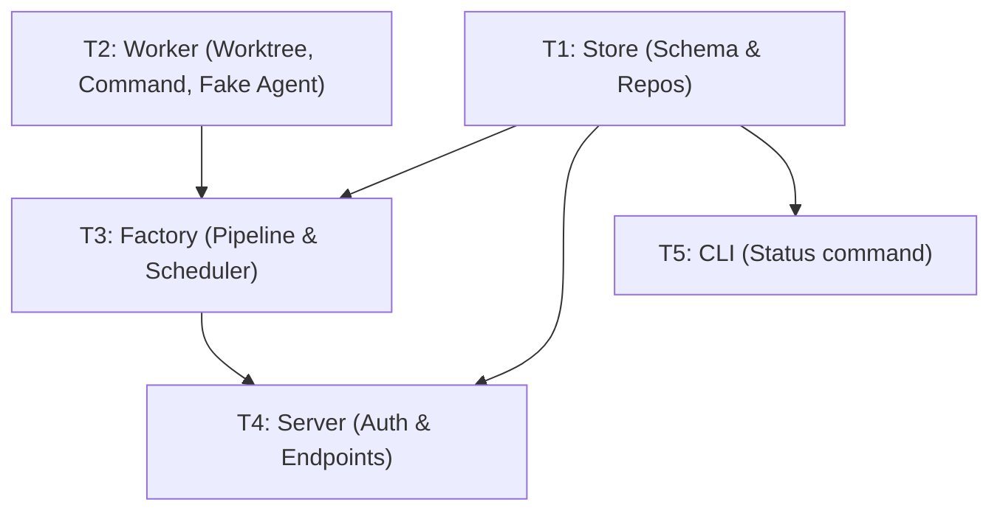

# M1 — Walking Skeleton

> Status: **Completed**
> Size: L · Depends on: M0
> Covers: `PRJ-1..6`, `INT-1` (API), `PIP-1..5`, `COD-1/2/9`, `REV` (fake file), `APR-5..7`, `WKT-1/3/4/6/9`, `SCH-1/3/4`, `LOG-1/2/4`, `CLI-4`, `SEC-1..5/8`, `NFR-4`

## Goal

One `refactor` job runs from creation to a "done"-shaped end through the API, with the fake agent, in a real worktree. 

This establishes the core engine architecture, the state machine, and the boundary with subprocesses (agents and commands).

## Dependency Graph

---

## Tasks

### T1 — Store (internal/store)

**Requirements:** `PRJ-1..6`, `LOG-1/4` (storage), `PIP-2` (transactions).
**Artifacts:** `migrations/0002_m1_schema.sql`, `project_repo.go`, `job_repo.go`, `event_repo.go`, `session_repo.go`

**What to do:**
1. Create `0002_m1_schema.sql`:
   - `projects`: id, name, repo_path, base_ref, enabled_work_types, created_at.
   - `jobs`: id, project_id, work_type, title, status (e.g. `queued`, `running`), stage (`01_Intent`, etc.), branch_name, worktree_path, base_sha, created_at, updated_at.
   - `step_runs`: id, job_id, stage, kind, attempt, executor, status (`success`, `fail`, `skipped`), exit_code, log_path, started_at, ended_at.
   - `events`: id (autoincrement), job_id, type, payload (JSON), created_at.
   - `approvals`: id, job_id, gate, decision, note, head_sha, created_at.
   - `sessions`: id, token_hash, expires_at.
   - `process_records`: id, step_run_id, pid, pgid, start_time, active.
2. Implement repository interfaces (e.g., `ProjectRepo`, `JobRepo`) providing CRUD operations. 
3. Implement `Tx(ctx, func(tx) error)` helper to ensure PIP-2 (state change and event append happen in a single transaction).
4. Add basic tests ensuring foreign keys and unique constraints (name/path for projects) hold.

**Acceptance Criteria:**
- M1 schema applies cleanly over M0.
- Repository operations successfully read and write to SQLite using WAL mode.
- Unique constraints on project name and repository path (`PRJ-5`).

---

### T2 — Worker (internal/worker)

**Requirements:** `WKT-1/3/4/6/9`, `LOG-2`, `SEC-6`.
**Artifacts:** `worktree/manager.go`, `command/runner.go`, `agent/fake.go`, `agent/runner.go`

**What to do:**
1. **Worktree Manager:**
   - Serialize git calls per project using an in-memory mutex (`WKT-9`).
   - Implement `Create`: `git fetch` (with timeout and fallback to local on failure), then `git worktree add -b garagefab/job-<id> <path> <base_ref>` (`WKT-1`, `WKT-2`). Return `base_sha` (`WKT-3`).
   - Implement `Reset` and `Remove`. Verify it never touches the main checkout (`WKT-4`, `WKT-6`).
2. **Command Runner:**
   - Execute commands via `sh -c` inside the worktree.
   - Create a new process group for the child (`SEC-6` pass specific env vars).
   - Stream stdout/stderr to `~/.garagefab/logs/<job-id>/<step-id>.log` (`LOG-2`).
3. **Fake Agent:**
   - Create a test binary or script (`cmd/fakeagent` or similar) that reads a scenario via flags/env. It should simulate work by waiting, optionally writing artifacts (like `review.json`), and exiting with a specific code.
   - Implement `AgentRunner` interface that calls this fake agent for M1.

**Acceptance Criteria:**
- `git worktree add` and `remove` operations are serialized per project.
- The fake agent runs in its own process group, its output is streamed to the correct log file, and environment variables are restricted.
- Main developer checkout remains completely unmodified during worktree operations.

---

### T3 — Factory (internal/factory)

**Requirements:** `PIP-1..5`, `SCH-1/3/4`, `COD-1/2/9`, `REV` (stub).
**Artifacts:** `pipeline.go`, `scheduler.go`, `step_executor.go`

**What to do:**
1. **Pipeline State Machine:**
   - Define the `refactor` profile: `01_Intent` -> `04_Coding` -> `05_Independent_Review` -> `06_Human_Approval_Gate` -> `07_Done` (`PIP-1`).
   - Implement transitions wrapped in the `store.Tx` helper to enforce `PIP-2`. Validate current stage/status before any action (`PIP-3`, `PIP-4`).
   - Ensure a job only executes one step at a time (`PIP-5`).
2. **Scheduler:**
   - Background goroutine ticking or waking up on events. 
   - Reads global `max_concurrent_jobs`. Selects `queued` jobs oldest-first (`SCH-3`). Jobs waiting on human (e.g., `awaiting_approval`) do not consume a slot (`SCH-4`).
3. **Step Execution:**
   - `Coding` step: run fake agent, execute commands (`build`/`test`/`lint` stubbed), commit checkpoint (`garagefab(job-<id>): coding`) (`COD-1/2/9`).
   - `Review` step: run fake agent which writes a fake `review.json` (`REV`).

**Acceptance Criteria:**
- The scheduler limits concurrent running jobs to `max_concurrent_jobs` (`SCH-1`).
- The pipeline advances a `refactor` job correctly through its stages.
- Checkpoint commits are created successfully after the coding step.

---

### T4 — Server (internal/server)

**Requirements:** `PRJ-1..4`, `INT-1`, `APR-5..7`, `SEC-1..5/8`.
**Artifacts:** `auth.go`, `api_project.go`, `api_job.go`, `sse.go`

**What to do:**
1. **Auth & Security:**
   - Middleware to verify Session cookie or Bearer token (`SEC-3`).
   - Reject non-loopback Host headers (`SEC-2`) and verify Origin for cookie-authenticated POST/PUT/DELETE requests (`SEC-5`).
   - Restrict Approve/Reject endpoints to Session cookie only, refusing Bearer tokens (`SEC-4`, `APR-7`).
2. **Endpoints:**
   - `POST /api/projects`: Register project, validate repository exists, read `project.yaml` (`PRJ-1..4`).
   - `POST /api/jobs`: Create a new job (`INT-1`).
   - `POST /api/jobs/{id}/approve`: Validate `head_sha` matches evidence (`APR-5`).
   - `POST /api/jobs/{id}/reject`: Require a non-empty note (`APR-6`).
   - `/api/events`: Global SSE stream for state changes (`LOG-4`).
   - Protect artifact paths from directory traversal (`SEC-8`).

**Acceptance Criteria:**
- Auth middleware correctly differentiates and restricts Cookie vs Bearer access.
- Invalid projects (bad repo path or invalid `project.yaml`) are rejected with clear errors.
- Jobs can be approved/rejected, with state changes broadcast over SSE.

---

### T5 — CLI (garagefab status)

**Requirements:** `CLI-4`.
**Artifacts:** `cmd/garagefab/status.go`

**What to do:**
1. Add `status` subcommand to Cobra.
2. Read directly from the SQLite database to fetch jobs in `running`, `needs_clarification`, `spec_review`, `awaiting_approval`, `failed`, or `interrupted` states.
3. Print a formatted table to stdout.

**Acceptance Criteria:**
- `garagefab status` executes cleanly while the main server is running.
- Outputs a readable list of active and attention-needing jobs.

---

## Exit Criteria

- [x] A CI test registers a temporary Git repository, creates a `refactor` job via the API, and sees it reach the approval gate, then `done` (delivery stubbed), with logs, events, and a checkpoint commit present.
- [x] End-to-end test utilizes the **fake agent**.
- [x] Baseline responsiveness tests (NFR-4) run and pass.

## Risks (from Plan §6)

- **R2 (Invalid artifacts):** Mitigated by strict validation on the fake agent's outputs.
- **R5 (Process group on macOS/Linux):** Fake agent must spawn children to verify process-group killing works correctly across platforms.
- **R9 (Git edge cases):** Use `--no-verify` for checkpoint commits to avoid triggering local hooks.
- **R11 (Flaky timing tests):** Synchronize CI tests on database events or SSE rather than using `time.Sleep`.
