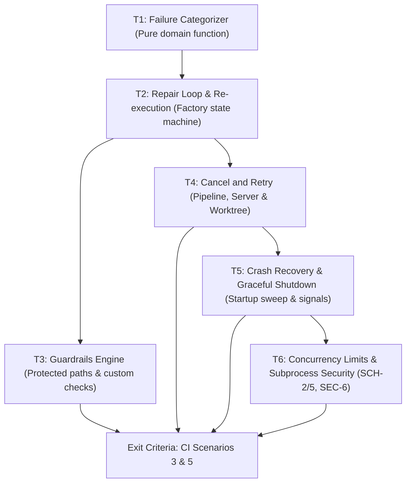

# M2 — Safety and Repair

> Status: **Completed**  
> Size: M · Depends on: M1  
> Covers: `COD-3..7/10`, `GRD-1..4`, `PIP-6/7`, `WKT-5/7/8`, `SCH-2/5`, `RCV-1..4`, `SEC-6`

## Goal

The pipeline is safe and resilient against faulty agent behavior (test failures, empty diffs, protected file tampering, hangs) and unexpected system crashes or shutdowns.

---

## Architectural Role & Boundaries

In accordance with `AGENTS.md` and Clean Architecture boundaries:
- **Factory (`internal/factory`):** Defines failure categorization as a deterministic pure function (`COD-4`). Manages the repair retry loop, attempt counters, and state machine transitions (`COD-5`, `PIP-6/7`). Factory **never** imports `store` or `worker`, nor does it execute shell commands directly.
- **Worker (`internal/worker`):** Owns subprocess lifecycle, process group signals (SIGTERM/SIGKILL), process metadata recording (`RCV-1`), worktree hard-reset (`WKT-5`), environment sanitization (`SEC-6`), and path guardrail verification (`GRD-1..4`). Worker **never** imports `store`.
- **Store (`internal/store`):** Owns persistence of process records (`process_records`), step attempt metadata (`step_runs`), and transactional status updates (`store.WithTx`).
- **Server (`internal/server`):** Exposes `POST /api/jobs/{id}/cancel` and `POST /api/jobs/{id}/retry` endpoints with session-based authentication and CSRF origin verification.
- **CLI / Entrypoint (`cmd/garagefab`):** Orchestrates startup orphan process cleanup (`RCV-2/3`), graceful signal termination (`RCV-4`), and wires factory, worker, and store together.

---

## Dependency Graph

---

## Tasks

### T1 — Failure Categorizer (`COD-4`)

**Requirements:** `COD-4`  
**Artifacts:** `internal/factory/failure.go`, `internal/factory/failure_test.go`

**What to do:**
1. Define failure category enumeration in `internal/factory/types.go` or `internal/factory/failure.go`:
   - `FailureCategoryFlawed`: Deterministic, code- or artifact-related defect that an agent can potentially fix (e.g. test failure, lint violation, compiler error, empty diff, guardrail violation). Triggers a repair run if attempts remain.
   - `FailureCategoryBlocked`: Environmental or systemic impediment where agent retries cannot succeed without external resolution (e.g. command timeout, command not found, permission denied, worktree/git corruption, missing binary).
   - `FailureCategoryManual`: Terminal escalation when repair attempts reach `max_repair_attempts`.
2. Implement pure domain function `CategorizeFailure(input FailureInput) FailureCategory`:
   - Inputs: `ExitCode int`, `TimedOut bool`, `EmptyDiff bool`, `GuardrailViolation bool`, `Stderr string`, `Stdout string`, `Attempt int`, `MaxAttempts int`.
   - Logic:
     - If `Attempt >= MaxAttempts`, return `FailureCategoryManual`.
     - If `TimedOut` is true, return `FailureCategoryBlocked`.
     - If `EmptyDiff` is true (agent exit 0 but no changes made vs step-start SHA, `COD-7`), return `FailureCategoryFlawed`.
     - If `GuardrailViolation` is true, return `FailureCategoryFlawed`.
     - If exit code indicates non-zero exit from build/test/lint with compilation or test failure signals, return `FailureCategoryFlawed`.
     - If exit code is 127 (command not found) or contains permission denied / system errors, return `FailureCategoryBlocked`.
3. Add comprehensive table-driven tests (`TestFailureCategorizer_COD4`) covering all edge cases, signal inputs, and attempt thresholds.

**Acceptance Criteria:**
- Given a non-zero exit from test/build/lint, returns `FailureCategoryFlawed`.
- Given an agent that exits 0 with zero diff against step-start SHA, returns `FailureCategoryFlawed`.
- Given a step timeout, returns `FailureCategoryBlocked`.
- Given attempt counter equal to or exceeding `max_repair_attempts`, returns `FailureCategoryManual`.
- Function executes with zero heap allocations or external dependencies (100% pure function).

---

### T2 — Repair Loop & Re-execution (`COD-3`, `COD-5`, `COD-6`, `COD-7`, `COD-10`)

**Requirements:** `COD-3`, `COD-5`, `COD-6`, `COD-7`, `COD-10`  
**Artifacts:** `internal/factory/pipeline.go`, `internal/factory/repair.go`, `internal/factory/pipeline_repair_test.go`, `internal/worker/agent/fake.go`

**What to do:**
1. **Attempt Counter & Feedback Loop:**
   - Extend `StepExecutor` in `internal/factory` to track repair attempts for the coding stage (`04_Coding`).
   - Configure default `max_repair_attempts = 3`.
   - When a coding run or post-coding check fails with `FailureCategoryFlawed` and `attempt < max_repair_attempts`:
     - Formulate a repair prompt containing: the approved job spec (or intent for refactor), the previous command error output (stdout/stderr or offending file list), and an explicit instruction to fix the failure (`COD-1`).
     - Re-run the coding agent in a fresh session with no prior conversation history.
     - Increment `step_runs.attempt`.
2. **Full Command Suite Re-execution (`COD-6`):**
   - After a repair run completes, re-run **all** command groups from the beginning in strict order: guardrails (`GRD-1`), then `commands.build`, `commands.test`, `commands.lint` (`COD-2`).
   - If any command fails, stop immediately, capture its output, and trigger the next repair attempt.
3. **Empty Diff Detection (`COD-7`):**
   - After an agent step exits 0, query the worktree diff against the step-start SHA.
   - If no files were created, modified, or deleted, classify the outcome as `FailureCategoryFlawed` ("no changes made") and feed this back to the repair loop.
4. **Unconfigured Commands (`COD-3`):**
   - If `commands.test`, `build`, or `lint` are omitted in configuration, record step run status as `skipped`.
5. **Timeouts (`COD-10`):**
   - Enforce timeouts (`timeouts.agent`, `timeouts.command`). On expiration, kill the process group immediately and mark the step failed as `FailureCategoryBlocked`.
6. Update `FakeAgentRunner` to support scenario scripting: e.g. fail attempt 1 with test error, fail attempt 2 with empty diff, pass attempt 3.

**Acceptance Criteria:**
- Given a failing test command and attempts remaining, the coding agent is invoked again with previous failure output in a clean session.
- Given a repaired lint failure, build and test run again before the step is deemed successful (`COD-6`).
- Given an agent that exits 0 without editing any files, the step is rejected as `Flawed` (`COD-7`).
- Given 3 successive flawed attempts, the job transitions to `04_Coding`/`failed` with category `Manual`.

---

### T3 — Guardrails Engine (`GRD-1..4`)

**Requirements:** `GRD-1..4`  
**Artifacts:** `internal/worker/command/guardrails.go`, `internal/worker/command/guardrails_test.go`, `internal/config/config.go`, `internal/factory/pipeline.go`

**What to do:**
1. **Protected Paths Guardrail (`GRD-1`):**
   - Implement `CheckProtectedPaths(repoDir string, stepStartSHA string, patterns []string) ([]string, error)` in `internal/worker/command`:
     - Run `git diff --name-status <step-start-sha>` in the worktree.
     - Inspect all modified (`M`), deleted (`D`), and renamed (`R`) files.
     - Match paths against glob patterns defined in `guardrails.protected_paths` (e.g. `**/*_test.go`).
     - **Rule:** If an **existing** file (present at `stepStartSHA`) matches a protected pattern and was modified/deleted/renamed, it is a violation.
     - **Rule:** Newly added files (`A`) matching the pattern are explicitly allowed (`GRD-1`), permitting agents to add new tests without triggering guardrail violations.
2. **Custom Command Guardrails (`GRD-3`):**
   - Support `guardrails.commands` list in project config.
   - Execute custom shell commands after protected paths check. Any non-zero exit code is recorded as a guardrail violation with its captured output.
3. **Integration with Repair Loop (`GRD-4`):**
   - Run guardrails immediately after any agent step that alters code (`04_Coding` and later `03_Probe`).
   - On violation, categorize the step as `FailureCategoryFlawed` (one repair attempt granted to undo the violation).
   - Inject the exact offending file paths into the repair prompt instructing the agent to revert them (`GRD-4`).

**Acceptance Criteria:**
- Given `guardrails.protected_paths: ["**/*_test.go"]` and an agent that edits `auth_test.go`, guardrail fails and lists `auth_test.go`.
- Given an agent that creates a new file `token_test.go`, guardrail passes cleanly.
- Given a guardrail violation, the repair prompt names the violating files and counts as 1 repair attempt.
- Given a custom guardrail command exiting 1, step fails as `Flawed` with command stderr.

---

### T4 — Cancel and Retry Actions (`PIP-6/7`, `WKT-5/7/8`)

**Requirements:** `PIP-6/7`, `WKT-5/7/8`  
**Artifacts:** `internal/factory/pipeline.go`, `internal/worker/worktree/manager.go`, `internal/server/api_job.go`, `internal/server/server_test.go`, `internal/store/job_repo.go`

**What to do:**
1. **Cancel Action (`PIP-6`, `WKT-6`):**
   - Implement `CancelJob(ctx context.Context, jobID int64) error` in factory:
     - Allowed in any non-terminal state (`queued`, `running`, `needs_clarification`, `spec_review`, `awaiting_approval`).
     - If the job is currently executing, cancel its running `context.Context` and signal its process group (SIGTERM, followed by SIGKILL after grace period).
     - Remove the job worktree from disk (`WKT-6`).
     - Atomically transition job status to `cancelled` and record `job.cancelled` event (`PIP-2`).
2. **Retry Action (`PIP-7`, `WKT-5`):**
   - Implement `RetryJob(ctx context.Context, jobID int64) error` in factory:
     - Allowed only when status is `failed` or `interrupted`.
     - Reset the worktree to the step-start checkpoint using `git reset --hard <checkpoint_sha>` and `git clean -fd` (`WKT-5`).
     - Reset the repair attempt counter to 0 (`COD-5`).
     - Atomically transition job status back to `queued` so the scheduler re-admits it.
3. **Leftover Branch Detection (`WKT-7`):**
   - In `worktree.Manager.Create`, check if local branch `garagefab/job-<id>` already exists before creating worktree. If branch exists without a recognized active job, abort with `Blocked` error stating branch already exists.
4. **Orphan Worktree Detection Helper (`WKT-8`):**
   - Implement `ListOrphanWorktrees(baseDir string, activeJobWorktrees []string) ([]string, error)`.
   - Discovered orphans are surfaced for manual review, never auto-deleted.
5. **Server REST Endpoints:**
   - Implement `POST /api/jobs/{id}/cancel` and `POST /api/jobs/{id}/retry`.
   - Protect endpoints with session authentication (`SEC-4`) and CSRF origin check. Return `409 invalid_state` if action is invalid for current state.

**Acceptance Criteria:**
- Given a running job, invoking Cancel sends SIGTERM/SIGKILL to the process group, deletes the worktree, and sets status to `cancelled`.
- Given a failed or interrupted job with dirty files in worktree, invoking Retry executes `git reset --hard` + `git clean -fd` to the step-start SHA, resets attempt counter, and queues the job.
- Given a leftover branch `garagefab/job-<id>`, job creation fails as `Blocked` with a descriptive message.
- Endpoints return `409` when called on illegal states (e.g. retrying a running job).

---

### T5 — Crash Recovery & Graceful Shutdown (`RCV-1..4`)

**Requirements:** `RCV-1..4`  
**Artifacts:** `cmd/garagefab/recovery.go`, `cmd/garagefab/recovery_test.go`, `cmd/garagefab/main.go`, `internal/store/process_repo.go`, `internal/worker/command/runner.go`

**What to do:**
1. **Process Group & Start Time Tracking (`RCV-1`):**
   - Ensure `command.Runner` and `agent.FakeRunner` record process information (`PID`, `PGID`, `StartTime` formatted RFC3339) in `process_records` before streaming stdout/stderr.
2. **Startup Orphan Process Sweep (`RCV-2`, `RCV-3`):**
   - In `cmd/garagefab/main.go` on startup, **before** the scheduler or API server starts accepting requests:
     - Query `store.ProcessRepo.ListActive(ctx)`.
     - For each record: check whether process `PID` exists in the OS.
     - Inspect process start time (using OS procfs/sysctl or POSIX tools) to prevent terminating an unrelated process due to OS PID reuse (`RCV-2`).
     - If active and start time matches: send SIGTERM to negative PGID (`-pgid`), wait 3 seconds grace period, escalate to SIGKILL.
     - Update process record `active = 0`.
     - In `store.WithTx`, mark affected `step_runs` as `status = fail`, `failure_category = Blocked`, and transition corresponding jobs to status `interrupted` (`RCV-3`).
     - Retain worktrees as-is on disk (`WKT-6`) to permit later manual Retry or Cancel.
3. **Graceful Shutdown (`RCV-4`):**
   - In `cmd/garagefab/main.go`, listen for OS signals `SIGINT` and `SIGTERM`.
   - When received:
     - Cancel the top-level scheduler context to cease admitting new jobs.
     - Signal all currently running process groups with SIGTERM.
     - Wait up to `grace_period` (default 10s) for processes to terminate.
     - Escalate to SIGKILL for any remaining active process groups.
     - Mark in-flight jobs as `interrupted` in the database before process exits.

**Acceptance Criteria:**
- Given a simulated crash (`kill -9`) during a long-running fake agent execution, restarting Garagefab kills the orphaned agent process group and marks the job `interrupted`.
- Given a PID reused by an unrelated system process with a different start time, startup sweep ignores it and does not kill it.
- Given `Ctrl+C` (SIGINT) while two jobs are running, all child process groups terminate cleanly, and both jobs are persisted as `interrupted`.

---

### T6 — Concurrency Limits & Subprocess Security (`SCH-2/5`, `SEC-6`)

**Requirements:** `SCH-2/5`, `SEC-6`  
**Artifacts:** `internal/factory/scheduler.go`, `internal/factory/scheduler_test.go`, `internal/worker/command/runner.go`, `internal/config/config.go`

**What to do:**
1. **Project-Level Concurrency Limit (`SCH-2`):**
   - Add optional `limits.max_concurrent_jobs` to project configuration.
   - In `scheduler.admitNextJob`: verify both global limit (`max_concurrent_jobs`) AND project-specific concurrency limit before launching a job.
   - If project limit is saturated, leave job in `queued` and evaluate next queued job from an available project.
2. **Parallel Jobs in Same Project (`SCH-5`):**
   - Ensure two jobs of the same project can run simultaneously in independent worktrees (`~/.garagefab/worktrees/<project>/<job-1>` and `~/.garagefab/worktrees/<project>/<job-2>`) without mutex deadlocks. Git worktree additions/removals remain serialized via `worktree.Manager` mutex (`WKT-9`).
3. **Subprocess Environment Isolation (`SEC-6`):**
   - Enforce strictly allow-listed environment variables passed to agent processes:
     - `PATH`, `HOME`, `USER`, `LANG`, `LC_*`, `TERM`, `SHELL`, `TMPDIR`, plus `engine.env_passthrough`.
   - Explicitly guarantee that `GARAGEFAB_API_TOKEN`, `GARAGEFAB_GITHUB_TOKEN`, and any internal credentials are wiped from agent subprocess environments (`GHB-4`).

**Acceptance Criteria:**
- Given global limit 5 and project limit 1, two jobs of that project never run concurrently, while a job of another project runs in parallel.
- Given two jobs for the same project touching the same file, both execute to completion in their respective worktrees.
- Given an agent inspecting its `env`, only allow-listed variables are present; sensitive tokens are absent.

---

## Exit Criteria

Milestone M2 is complete when:

1. **Unit & Package Tests:** 100% pass across `factory`, `worker`, `store`, and `server`.
2. **CI Acceptance Scenario 3 (Repair Loop & Guardrail):**
   - Automated integration test registers a temporary git repo.
   - Coding attempt 1 fails a test command -> attempt 2 triggers a `protected_paths` guardrail violation on `*_test.go` -> attempt 3 corrects the code cleanly -> all commands re-run and pass -> job reaches approval gate with repair counter at 2.
   - Variant verifying `max_repair_attempts` exhaustion results in `failed` (`Manual`).
3. **CI Acceptance Scenario 5 (Crash Recovery):**
   - Automated integration test starts Garagefab with a live fake agent that hangs or sleeps.
   - Process is killed with `SIGKILL`.
   - On restart, the orphan agent process group is identified and terminated, the job is found in `interrupted` status, and worktree is preserved.
   - A subsequent `POST /api/jobs/{id}/retry` resets the worktree to the checkpoint and successfully drives the job to completion.
4. **Clean Code & Tooling:** `make ci` passes on both macOS and Linux with 0 lint warnings and strict clean-architecture boundary adherence.

---

## Risks and Mitigations

| ID | Risk | Mitigation |
|----|------|------------|
| **R5** | Process-group and signal behaviors differ between macOS and Linux | Use negative PGID (`syscall.Kill(-pgid, sig)`) and verify with fake agent processes on both OS targets in CI matrix. |
| **R11** | Timing-based process tests are flaky in CI | Avoid arbitrary `time.Sleep`; synchronize tests using explicit event subscriptions (`store.EventRepo`) and loopback HTTP polling. |
| **R6** | Database locking during rapid state transitions | Keep transactions short (`store.WithTx`), never hold a SQLite transaction across a subprocess execution. |
