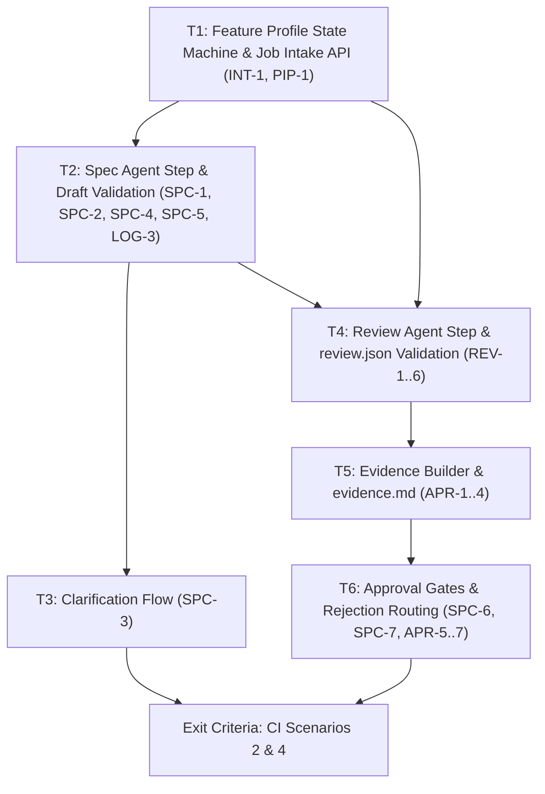

# M3 — Spec Flow and Evidence

> Status: **In progress** (Detailed plan prepared for review)  
> Size: L · Depends on: M2  
> Covers: `SPC-1..7`, `REV-1..6`, `APR-1..7`, `LOG-3`, `INT-1` (full), review and job-spec validators, clarification handling, evidence builder and `evidence.md`.

## Goal

The `feature` profile works end-to-end through the API. A `feature` job passes clarification, spec review, coding, review report, evidence generation, and approval gate via the API; Scenarios 2 (clarification) and 4 (rejection) pass in CI.

---

## Architectural Role & Boundaries

In accordance with `AGENTS.md` and Clean Architecture boundaries:
- **Factory (`internal/factory`):**
  - Defines the multi-stage state machine for the `feature` profile (`01_Intent` → `02_Clarification_and_Spec` → `04_Coding` → `05_Independent_Review` → `06_Human_Approval_Gate` → `07_Done`).
  - Implements pure domain validators:
    - `SpecValidator`: Validates `spec.md` structure (§6.1: required headings, non-empty, `AC-<n>` criteria, ordered plan).
    - `ReviewValidator`: Validates `review.json` (§6.2: JSON schema, decision values, scores 1–5, severity, blocking rules).
    - `EvidenceBuilder`: Compiles command results, review report, diff metrics, and generates `evidence.md` (§6.3/§6.7).
  - Factory **never** imports `store` or `worker`, nor does it execute shell commands or direct file I/O directly.
- **Worker (`internal/worker`):**
  - Owns agent prompts: Spec Agent prompt (`SPC-1/2`) and Review Agent prompt (`REV-1`).
  - Enforces session hygiene: Review agent runs in an isolated fresh session without coding conversation history (`REV-1`).
  - Owns file operations in the job-specific worktree directory (`.garagefab/jobs/<id>/`): `intent.md`, `spec.md`, `clarification-questions.md`, `clarification.md`, `review.json`, `evidence.md`, `rejections/<n>.md`.
  - Enforces repository preservation: Reverts repository modifications if the review agent touches source code (`REV-4`).
  - Worker **never** imports `store`.
- **Store (`internal/store`):**
  - Manages schema and persistence for job intent, spec hash, approvals table (`approvals`), step runs (`step_runs`), and transactional state transitions (`store.InTx`).
  - Exposes queries for approval records and job history.
  - Store **owns all SQL**; no other package imports `database/sql`.
- **Server (`internal/server`):**
  - Exposes job intake `POST /api/jobs` (`INT-1`).
  - Exposes clarification answer submission `POST /api/jobs/{id}/clarification` (Auth: `B` - Bearer or Session).
  - Exposes human approval gates: `POST /api/jobs/{id}/approve` and `POST /api/jobs/{id}/reject` (Auth: **S** - Session cookie ONLY, `APR-7`).
  - Exposes evidence summary `GET /api/jobs/{id}/evidence` and artifact inspection `GET /api/jobs/{id}/artifacts/{name}` (Auth: `B`).
- **CLI / Entrypoint (`cmd/garagefab`):**
  - Wires factory, worker, store, and server. Houses CI end-to-end integration tests verifying Scenarios 2 & 4.

---

## Dependency Graph



---

## Tasks

### T1 — Feature Profile State Machine & Job Intake API (`INT-1`, `PIP-1`)

**Requirements:** `INT-1`, `PIP-1`  
**Artifacts:** `internal/factory/pipeline.go`, `internal/factory/pipeline_feature_test.go`, `internal/server/api_job.go`, `internal/server/server_test.go`

**What to do:**
1. **Feature Profile Pipeline Flow (`PIP-1`):**
   - In `internal/factory/pipeline.go`, define the stage sequence for `WorkTypeFeature`:
     `StageIntent` (01) → `StageClarificationAndSpec` (02) → `StageCoding` (04) → `StageIndependentReview` (05) → `StageHumanApprovalGate` (06) → `StageDone` (07).
   - In `ExecuteJob`:
     - When a job is in `StageIntent` / `StatusQueued`:
       - Ensure worktree exists (`WKT-1`).
       - Write `.garagefab/jobs/<id>/intent.md` with `job.Intent` content.
       - Create Git checkpoint commit: `garagefab(job-<id>): 01_Intent`.
       - Transition job state to `StageClarificationAndSpec` / `StatusQueued`.
2. **Job Intake API (`INT-1`):**
   - Extend `POST /api/jobs`:
     - Accepts JSON payload: `{"project_id": 1, "work_type": "feature", "title": "Add SSO", "intent": "Detailed intent text..."}`.
     - Validate `work_type` against `project.EnabledWorkTypes` (`PRJ-4`).
     - Validate `title` and `intent` are non-empty.
     - Persist job in `01_Intent` / `queued`.
     - Return `201 Created` with the full `Job` object.

**Acceptance Criteria:**
- Given a `POST /api/jobs` request with `work_type: feature`, job is persisted in `01_Intent`/`queued`.
- When `ExecuteJob` runs for a `feature` job at `01_Intent`, `.garagefab/jobs/<id>/intent.md` is written to the worktree and committed as a checkpoint.
- Job transitions cleanly from `01_Intent` to `02_Clarification_and_Spec`/`queued`.

---

### T2 — Spec Agent Step & Draft Validation (`SPC-1`, `SPC-2`, `SPC-4`, `SPC-5`, `LOG-3`)

**Requirements:** `SPC-1`, `SPC-2`, `SPC-4`, `SPC-5`, `LOG-3`  
**Artifacts:** `internal/factory/spec_validator.go`, `internal/factory/spec_validator_test.go`, `internal/factory/pipeline.go`, `internal/worker/agent/fake.go`

**What to do:**
1. **Pure Domain Spec Validator (`spec_validator.go`, `SPC-4`):**
   - Implement `ValidateSpec(content string, workType string) error`:
     - Enforce presence of required second-level Markdown headings (§6.1):
       `## Summary`, `## Goals and Non-Goals`, `## Design`, `## Acceptance Criteria`, `## Implementation Plan`, `## Test Plan`, `## Risks and Assumptions` (plus `## Reproduction` if `workType == "bug_fix"`).
     - Verify each section contains non-empty body text.
     - Verify `## Acceptance Criteria` contains at least one item matching `AC-\d+` with Given/When/Then structure.
     - Verify `## Implementation Plan` contains an ordered list referencing `AC-\d+` IDs.
     - Return descriptive validation errors if any rule fails.
2. **Spec Step Execution in Factory (`pipeline.go`):**
   - When job is at `02_Clarification_and_Spec` / `queued`:
     - Invoke `AgentRunner` in a fresh session with prompt containing `intent.md` and any existing `clarification.md` (`SPC-1`).
     - Inspect files produced under `.garagefab/jobs/<id>/`:
       - **Rule (`SPC-1`):** Exactly ONE of `spec.md` or `clarification-questions.md` must be created.
       - If both files exist, neither exists, or `spec.md` fails validation:
         - Mark step run failed with category `FailureCategoryFlawed`.
         - Re-run while attempts remain (`max_repair_attempts`). If exhausted, transition to `02`/`failed` (`Manual`).
       - If `clarification-questions.md` exists and is non-empty (`SPC-2`):
         - Transition job status to `needs_clarification`.
         - Yield execution (job waits for human input).
       - If valid `spec.md` exists:
         - Create Git checkpoint commit: `garagefab(job-<id>): 02_Clarification_and_Spec draft spec`.
         - Transition job status to `spec_review` (`SPC-5`).
         - Yield execution (job waits for human approval).

**Acceptance Criteria:**
- Given a `spec.md` missing `## Acceptance Criteria` or having no `AC-<n>`, validation fails; step is marked `Flawed` (`SPC-4`).
- Given an agent that outputs both `spec.md` and `clarification-questions.md`, the step fails as `Flawed` (`SPC-1`).
- Given an agent that writes questions, the job transitions to `needs_clarification` (`SPC-2`).
- Given a valid `spec.md`, checkpoint commit is created and job transitions to `spec_review` (`SPC-5`).
- All artifacts are written to `.garagefab/jobs/<id>/` (`LOG-3`).

---

### T3 — Clarification Flow (`SPC-3`)

**Requirements:** `SPC-3`  
**Artifacts:** `internal/server/api_clarification.go`, `internal/server/server_test.go`, `internal/factory/pipeline.go`

**What to do:**
1. **Clarification API Endpoint (`POST /api/jobs/{id}/clarification`):**
   - Auth: `B` (Session cookie or Bearer token, accessible by CLI and developer).
   - Request Body:
     ```json
     {
       "answers": [
         { "q": 1, "answer": "Use PostgreSQL JSONB columns." },
         { "q": 2, "answer": "Default timeout is 30 seconds." }
       ]
     }
     ```
   - Validation:
     - Verify job is in `02_Clarification_and_Spec` and status is `needs_clarification`. Return `409 invalid_state` otherwise.
     - Verify `answers` is non-empty and answers contain text.
2. **File Assembly & Checkpoint:**
   - Read `.garagefab/jobs/<id>/clarification-questions.md` from the worktree.
   - Format and write `.garagefab/jobs/<id>/clarification.md` as Q&A blocks (§6.4):
     ```markdown
     ## Q1
     <question text>
     **Answer:** <answer text>
     ```
   - Remove `clarification-questions.md` from the worktree (`SPC-1`).
   - Create Git checkpoint commit: `garagefab(job-<id>): clarification answers`.
3. **State Resumption:**
   - In transaction, update job status to `queued` (`02_Clarification_and_Spec`).
   - Emit `job.status_changed` event and notify the scheduler.
   - On the next execution, the spec agent receives both `intent.md` and `clarification.md`.

**Acceptance Criteria:**
- Given a job in `needs_clarification`, `POST /api/jobs/{id}/clarification` writes `.garagefab/jobs/<id>/clarification.md` and removes `clarification-questions.md`.
- Calling the endpoint with empty answers returns `422 validation_failed`.
- Calling the endpoint when the job is not in `needs_clarification` returns `409 invalid_state`.
- Job status returns to `queued`, allowing the scheduler to run the spec step again with clarification context.

---

### T4 — Review Agent Step & `review.json` Validation (`REV-1..6`)

**Requirements:** `REV-1..6`  
**Artifacts:** `internal/factory/review_validator.go`, `internal/factory/review_validator_test.go`, `internal/factory/pipeline.go`, `internal/factory/pipeline_review_test.go`, `internal/worker/agent/fake.go`

**What to do:**
1. **Pure Domain Review Validator (`review_validator.go`, `REV-2`):**
   - Validate `.garagefab/jobs/<id>/review.json` against §6.2:
     - `schema_version == 1`
     - `decision` must be `"approve"` or `"request_changes"`.
     - `risk`: `side_effect`, `performance`, `backward_compatibility` must have integer scores between 1 and 5, with non-empty `rationale`.
     - `findings`: list of items with `severity` (`"blocking"` or `"minor"`), `file`, `line`, `description`.
     - **Rule (`REV-2`):** If `decision == "approve"`, there must be NO finding with `severity == "blocking"`.
     - `warnings`: list of out-of-scope observations (`file`, `description`).
     - `spec_coverage`: list of criteria coverage items (`criterion`, `status` in `met|partial|not_met`, `note`).
2. **Review Step Execution in Factory (`pipeline.go`):**
   - When entering stage `05_Independent_Review`:
     - Record step-start SHA.
     - Invoke Review Agent with prompt: spec content (or intent), git diff from merge base, and command output summary.
     - **Session Isolation (`REV-1`):** Prompt must contain NO dialogue or scratchpad from stage `04_Coding`.
   - **Repository Tampering Guard (`REV-4`):**
     - Compare worktree changes against step-start SHA.
     - If the agent modified, deleted, or added any file other than `.garagefab/jobs/<id>/review.json`:
       - Execute `git reset --hard <step-start-sha>` and `git clean -fd` to revert repository modifications.
       - Fail the step as `FailureCategoryFlawed` with error message naming the tampered files.
   - **Validation & Progression (`REV-3`, `REV-5`, `REV-6`):**
     - Validate `review.json` with `ReviewValidator`. If invalid, fail step as `FailureCategoryFlawed`.
     - Warnings do NOT block progression (`REV-3`).
     - On success: create checkpoint commit `garagefab(job-<id>): 05_Independent_Review review.json`.
     - Advance job to `06_Human_Approval_Gate` / `awaiting_approval` (`REV-5`).
     - Note: `request_changes` does not auto-loop in Phase 1; it proceeds to `awaiting_approval` and is highlighted in the evidence (`REV-6`).

**Acceptance Criteria:**
- Review agent prompt contains no coding session history (`REV-1`).
- An invalid `review.json` (bad JSON, missing score, or `approve` with blocking finding) fails as `Flawed` (`REV-2`).
- If review agent edits source files, changes are reverted and step fails as `Flawed` (`REV-4`).
- Pre-existing warnings do not block progress; job advances to `awaiting_approval` (`REV-3`, `REV-5`).

---

### T5 — Evidence Builder & `evidence.md` (`APR-1..4`, `LOG-3`)

**Requirements:** `APR-1..4`, `LOG-3`  
**Artifacts:** `internal/factory/evidence.go`, `internal/factory/evidence_test.go`, `internal/server/api_evidence.go`, `internal/server/server_test.go`

**What to do:**
1. **Evidence Compiler Domain Service (`evidence.go`):**
   - Implement `BuildEvidenceSummary(job *Job, steps []*StepRun, review *ReviewReport, diffStat *DiffStat) (*EvidenceSummary, string)`:
     - Gathers:
       - Command execution results (build, test, lint pass/fail indicators).
       - Review decision (`approve` or `request_changes`), risk scores (1–5), finding counts (blocking/minor).
       - Changed files count, insertions, deletions from merge base.
       - Out-of-scope warnings count.
       - Drill-down links to diff, full logs, spec, and review report.
     - Formats Markdown summary string for `evidence.md` (§6.7).
2. **Worktree Persistence & Checkpoint:**
   - In factory stage `06_Human_Approval_Gate`:
     - Write `.garagefab/jobs/<id>/evidence.md`.
     - Read and record current worktree `HEAD` SHA.
     - Commit checkpoint: `garagefab(job-<id>): 06_Human_Approval_Gate evidence.md`.
     - Store evidence `HEAD` SHA on the job record for stale check (`APR-5`).
3. **Server REST Endpoints:**
   - `GET /api/jobs/{id}/evidence` (Auth: `B`):
     - Returns JSON representation of `EvidenceSummary` with drill-down URLs (`APR-1`, `APR-2`).
     - **Constraint (`APR-3`):** Must strictly read from stored step runs and artifacts; executes no new subprocesses or agents.
   - `GET /api/jobs/{id}/artifacts/{name}` (Auth: `B`, `LOG-3`):
     - Returns raw file content for `intent`, `spec`, `clarification`, `review`, `evidence`.

**Acceptance Criteria:**
- `GET /api/jobs/{id}/evidence` returns test results, review decision, risk scores, diff stats, and warning counts (`APR-1`).
- Drill-down links allow inspecting logs, diff, spec, and review report (`APR-2`).
- Evidence generation spawns zero subprocesses or agent runs (`APR-3`).
- `.garagefab/jobs/<id>/evidence.md` is committed and present in the worktree (`APR-4`).

---

### T6 — Approval Gates & Rejection Routing (`SPC-6`, `SPC-7`, `APR-5..7`)

**Requirements:** `SPC-6`, `SPC-7`, `APR-5..7`  
**Artifacts:** `internal/server/api_approval.go`, `internal/server/server_test.go`, `internal/factory/pipeline.go`, `internal/store/approval_repo.go`

**What to do:**
1. **Session-Only Security Gate (`APR-7`, `SEC-4`):**
   - Endpoints `POST /api/jobs/{id}/approve` and `POST /api/jobs/{id}/reject`:
     - Inspect request authentication: accept **only** valid dashboard session cookies.
     - If called with a Bearer token or unauthenticated: return `403 Forbidden` (`{"error": {"code": "forbidden"}}`).
2. **Spec Review Approval Gate (`SPC-6`, `SPC-7`):**
   - When job is at `02_Clarification_and_Spec` / `spec_review`:
     - Re-read `.garagefab/jobs/<id>/spec.md` directly from the worktree (supporting manual developer edits).
     - Re-validate with `ValidateSpec`. If invalid, return `422 validation_failed`.
     - Compute SHA-256 hash of `spec.md`.
     - In transaction:
       - Record approval in `approvals` table (`gate: spec_review`, `decision: approve`, `spec_hash: <sha256>`).
       - Commit checkpoint: `garagefab(job-<id>): approved spec.md`.
       - Transition job to `04_Coding` / `queued`.
     - **Rule (`SPC-7`):** The pipeline never advances past stage 02 without this explicit approval.
3. **Final Approval Gate (`APR-5`):**
   - When job is at `06_Human_Approval_Gate` / `awaiting_approval`:
     - Check current Git `HEAD` SHA in the worktree.
     - If `HEAD` != stored evidence `HEAD` SHA: return `409 stale_evidence`.
     - In transaction: record final approval (`gate: human_approval`, `decision: approve`, `head_sha: <sha>`).
     - Advance job to `07_Done` (in M3, delivery is stubbed; status becomes `done`).
4. **Rejection Action (`APR-6`):**
   - `POST /api/jobs/{id}/reject`:
     - Request body: `{"note": "Please refactor the error handling to use sentinel errors."}`.
     - If `note` is empty or whitespace: return `422 validation_failed`.
     - Write `.garagefab/jobs/<id>/rejections/<n>.md` with timestamp and note text.
     - Record rejection in `approvals` table (`decision: reject`, `note: ...`).
     - Commit checkpoint: `garagefab(job-<id>): rejected at gate`.
     - Reset repair attempts counter to 0 (`COD-5`).
     - Route job back to `04_Coding` / `queued`. The next coding agent prompt includes the rejection note.

**Acceptance Criteria:**
- Bearer token calling `/approve` or `/reject` returns `403 forbidden` (`APR-7`).
- Spec approve re-validates the worktree file, records its SHA-256, and advances to `04_Coding`/`queued` (`SPC-6`).
- Job in `spec_review` remains stuck indefinitely without approve (`SPC-7`).
- Final approve with modified worktree returns `409 stale_evidence` (`APR-5`).
- Reject requires non-empty note, writes `rejections/<n>.md`, and resets repair counter to 0 while routing to `04_Coding`/`queued` (`APR-6`).

---

## Exit Criteria

Milestone M3 is complete when:

1. **Unit & Package Tests:** 100% pass across `factory`, `worker`, `store`, and `server`.
2. **CI Acceptance Scenario 2 (Clarification Flow):**
   - Feature job created with ambiguous intent.
   - Fake spec agent outputs `clarification-questions.md`; job enters `needs_clarification`.
   - Clarification answers posted via API; `clarification.md` created; job returns to `queued`.
   - Spec agent re-runs, receives answers, outputs valid `spec.md`; job enters `spec_review`.
   - Spec approved via session cookie; coding, review, and evidence succeed.
3. **CI Acceptance Scenario 4 (Rejection Flow):**
   - Feature job reaches `06_Human_Approval_Gate` / `awaiting_approval`.
   - Rejection is submitted with note via session cookie.
   - `rejections/1.md` is committed; job routes back to `04_Coding` / `queued`.
   - Coding agent receives rejection note, fixes code; review passes; job re-enters `awaiting_approval`.
   - Final approval succeeds; job reaches `07_Done`.
4. **Clean Code & Tooling:** `make ci` passes on macOS and Linux with 0 lint warnings, `CGO_ENABLED=0`, and strict Clean Architecture boundaries.

---

## Risks and Mitigations

| ID | Risk | Mitigation |
|----|------|------------|
| **R2** | Agent produces invalid or missing `spec.md` or `review.json` | Strict pure domain validators (`spec_validator.go`, `review_validator.go`); invalid outputs classified as `Flawed` with automated repair loop retries. |
| **R12** | Worktree modified between evidence creation and final approval | Check current Git `HEAD` SHA against stored evidence SHA; abort with `409 stale_evidence` if mismatched (`APR-5`). |
| **R13** | Automated or unauthorized gate approvals | Hard-enforce session cookie authentication (`APR-7`, `SEC-4`) with `403 forbidden` if bearer tokens attempt to approve or reject. |
