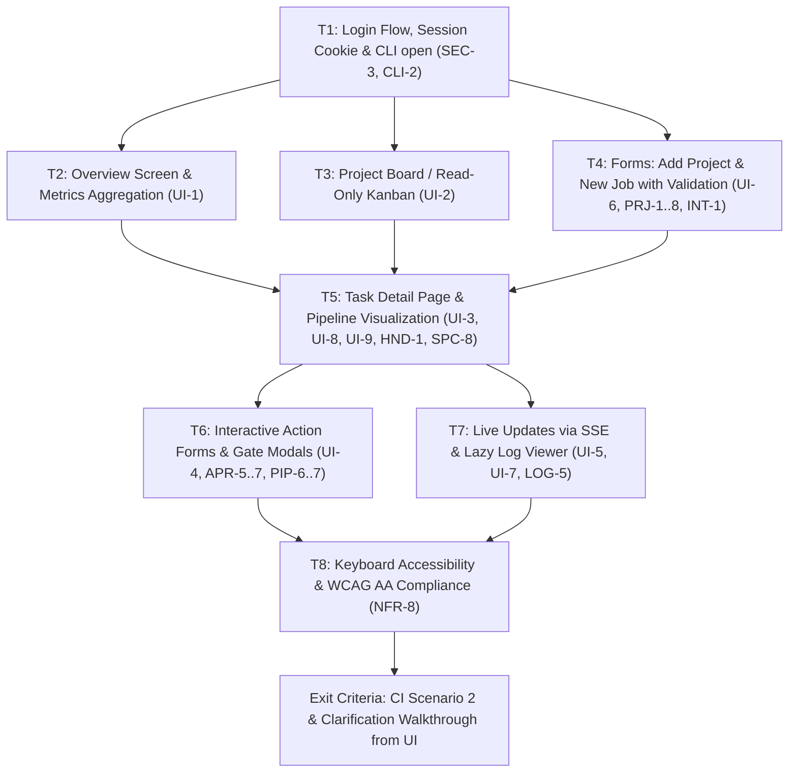

# M4 — Dashboard and Security

> Status: **Completed**  
> Size: L · Depends on: M3  
> Covers: `UI-1..9`, login flow (`SEC-3` UI part, `CLI-2`), live updates, log viewer, forms (`PRJ-1..8`, `INT-1` UI), `LOG-5`, `NFR-8`.

## Goal

Everything the developer needs, in the browser. The `feature` flow and clarification flow are drivable from the UI with the fake agent; keyboard-only accessibility and WCAG 2.1 AA compliance verified.

---

## Architectural Role & Boundaries

In accordance with `AGENTS.md` and Clean / Hexagonal Architecture boundaries:

- **Frontend React SPA (`ui/`):**
  - Primary interactive driving client interface (Single Page Application built with React 19, TypeScript, Vite, Tailwind CSS v4, and Lucide icons).
  - Communicates with the backend exclusively via standard HTTP REST endpoints under `/api` and real-time Server-Sent Events via `GET /api/events`.
  - The UI layer maintains zero knowledge of database internals, git worktree details, or subprocess execution. It renders purely from API contracts (§7).
  - Uses session cookies (`gf_session`) with `credentials: 'include'` for all requests.

- **Server (`internal/server`):**
  - Primary Inbound / Driving Adapter.
  - Exposes REST endpoints for Overview aggregation (`UI-1`), Project archiving and config template writing (`PRJ-7/8`), Step log retrieval and live streaming (`UI-7`, `LOG-5`), and Job lifecycle control (`UI-4`).
  - Hosts the SSE event broker (`UI-5`) and enforces dual-mode authentication (`SEC-1..5`), restricting gate approval/rejection strictly to interactive browser sessions (`SEC-4`, `APR-7`).
  - Serves compiled SPA static assets from embedded `uiFS` (`//go:embed`), returning `index.html` for client-side SPA route fallbacks.

- **CLI / Entrypoint (`cmd/garagefab`):**
  - Out-of-band Driving Adapter.
  - Implements `garagefab open` (`CLI-2`), which reads the active configuration, constructs the authenticated login URL (`http://127.0.0.1:<port>/login#token=<api_token>`), prints it to stdout, and launches the default system browser.

- **Store (`internal/store`):**
  - Outbound / Driven Adapter.
  - Exposes optimized query methods for dashboard metrics (`store/overview_repo.go`): status breakdown counts, active attention items (`needs_clarification`, `spec_review`, `awaiting_approval`, `failed`, `interrupted`), and recent audit events (`LOG-4`).
  - Enforces project archiving states (`is_archived`) and non-terminal job protection (`PRJ-8`).
  - Owns all SQL and schema integrity. No other package imports `database/sql`.

- **Factory (`internal/factory`):**
  - Core Domain.
  - Pure domain rules: pipeline state machine, validation of job specs and review reports, evidence compilation, failure categorization.
  - Factory remains strictly decoupled from UI, HTTP, and SQL.

---

## Dependency Graph



---

## Tasks

### T1 — Login Flow, Session Cookie & CLI `open` (`SEC-3`, `CLI-2`)

**Requirements:** `SEC-3`, `CLI-2`  
**Target Artifacts:**
- `cmd/garagefab/open.go`, `cmd/garagefab/open_test.go`
- `internal/server/auth.go`, `internal/server/server_test.go`
- `ui/src/pages/LoginPage.tsx`, `ui/src/lib/auth.ts`, `ui/src/lib/api.ts`

**What to do:**
1. **CLI `open` Subcommand (`cmd/garagefab/open.go`, `CLI-2`):**
   - Add `openCmd` attached to `rootCmd`.
   - Load configuration (`config.Load(dataDirFlag)`).
   - Parse port from `cfg.Server.Listen` (support flag override `--port`).
   - Construct login URL: `http://127.0.0.1:<port>/login#token=<api_token>`.
   - Print login URL to stdout.
   - Launch system browser using `openBrowser(dashboardURL)` (with `--no-open` flag support for headless/testing environments).
2. **Backend Session Endpoint Enhancements (`internal/server/auth.go`, `SEC-3`):**
   - Enhance `handleCreateSession` (`POST /api/session`) to support both `application/json` (`{"token": "..."}`) and `application/x-www-form-urlencoded` payloads, as well as `Authorization: Bearer <token>` header.
   - Set cookie `gf_session`: `HttpOnly: true`, `SameSite: Strict`, `Path: "/"`, expiration 7 days.
   - Ensure `POST /api/session` returns `{"status": "ok"}` on success, `401 Unauthorized` on mismatch.
3. **UI Login Page (`ui/src/pages/LoginPage.tsx`):**
   - Check `window.location.hash` on mount for `#token=<token>`.
   - If present:
     - Automatically submit token to `POST /api/session` with `credentials: 'include'`.
     - On HTTP 200: immediately clean browser URL using `history.replaceState(null, '', window.location.pathname)` to prevent sensitive token persistence in browser history and referrers (`SEC-3`).
     - Redirect user to the dashboard (`/`).
   - If absent:
     - Render clean login form with "API Token" password field and submit button.
     - Display inline error message on HTTP 401.

**Acceptance Criteria:**
- `CLI-2`: Running `garagefab open` prints the fresh login URL with `#token=...` fragment and opens the browser.
- `SEC-3`: When loading `/login#token=...`, the UI successfully exchanges the token for a `gf_session` cookie and clears the hash fragment from the URL bar without reloading.
- `SEC-3`: Attempting to access protected `/api` routes without cookie or bearer token returns `401 Unauthorized`.

---

### T2 — Overview Screen & Metrics Aggregation (`UI-1`)

**Requirements:** `UI-1`  
**Target Artifacts:**
- `internal/store/overview_repo.go`, `internal/store/repos_test.go`
- `internal/server/api_overview.go`, `internal/server/api_overview_test.go`
- `ui/src/pages/OverviewPage.tsx`, `ui/src/components/AttentionList.tsx`, `ui/src/components/ActivityFeed.tsx`

**What to do:**
1. **Store Overview Metrics (`internal/store/overview_repo.go`):**
   - Implement `GetOverviewData(ctx context.Context) (*OverviewData, error)`:
     - Aggregates status counts across non-archived projects (`queued`, `running`, `needs_clarification`, `spec_review`, `awaiting_approval`, `done`, `failed`, `interrupted`, `cancelled`).
     - Queries recent events (last 15 rows from `events` table ordered by `id DESC` joined with job title).
     - Queries attention list: jobs where status IN (`needs_clarification`, `spec_review`, `awaiting_approval`, `failed`, `interrupted`).
2. **Server Handler (`internal/server/api_overview.go`):**
   - Expose `GET /api/overview` (Auth: `B` - Bearer or Session).
   - Response payload schema:
     ```json
     {
       "job_counts": {
         "queued": 1,
         "running": 2,
         "needs_clarification": 1,
         "spec_review": 1,
         "awaiting_approval": 0,
         "done": 15,
         "failed": 0,
         "interrupted": 0,
         "cancelled": 1
       },
       "attention_list": [
         {
           "id": 12,
           "project_id": 1,
           "project_name": "backend",
           "work_type": "feature",
           "title": "Add OAuth",
           "stage": "02_Clarification_and_Spec",
           "status": "needs_clarification",
           "updated_at": "2026-10-02T15:00:00Z"
         }
       ],
       "recent_activity": [
         {
           "id": 105,
           "job_id": 12,
           "job_title": "Add OAuth",
           "type": "job.status_changed",
           "created_at": "2026-10-02T15:00:00Z"
         }
       ],
       "intake_errors": [],
       "orphan_worktrees": []
     }
     ```
3. **UI Overview Page (`ui/src/pages/OverviewPage.tsx`):**
   - Top Metric Cards: Total Active Jobs, Running Jobs, Needs Human Attention, Done.
   - **Attention List Section (`AttentionList.tsx`):** Prominently renders items requiring developer action with distinct status pills and direct navigation links to `/jobs/:id`.
   - **Recent Activity Feed (`ActivityFeed.tsx`):** Reverse-chronological timeline of events with timestamps and job titles.
   - **System Health:** Displays orphan worktrees or intake errors if detected.

**Acceptance Criteria:**
- `UI-1`: Status counts match the database across all registered non-archived projects.
- `UI-1`: Jobs in `needs_clarification`, `spec_review`, `awaiting_approval`, `failed`, or `interrupted` appear in the Attention List.
- `UI-1`: Clicking an attention item routes directly to that job's detail page.

---

### T3 — Project Board / Read-Only Kanban (`UI-2`)

**Requirements:** `UI-2`  
**Target Artifacts:**
- `ui/src/pages/BoardPage.tsx`
- `ui/src/components/KanbanColumn.tsx`
- `ui/src/components/JobCard.tsx`
- `ui/src/components/ProjectFilter.tsx`

**What to do:**
1. **Board Architecture:**
   - 7 stage columns matching factory stages:
     1. `01_Intent`
     2. `02_Clarification`
     3. `03_Spec`
     4. `04_Coding`
     5. `05_Review`
     6. `06_Approval`
     7. `07_Delivered`
   - Mapping rule: Maps backend stages (`01_Intent`, `02_Clarification_and_Spec`, `04_Coding`, `05_Independent_Review`, `06_Human_Approval_Gate`, `07_Done`) to appropriate column slots.
2. **Job Card (`JobCard.tsx`):**
   - Displays Job ID (`#<id>`), Title, Work Type pill (`feature`, `refactor`, `bug_fix`, `docs`).
   - Status indicator combining icon, color, and text:
     - `running`: spinning `Loader2` icon with blue accent.
     - `needs_clarification`: `HelpCircle` icon with amber accent.
     - `spec_review` / `awaiting_approval`: `ShieldAlert` icon with purple accent.
     - `failed` / `interrupted`: `AlertTriangle` icon with rose accent.
     - `done`: `CheckCircle2` icon with emerald accent.
   - Clicking a card navigates to `/jobs/:id`.
3. **Project Filter & Read-Only Constraint:**
   - Dropdown filter to view all projects or filter by a specific project ID.
   - Strictly read-only: **Zero drag-and-drop** library or event handlers (`UI-2`).

**Acceptance Criteria:**
- `UI-2`: Given a job in stage `04_Coding` with status `running`, its card is rendered in the Coding column with an animated running indicator.
- `UI-2`: Board strictly enforces read-only presentation with no drag-and-drop controls.
- `UI-2`: Cards display title, work type, job ID, and status indicator.

---

### T4 — Forms: Add Project & New Job with Validation (`UI-6`, `PRJ-1..8`, `INT-1`)

**Requirements:** `UI-6`, `PRJ-1..8`, `INT-1`  
**Target Artifacts:**
- `internal/server/api_project.go`, `internal/server/api_project_test.go`
- `internal/store/project_repo.go`
- `ui/src/components/AddProjectModal.tsx`, `ui/src/components/NewJobModal.tsx`

**What to do:**
1. **Project Registration Enhancements (`PRJ-2..5`, `PRJ-7`, `PRJ-8`):**
   - In `POST /api/projects`:
     - Inspect repository root for `.garagefab/project.yaml` (`PRJ-3`).
     - If missing, return `422 Unprocessable Entity` with `validation_failed`, error message, and a default valid YAML template payload (`PRJ-3`).
     - Validate YAML schema and supported agents (`PRJ-4`).
     - Enforce unique name and repo path (`PRJ-5`).
   - Implement `POST /api/projects/{id}/config-template` (`PRJ-7`):
     - Writes the default `.garagefab/project.yaml` into the project's root checkout directory (`WKT-4` explicit exception).
   - Implement `POST /api/projects/{id}/archive` (`PRJ-8`):
     - Verify project has no non-terminal jobs. If active jobs exist, refuse with `409 Conflict`.
     - Update `is_archived = 1`. Archived projects are hidden from the board and project selector.
2. **UI Add Project Modal (`AddProjectModal.tsx`, `UI-6`, `PRJ-1`):**
   - Path input, Project Name (optional, defaults to folder name), Base branch (defaults to `origin/main`).
   - Inline field error rendering: Displays validation errors returned by the API directly under the offending input field.
   - Missing `project.yaml` handling: Renders a warning box with a "Generate project.yaml" action button calling `POST /api/projects/{id}/config-template`.
3. **UI New Job Modal (`NewJobModal.tsx`, `INT-1`):**
   - Project selector dropdown (filters out archived projects).
   - Work type selector (`feature`, `refactor`, `bug_fix`, `docs`) checking against project's `enabled_work_types`.
   - Title input with length validation.
   - Intent Markdown textarea with helper description.
   - On submit: calls `POST /api/jobs`. On `201 Created`, navigates to `/jobs/:id` and closes modal.

**Acceptance Criteria:**
- `UI-6`: When an invalid path is submitted, the error appears inline directly next to the input field.
- `PRJ-3` & `PRJ-7`: Submitting a repository without `.garagefab/project.yaml` shows the missing configuration error with an action to write the template.
- `PRJ-8`: Archiving a project with active running jobs is refused; archiving an idle project hides it from the board.
- `INT-1`: Submitting the New Job form creates a job in `01_Intent`/`queued` and updates the board.

---

### T5 — Task Detail Page & Pipeline Visualization (`UI-3`, `UI-8`, `UI-9`, `HND-1`, `SPC-8`)

**Requirements:** `UI-3`, `UI-8`, `UI-9`, `HND-1`, `SPC-8`  
**Target Artifacts:**
- `ui/src/pages/JobDetailPage.tsx`
- `ui/src/components/PipelineVisualizer.tsx`
- `ui/src/components/MarkdownViewer.tsx`
- `ui/src/components/EvidenceSection.tsx`
- `ui/src/components/DiffViewer.tsx`
- `ui/src/components/ClarificationForm.tsx`

**What to do:**
1. **Pipeline Visualizer (`PipelineVisualizer.tsx`, `UI-3`):**
   - Renders linear progress steps corresponding to the job's work profile (e.g. for `feature`: Intent → Clarification & Spec → Coding → Review → Approval → Done).
   - Node status: Complete (green check), Active/Running (blue pulse/spinner), Failed (rose alert), Pending (slate circle).
   - Clicking a step allows inspecting step details and opening the log viewer.
2. **Metadata & Handoff Command (`HND-1`):**
   - Header shows Job ID, Title, Project, Stage, Status, Base SHA, Head SHA, Worktree path.
   - Handoff Command Copy Button: Single click copies `garagefab work --job <id>` (or backend `handoff_command`) to clipboard with visual feedback ("Copied!").
3. **Spec Markdown Viewer (`MarkdownViewer.tsx`, `SPC-8`):**
   - When job is at or past `spec_review`, fetches `GET /api/jobs/{id}/artifacts/spec`.
   - Renders GitHub-flavored Markdown cleanly with proper typography, heading hierarchy, checklists, and acceptance criteria callouts.
4. **Clarification Questionnaire Form (`ClarificationForm.tsx`, `SPC-3`):**
   - When job is in `needs_clarification`, fetches `GET /api/jobs/{id}/artifacts/clarification-questions`.
   - Parses questions list and provides structured answer input fields for each question item.
   - Submits `POST /api/jobs/{id}/clarification` with payload `{"answers": [{"q": 1, "answer": "..."}]}`.
5. **Evidence Summary & Warnings Badge (`EvidenceSection.tsx`, `UI-8`):**
   - Fetches `GET /api/jobs/{id}/evidence`.
   - Displays verdict banner (`PASSED`, `FLAWED`, `BLOCKED`), test execution tallies, lint/build check status.
   - If review warnings exist, displays prominent ⚠️ badge with count (`UI-8`); clicking toggles a drawer showing non-blocking warning details and file references.
6. **Diff Viewer with Truncation (`DiffViewer.tsx`, `UI-9`):**
   - Fetches unified git diff from `GET /api/jobs/{id}/diff`.
   - Truncates rendering if diff exceeds 500 lines or 50 files, providing a "Show more" button to ensure browser responsiveness.

**Acceptance Criteria:**
- `UI-3`: Pipeline visualizer reflects actual step states (completed, running, pending, failed).
- `HND-1`: Clicking the handoff button copies the valid resumption command to clipboard.
- `SPC-8`: Draft `spec.md` is rendered as styled Markdown for jobs in `spec_review`.
- `UI-8`: Review warnings badge shows count of warnings and expands on click.
- `UI-9`: Large diffs render truncated initially with a "Show more" expander.

---

### T6 — Interactive Action Forms & Gate Modals (`UI-4`, `APR-5..7`, `PIP-6..7`)

**Requirements:** `UI-4`, `APR-5..7`, `PIP-6..7`  
**Target Artifacts:**
- `ui/src/components/JobActions.tsx`
- `ui/src/components/RejectModal.tsx`
- `ui/src/components/ConfirmModal.tsx`

**What to do:**
1. **Dynamic Action Button States (`JobActions.tsx`, `UI-4`):**
   - Buttons are strictly enabled/disabled according to the job's current status:
     - **Approve:** Enabled ONLY when status is `spec_review` or `awaiting_approval`. Calls `POST /api/jobs/{id}/approve` (authenticated via session cookie only, `APR-7`).
     - **Reject:** Enabled ONLY when status is `awaiting_approval`. Opens Reject Modal.
     - **Retry:** Enabled ONLY when status is `failed` or `interrupted`. Calls `POST /api/jobs/{id}/retry`.
     - **Cancel:** Enabled for ANY non-terminal status (`queued`, `running`, `needs_clarification`, `spec_review`, `awaiting_approval`). Calls `POST /api/jobs/{id}/cancel`.
     - When status is terminal (`done`, `cancelled`), all action buttons are disabled.
2. **Rejection Modal (`RejectModal.tsx`, `APR-6`):**
   - Prompts the user with a mandatory rejection note textarea explaining what needs repair.
   - Submit button is disabled until note contains non-whitespace text.
   - Calls `POST /api/jobs/{id}/reject` with `{"note": note}`.
3. **Session-Only Security Enforcement (`APR-7`):**
   - All gate action requests send `credentials: 'include'` and header `Origin: http://127.0.0.1:<port>`.

**Acceptance Criteria:**
- `UI-4`: For a job in `running`, ONLY Cancel is enabled; Approve, Reject, and Retry are disabled.
- `UI-4`: For a job in `spec_review`, Approve is enabled; Reject is disabled.
- `APR-6`: Rejecting a job requires entering a note; submitting the note transitions the job to coding re-run and records the rejection.

---

### T7 — Live Updates via SSE & Lazy Log Viewer (`UI-5`, `UI-7`, `LOG-5`)

**Requirements:** `UI-5`, `UI-7`, `LOG-5`  
**Target Artifacts:**
- `internal/server/api_logs.go`, `internal/server/api_logs_test.go`
- `ui/src/hooks/useSSE.ts`
- `ui/src/components/LogViewerModal.tsx`

**What to do:**
1. **Server Step Log Endpoint (`internal/server/api_logs.go`, `LOG-5`, `UI-7`):**
   - Expose `GET /api/jobs/{id}/steps/{stepId}/log`:
     - If header `Accept: text/event-stream` is requested:
       - Streams log lines in real-time as SSE:
         ```
         id: 1
         event: log
         data: {"line": 1, "text": "Starting compiler..."}
         ```
     - If standard HTTP request:
       - Returns log file content as `text/plain` supporting optional query param `?offset=<bytes>`.
2. **UI Server-Sent Events Hook (`useSSE.ts`, `UI-5`):**
   - Connects to `GET /api/events`.
   - On incoming events (`job.status_changed`, `step.started`, `step.finished`):
     - Updates local React state within 1 second without full page reload.
     - Automatically handles reconnection with exponential backoff on connection drops.
3. **Lazy Log Viewer Component (`LogViewerModal.tsx`, `LOG-5`, `UI-7`):**
   - **Lazy Loading Rule (`LOG-5`):** Step logs are NEVER fetched by default on page load. Requests are only initiated when the user clicks "View Logs" for a specific step.
   - When opened for a `running` step: streams real-time lines via SSE (`UI-7`).
   - When opened for a completed step: loads the persisted log file from disk.
   - Features: dark monospace terminal theme, auto-scroll ("Follow") toggle, search filter, line numbers, and copy-all button.

**Acceptance Criteria:**
- `UI-5`: Pipeline status and board cards update within 1 second of factory state changes without browser refresh.
- `LOG-5`: Navigating to the job detail page causes zero log requests until "View Logs" is clicked.
- `UI-7`: Opening the log viewer on a running step streams new output lines in real-time; opening a finished step shows the stored output.

---

### T8 — Keyboard Accessibility & WCAG 2.1 AA Compliance (`NFR-8`)

**Requirements:** `NFR-8`  
**Target Artifacts:**
- `ui/src/index.css`
- Accessibility review across all components (`BoardPage.tsx`, `JobDetailPage.tsx`, Modals)

**What to do:**
1. **Keyboard Operability:**
   - Verify every interactive element (buttons, links, form controls, tabs, modal close triggers) is focusable via `Tab` and `Shift+Tab`.
   - Implement clear `:focus-visible` focus rings (`focus-visible:outline-2 focus-visible:outline-indigo-500 focus-visible:outline-offset-2`).
   - Modal dialogs trap focus and close cleanly on `Escape` key press.
2. **Color Contrast Verification (WCAG 2.1 AA):**
   - Normal text contrast >= 4.5:1 against background colors.
   - Large text and UI components contrast >= 3:1 against background colors.
3. **Non-Color Status Cues:**
   - Every status badge and indicator pairs color with an explicit semantic icon and text label (e.g. green Checkmark + "Succeeded", red Alert + "Failed", blue Spinner + "Running").

**Acceptance Criteria:**
- `NFR-8`: The entire UI can be navigated and operated using keyboard alone (`Tab`, `Enter`, `Space`, `Escape`).
- `NFR-8`: Contrast checks meet WCAG 2.1 AA requirements.
- `NFR-8`: Status is never conveyed through color alone.

---

## Acceptance Scenarios & Test Plan

1. **Unit & API Integration Tests (`internal/server/api_overview_test.go`, `api_logs_test.go`, `api_project_test.go`):**
   - Verify `GET /api/overview` aggregates correct status counts, attention items, and recent events.
   - Verify `POST /api/projects` validates `.garagefab/project.yaml` and returns template on missing file.
   - Verify `POST /api/projects/{id}/config-template` creates template file.
   - Verify `POST /api/projects/{id}/archive` blocks archiving when active jobs exist.
   - Verify `GET /api/jobs/{id}/steps/{stepId}/log` serves text and SSE streams.
2. **End-to-End Test (`cmd/garagefab/e2e_m4_test.go`):**
   - Spin up server with embedded UI.
   - Test `garagefab open` login flow: verify token exchange, cookie issuance, and subsequent authenticated calls.
   - Create a `feature` job and verify it appears on the Kanban board in `01_Intent`.
   - Verify job transitions to `02_Clarification_and_Spec` / `needs_clarification`.
   - Submit clarification answers via UI endpoint and verify job resumes.
   - Approve draft spec at `spec_review` via interactive session cookie.
   - Verify pipeline visualization and board cards update via SSE stream without page reload (`UI-5`).
   - Open log viewer for coding step and verify logs are loaded on-demand (`LOG-5`, `UI-7`).
   - Approve final gate at `awaiting_approval` and verify job reaches `done`.
3. **Frontend Automated Build & Typecheck:**
   - `cd ui && npm run build` (runs `tsc -b && vite build`) executes cleanly with zero errors.

---

## Exit Criteria

- [x] All 8 tasks (T1..T8) are fully implemented and covered by automated tests.
- [x] `make ci` passes cleanly (`golangci-lint`, `go vet`, `go test ./...`, `npm run build`).
- [x] The `feature` flow and clarification flow are drivable entirely from the browser UI with the fake agent.
- [x] Keyboard-only pass completed and WCAG 2.1 AA compliance verified.

---

## Risks and Mitigations

- **R8: Dashboard effort balloons beyond Phase 1 scope.**
  - *Mitigation:* Adhere strictly to the screens and components specified in `spec.md` §4 (`UI-1..9`). Board is strictly read-only (no drag-and-drop libraries); log viewer is lazy-loaded; no extra settings or custom dashboard builders.
