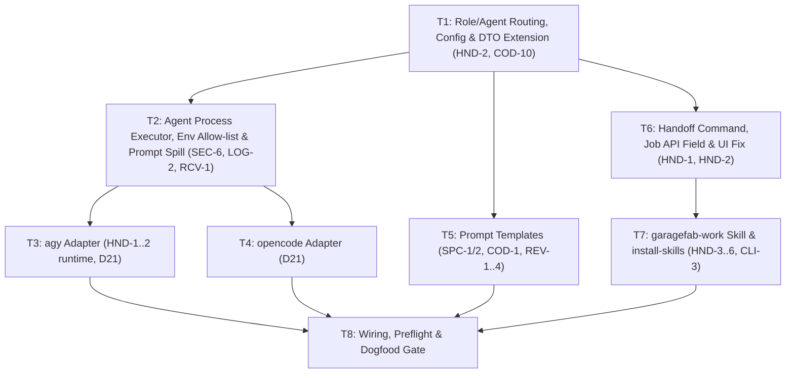

# M5 — Real Agents and Skill

> Status: **Ready for Review (Planning phase complete)**  
> Size: M · Depends on: M3, SA  
> Covers: `HND-1..6`, `CLI-3`, `COD-10` (agent part), `SEC-6` (passthrough), `agy` and `opencode` adapters, prompt templates, `garagefab-work` skill.

## Goal

Real agents replace the fake one in the same pipeline. A `refactor` job completes locally with each of `agy` and `opencode`; the `garagefab-work` skill is installed by `garagefab install-skills`, reads a job through the local API and posts clarification answers back. **The dogfooding gate opens.**

Nothing in `factory` pipeline *logic* changes: the engine keeps validating artifacts, running guardrails and commands, and categorizing failures exactly as in M2/M3. M5 only changes **who executes an agent step** and **what text the agent is given**.

---

## Architectural Role & Boundaries

In accordance with `AGENTS.md` and Clean / Hexagonal Architecture:

- **Factory (`internal/factory`) — Core Domain:**
  - Owns **prompt construction** (`architecture.md` §9.2): pure `text/template` rendering, no I/O. Templates are embedded with `//go:embed`.
  - Owns the pure functions `RoleForStage`, `AgentForRole` (`HND-2`) and `HandoffCommand` (`HND-1`). No process execution, no SQL.
  - Extends its own port DTOs (`AgentRequest`, `AgentResult`, `ProjectConfig`) with `Role`, `Agent`, `Timeout`, `TimedOut`. It still imports neither `worker`, `store`, `server` nor `config`.

- **Worker (`internal/worker/agent`) — Driven Adapter:**
  - Owns subprocess execution of `agy` and `opencode`: argv construction, environment allow-list, process groups, timeouts, stream parsing, structured results. Must not import `store` or `factory`.
  - A `Router` implements `agent.Runner` and dispatches by `AgentRequest.Agent` (`agy` | `opencode` | `fake`).

- **Config (`internal/config`):**
  - `ProjectYAML` gains `agents.{spec,probe,coding,review}` and optional `timeouts.agent`; validation names file and key (`architecture.md` §14).

- **Server (`internal/server`) — Driving Adapter:**
  - `GET /api/jobs/{id}` additionally returns `handoff_command` (`HND-1`) and `worktree_path` (already present). No pipeline logic. Approve/Reject stay session-only (`SEC-4`, `HND-5`).

- **CLI / Composition Root (`cmd/garagefab`):**
  - New `install-skills` subcommand (`CLI-3`, `HND-3`), embedded skill files, `Router` wiring, agent preflight checks. Only place that knows concrete types.

- **Skill (`cmd/garagefab/skills/garagefab-work/`):**
  - Out-of-band human-in-the-loop client. Talks to the local API with the bearer token only. Has no code path to approve/reject.

> [!IMPORTANT]
> **Import rules stay enforced.** `worker/agent` may import `worker/command` (same layer, for `SanitizeEnv`), never `factory`. DTO translation between `factory.AgentRequest` and `agent.AgentRequest` stays in `cmd/garagefab/factory_worker_adapters.go`.

---

## Findings That Shape This Plan

Verified against the current code base and Spike A (`PROJECT_DOCS/spikes/agent-clis.md`):

| # | Finding | Consequence |
|---|---------|-------------|
| F1 | `factory.AgentRequest` has no `Agent`/`Role`; `main.go` hardcodes `agent.NewFakeRunner()` | Routing by role and project config is new work (T1). |
| F2 | `config.ProjectYAML` has no `agents` section although `architecture.md` §14 and `HND-2` require it | Add + validate (T1). |
| F3 | Both CLIs exit `0` on task-level failure (Spike Q6) | Adapters must parse the output envelope (T3, T4); exit code alone is insufficient. |
| F4 | Spike failure fixture: `agy --print --dangerously-skip-permissions "<p>"` makes `--print` swallow the next flag | Always use the attached form `--print=<prompt>` (T3). |
| F5 | `command.SanitizeEnv` drops every var containing `KEY`/`TOKEN`/`AUTH`, **even** names in `engine.env_passthrough`; `EnvPassthrough` is parsed in config but never used; `LC_*` is not allowed though `SEC-6` lists it | Add explicit passthrough that bypasses the blacklist **only** for names the user listed (T2). |
| F6 | `internal/factory/pipeline.go` builds prompts inline (`fmt.Sprintf`), review prompt contains a literal `<id>` | Replace with embedded templates (T5). |
| F7 | `ui/src/components/JobActions.tsx` renders a hardcoded `garagefab work --job <id>`, contradicting `HND-1` | Server computes the command; UI renders it and only for the five eligible statuses (T6). |
| F8 | No step timeout is applied to agent runs today (`StepTimeouts` is parsed only) | Wire `timeouts.agent` for agent steps (T1/T2). Command timeouts are **out of scope** — recorded as warning W1. |
| F9 | `macOS ARG_MAX` ≈ 1 MiB (args + env); review prompts embed a diff | Large prompts are spilled to a file outside the worktree and referenced from a short argv prompt (T2). |
| F10 | `opencode` skill invocation (`opencode garagefab-work 178`) and skill directory are **not** verified by Spike A (only `agy` skill dirs are) | T7 starts with a short verification step; a documented fallback exists. |
| F11 | Probe stage (`03`) is implemented in M7, not M5 | The `probe` template is delivered and unit-tested here, but **not wired** into the pipeline. |

---

## Dependency Graph



---

## Tasks

### T1 — Role/Agent Routing, Config & DTO Extension (`HND-2`, `COD-10`)

**Requirements:** `HND-2`, `COD-10` (agent timeout), `PRJ-*` validation conventions  
**Target Artifacts:**
- `internal/config/project.go`, `internal/config/project_test.go`
- `internal/factory/types.go`, `internal/factory/roles.go`, `internal/factory/roles_test.go`
- `internal/factory/pipeline.go` (populate new request fields; treat `TimedOut` as Blocked)
- `cmd/garagefab/factory_worker_adapters.go`

**What to do:**
1. **Config (`project.go`):** add
   ```go
   Agents struct {
       Spec, Probe, Coding, Review string // yaml: spec, probe, coding, review
   } `yaml:"agents"`
   Timeouts struct{ Agent time.Duration } `yaml:"timeouts"` // optional override
   ```
   Validation: each non-empty value ∈ {`agy`, `opencode`}; `probe` defaults to `coding`; otherwise error `config: project.yaml: agents.coding: unknown agent "foo" (want agy|opencode)`. Missing roles required by the job's work type are detected at job start (see 4).
2. **Domain mapping (`roles.go`, pure):**
   ```go
   func RoleForStage(stage string) (role string, ok bool) // 02→spec 03→probe 04→coding 05→review 06→coding
   func (c ProjectConfig) AgentForRole(role string) string // probe falls back to coding
   ```
3. **DTO extension:** `factory.AgentRequest` += `Role string`, `Agent string`, `Timeout time.Duration`; `factory.AgentResult` += `TimedOut bool`; `factory.ProjectConfig` += `Agents map[string]string`, `AgentTimeout time.Duration`. Engine gets `SetDefaultAgentTimeout(d)` (global `engine.step_timeouts.agent`, default 30m); project value overrides.
4. **Pipeline:** every `agentRunner.Run` call site (spec ≈ L304, coding ≈ L509, review ≈ L858) sets `Role`, `Agent`, `Timeout`. If the resolved agent name is empty the step fails immediately as **Blocked** with message `no agent configured for role "coding" (set agents.coding in .garagefab/project.yaml)`.
5. **Timeout handling:** `res.TimedOut == true` → `FailureBlocked` (spec §8: "Process group terminated; Blocked"); never a repair attempt.
6. **Adapters file:** translate the three new fields in both directions.

**Acceptance Criteria:**
- `HND-2`: table test — stages 02/03/04/05/06 map to spec/probe/coding/review/coding; with `agents.probe` unset, probe resolves to the coding agent.
- Invalid agent name in `project.yaml` → startup/add-project error naming file and key.
- `COD-10`: a fake runner returning `TimedOut: true` makes the step `failed` with category `Blocked` and **no** repair run.
- Existing M1–M4 pipeline tests stay green (fake runner ignores new fields).

---

### T2 — Agent Process Executor, Env Allow-list & Prompt Spill (`SEC-6`, `LOG-2`, `RCV-1`, `COD-10`)

**Requirements:** `SEC-6`, `LOG-2`, `RCV-1`, `COD-10`, `RCV-4`  
**Target Artifacts:**
- `internal/worker/agent/proc.go`, `internal/worker/agent/proc_test.go`
- `internal/worker/agent/router.go`, `internal/worker/agent/router_test.go`
- `internal/worker/agent/agent.go` (request/result extension)
- `internal/worker/command/runner.go` (`SanitizeEnvWithPassthrough`), `runner_test.go`

**What to do:**
1. **Request/result extension (`agent.go`):** `AgentRequest` += `Agent`, `Role`, `Timeout`; `AgentResult` += `TimedOut`, `Cancelled`, `Duration`, `Usage` (optional token counts, informational only).
2. **Env (`runner.go`):** add
   ```go
   func SanitizeEnvWithPassthrough(passthrough []string, custom map[string]string) []string
   ```
   Same allow-list as `SanitizeEnv` plus `LC_*` (fixes F5 / `SEC-6`), plus names in `passthrough` **even if** they match the secret blacklist (the user listed them explicitly). `GARAGEFAB_*` and the API token are **never** passed, even if listed (hard deny, logged as warning at startup). `SanitizeEnv` delegates with `nil`.
3. **Executor (`proc.go`)** — shared by both adapters:
   ```go
   type procSpec struct {
       Binary   string
       Args     []string
       Dir      string
       Env      []string
       LogPath  string
       Timeout  time.Duration
       OnStart  ProcessStartFunc
       OnLine   func(stream, line string) // adapter-specific parsing hook
   }
   func runProc(ctx context.Context, p procSpec) (procResult, error)
   ```
   - `Setpgid: true`; call `OnStart(pid, pgid, start)` **before** reading output (`RCV-1`).
   - Two scanner goroutines (stdout/stderr) with a 2 MiB line buffer; every line is appended to `LogPath` as `[<RFC3339Nano>] [stdout|stderr] <text>` (same format as the command runner, `LOG-2`) and passed to `OnLine`. Memory does not grow with output (only parsed state is kept, not a full buffer — except a bounded 64 KiB tail kept for error summaries).
   - **Timeout/cancel:** derive `ctx` with `Timeout`; on expiry send `SIGTERM` to `-pgid`, wait 10 s grace, then `SIGKILL`. `TimedOut = deadline exceeded && parent ctx alive`; `Cancelled = parent ctx cancelled`.
   - Start failure (`exec: not found`, permission) returns a typed `ErrAgentUnavailable` so the pipeline can categorize **Blocked** (§9.4 "agent process failed to start").
   - **Stdin is `/dev/null`** (Spike Q11).
4. **Prompt delivery with spill (F9):** helper `deliverPrompt(prompt, logPath string) (arg string, cleanup func(), err error)`: if `len(prompt) <= 64 KiB` return it verbatim; else write `prompt_<stepid>.md` next to the log (`~/.garagefab/logs/<job>/`, outside the worktree so it is never committed) and return `Read the full task instructions from <abs path> and follow them exactly.` The spilled file is kept (audit, `LOG-3`-style retention) and 0600.
5. **Router (`router.go`):**
   ```go
   type Router struct { runners map[string]Runner }
   func NewRouter() *Router
   func (r *Router) Register(name string, run Runner)
   func (r *Router) Run(ctx, req) (*AgentResult, error) // unknown name → ErrAgentUnavailable
   ```
   The `fake` runner is registered under `"fake"`.

**Acceptance Criteria:**
- `SEC-6`: with `GARAGEFAB_GITHUB_TOKEN`, `GARAGEFAB_API_TOKEN` set in the test process, a child `env` dump contains neither; with `passthrough=["GEMINI_API_KEY"]` it **does** contain `GEMINI_API_KEY`; `LC_CTYPE` passes; `passthrough=["GARAGEFAB_API_TOKEN"]` is still refused.
- `RCV-1`: `OnStart` is invoked before the first output line is processed (test with a script that sleeps then prints).
- `LOG-2`/NFR: a script printing 10 000 lines yields 10 000 ordered log entries; RSS growth bounded (assert via bounded buffer size, not RSS).
- `COD-10`: script `sleep 60` + 300 ms timeout → `TimedOut=true`, whole process group (including a spawned grandchild) gone within grace + 1 s; no orphan.
- Parent cancel → `Cancelled=true`, group terminated.
- Prompt of 200 KiB triggers spill; argv length stays < 1 KiB; file exists with mode 0600.
- Unknown agent name or missing binary → `ErrAgentUnavailable`.

---

### T3 — `agy` Adapter (D21, Spike Q1–Q8)

**Requirements:** D21, `COD-10`, `SPC-1`, `REV-2`  
**Target Artifacts:**
- `internal/worker/agent/agy.go`, `internal/worker/agent/agy_test.go`
- `internal/worker/agent/testdata/agy/{success,agent_failure,garbage}.stdout`, `fake_agy.sh`

**What to do:**
1. **Struct:** `type AgyRunner struct { Binary string; EnvPassthrough []string }` (`Binary` defaults to `agy`; overridable for tests).
2. **Invocation (F4):**
   ```
   agy --print=<prompt> --dangerously-skip-permissions --output-format json --effort <low|medium|high>
   ```
   cwd = `req.WorktreePath`. **Never** `--continue`/`--conversation` (fresh session, adapter obligation 1). Effort by role: `coding` → `medium`, `spec`/`review`/`probe` → `high` (Spike §3.3); constants, no new config key.
3. **Result mapping:** after exit, locate the **last stdout line starting with `{`**, `json.Unmarshal` into `{conversation_id,status,response,duration_seconds,usage}`:

   | Process exit | Envelope | `AgentResult.ExitCode` | Summary |
   |--------------|----------|------------------------|---------|
   | 0 | `status == "SUCCESS"` | 0 | first 500 chars of `response` |
   | 0 | `status != SUCCESS` | 1 | `agy reported status <X>` |
   | 0 | missing / not JSON | 1 | `agy produced no result envelope` |
   | ≠ 0 | any | process exit code | stderr tail |
   | timeout | — | 124 + `TimedOut` | `agent timed out after <d>` |

   Rationale: the pipeline treats non-zero exit as Flawed (repair loop), which is the correct response to a task-level failure; timeout is Blocked via `TimedOut`.
4. **Skills disabled in headless runs:** pass `--disable-slash-commands` so a user's global skills cannot change a pipeline step's behavior (determinism).
5. **No artifact interpretation:** the adapter does not read `spec.md`/`review.json`; the engine validates them (obligation 5, `architecture.md` §11.2).

**Acceptance Criteria:**
- Contract tests against recorded Spike fixtures (`PROJECT_DOCS/spikes/fixtures/agy/*` copied into `testdata/`) via a stub shell script: success → exit 0; fixture `failure_stdout` envelope with `status != SUCCESS` → exit 1; garbage → exit 1.
- Argv assertion test: contains `--print=` attached form, `--dangerously-skip-permissions`, `--output-format json`, and does **not** contain `--continue`/`--conversation`.
- Env assertion: child sees only allow-listed variables.
- `go test` never needs the real `agy` binary.

---

### T4 — `opencode` Adapter (D21, Spike Q1–Q8)

**Requirements:** D21, `COD-10`, `LOG-2`  
**Target Artifacts:**
- `internal/worker/agent/opencode.go`, `internal/worker/agent/opencode_test.go`
- `internal/worker/agent/testdata/opencode/{success.ndjson,truncated.ndjson,error_event.ndjson}`, `fake_opencode.sh`

**What to do:**
1. **Struct:** `type OpenCodeRunner struct { Binary string; EnvPassthrough []string }`.
2. **Invocation:** `opencode run --auto --format json --dir <worktree> <prompt>` with cwd = worktree. Prompts always begin with a `# ` markdown heading (T5), so the positional message can never be parsed as a flag. No `--continue`/`--session`.
3. **Streaming parse:** each stdout line is NDJSON; keep only O(1) state:
   - `step_start` count, last `step_finish.part.reason`;
   - any `{"type":"error"}` event → failure with its message;
   - `tool_use` events with `part.state.status` are forwarded to the log as-is (SSE shows activity live through the log tail, `UI-7`).
   Non-JSON lines (banners, stderr noise) are logged but ignored.
4. **Result mapping:**

   | Process exit | Stream | `ExitCode` | Summary |
   |--------------|--------|------------|---------|
   | 0 | ≥1 `step_finish`, last reason ∈ {`stop`}, no error event | 0 | last `text` part (≤500 chars) |
   | 0 | error event | 1 | event message |
   | 0 | no `step_finish` (truncated) | 1 | `opencode stream ended without step_finish` |
   | ≠ 0 | any | exit code | stderr tail |
   | timeout | — | 124 + `TimedOut` | — |
5. **Assumption to verify (A1):** the exact shape of an `error` event is **not** in the Spike fixtures (the recorded failure used the plain format). T4 begins by recording a real failing run with `--format json` into `testdata/opencode/error_event.ndjson`; until recorded, the "no `step_finish`" rule is the authoritative failure signal and the error-event rule is additive.

**Acceptance Criteria:**
- Contract tests on `success.ndjson` (from Spike fixture), `truncated.ndjson`, `error_event.ndjson` through the stub script.
- A 50 000-line synthetic stream is processed with bounded memory (test asserts the parser keeps no per-line slice).
- Argv assertions mirror T3.
- Real-binary tests exist behind `//go:build realagent` and are skipped in `make ci`.

---

### T5 — Prompt Templates (`SPC-1/2`, `COD-1`, `COD-9`, `REV-1..4`, `PRB`)

**Requirements:** `SPC-1`, `SPC-2`, `COD-1`, `COD-5`, `COD-9`, `APR-6`, `REV-1..4`  
**Target Artifacts:**
- `internal/factory/prompts/{spec,coding,review,probe}.md.tmpl` (`//go:embed`)
- `internal/factory/prompt.go`, `internal/factory/prompt_test.go`
- `internal/factory/testdata/prompts/*.golden`
- `internal/factory/pipeline.go` (replace the three inline `fmt.Sprintf` builders)

**What to do:**
1. **Renderer (pure):**
   ```go
   type PromptData struct {
       JobID int64; WorkType, Intent string
       ArtifactDir string            // ".garagefab/jobs/<id>"
       Spec, Clarification string
       RepairFeedback string; RejectionNotes []string
       BuildCmds, TestCmds, LintCmds []string
       ProtectedPaths []string; ProbeFiles []string
       Diff string; CommandSummary []string; ProbeResult string
   }
   func RenderPrompt(role string, d PromptData) (string, error)
   ```
   Uses `text/template` with `missingkey=error`; unknown role → error.
2. **Fixed section order** (determinism, `architecture.md` principle): every prompt starts with `# Garagefab <Role> Task` then `## Role & Rules`, `## Context`, `## Required Output`, `## Constraints`. Sections for absent data (no repair feedback, no rejection) are **omitted entirely**, never rendered empty.
3. **`spec` template:**
   - Context: intent, `clarification.md` history (`SPC-1`), repair feedback.
   - Rules: *never assume on ambiguity* (`SPC-2`); produce **exactly one** of `<ArtifactDir>/clarification-questions.md` (numbered `Q1.` paragraphs, §6.4) or `<ArtifactDir>/spec.md` (inlined heading list from §6.1; `## Reproduction` only for `bug_fix`, `OQ-10`); do not modify source files; do not run git commit.
4. **`coding` template:**
   - Context: approved spec (or intent for refactor/docs, `COD-1`), rejection notes (`APR-6`), **previous failure output only** — never earlier conversation (`COD-1` repair acceptance).
   - Rules: do not `git commit` (`COD-9`); existing files matching `ProtectedPaths` must not be modified (new files allowed, `GRD-1`); probe files untouched (`COD-8`); the configured build/test/lint commands are listed so the agent can self-check; make a real change (`COD-7`).
5. **`review` template:**
   - Context: spec/intent, diff, command summary, probe result. **Never** coding-agent output (`REV-1`).
   - Required output: `review.json` at the real `<ArtifactDir>/review.json` (fixes F6), schema §6.2 inlined, scores 1–5, `approve` must not carry a `blocking` finding.
   - Rules: scope-bound — findings about the change, pre-existing debt under `warnings` (`REV-3`); **must not modify any other file** (`REV-4`).
6. **`probe` template:** `probe.json` schema §6.3; delivered and golden-tested, **not wired** until M7 (F11).
7. **Pipeline:** the three call sites build `PromptData` and call `RenderPrompt`; the existing `[Automated Repair Feedback on Previous Attempt]` and `[Rejection Note from Gate]` marker lines are kept verbatim as section titles so existing tests asserting them continue to pass.
8. **Template hygiene:** all prompts are ASCII-safe English, start with `# `, contain no secrets (no API token, no env values).

**Acceptance Criteria:**
- Golden-file tests per role × scenario (first run, repair, after rejection, bug_fix variant) — byte-exact, regenerated with `-update`.
- `COD-1`: coding repair prompt contains the previous failure output and no text from an earlier agent response.
- `REV-1`: review prompt for a job with step logs present contains none of the coding step's agent output.
- `SPC-1/2`: spec prompt contains the "exactly one" and "never assume" rules and the 7 required headings.
- Omitted-section tests: no `## Repair` header when feedback is empty.
- Missing template variable → render error (`missingkey=error`), not silent empty text.

---

### T6 — Handoff Command, Job API Field & UI Fix (`HND-1`, `HND-2`)

**Requirements:** `HND-1`, `HND-2`, `HND-4` (data availability)  
**Target Artifacts:**
- `internal/factory/handoff.go`, `internal/factory/handoff_test.go`
- `internal/server/api_job.go`, `internal/server/api_job_test.go`
- `ui/src/components/JobActions.tsx`, `ui/src/lib/api.ts` (type)

**What to do:**
1. **Pure function (`handoff.go`):**
   ```go
   func HandoffCommand(projectPath, agent string, jobID int64) string
   // → "cd '/Users/me/my app' ; agy garagefab-work 178"
   func HandoffEligible(status string) bool // needs_clarification, spec_review, awaiting_approval, failed, interrupted
   ```
   Quoting: a path is single-quoted when it contains any character outside `[A-Za-z0-9_@%+=:,./-]`; embedded `'` is rendered `'\''`. Safe paths are left bare.
2. **Server:** `GET /api/jobs/{id}` adds `handoff_command` (string, empty when not eligible). Agent = `AgentForRole(RoleForStage(job.Stage))` from the project config; if unresolved, empty string.
3. **UI:** `JobActions.tsx` removes the hardcoded `garagefab work --job` string (F7), renders `job.handoff_command` and shows the copy button only when non-empty.
4. **Regression guard:** a server test asserts the `Authorization: Bearer` token yields `403` on `POST /api/jobs/{id}/approve` and `/reject` (`HND-5`, `SEC-4`) — already implemented in M2, locked here with a named test `TestApprove_BearerOnly_HND5`.

**Acceptance Criteria:**
- `HND-1`: project at `/Users/me/my app`, job 178, `agents.spec: agy` → `cd '/Users/me/my app' ; agy garagefab-work 178`; path with `'` is escaped; safe path unquoted.
- `HND-2`: job in stage 04 with `agents.coding: opencode` → command uses `opencode`.
- `HND-1`: statuses `queued`, `running`, `done`, `cancelled` → empty command and no button; the five listed statuses → button.
- UI build passes (`npm run build`), copy button copies exactly the server-provided string.

---

### T7 — `garagefab-work` Skill & `install-skills` (`HND-3..6`, `CLI-3`)

**Requirements:** `HND-3`, `HND-4`, `HND-5`, `HND-6`, `CLI-3`, `SEC-3`, `SEC-4`  
**Target Artifacts:**
- `cmd/garagefab/skills/garagefab-work/SKILL.md`
- `cmd/garagefab/skills/garagefab-work/scripts/gf-api.sh`
- `cmd/garagefab/skills/embed.go` (`//go:embed all:garagefab-work`)
- `cmd/garagefab/install_skills.go`, `cmd/garagefab/install_skills_test.go`

**What to do:**
0. **Verification step first (F10):** with `agy 1.2.14` and `opencode 1.18.34`, install a stub skill and confirm (a) the skill directory each CLI scans and (b) how `<agent> garagefab-work 178` resolves to the skill. Record results in `PROJECT_DOCS/spikes/agent-clis.md` §5 (addendum). **Fallback** if `opencode <skill> <arg>` is not valid: the handoff for `opencode` becomes `cd <path> ; opencode run "/garagefab-work 178"` (or the documented equivalent). Per the working agreement this is a spec change (`HND-1` example) and is committed to the docs **first**, in its own PR, before T6/T7 code is finalized.
1. **Skill (`SKILL.md`)** — frontmatter `name: garagefab-work`, `description:` ("Use when the user runs `garagefab-work <job-id>`…"). Body instructs the agent to:
   1. Read the job: `scripts/gf-api.sh GET /api/jobs/<id>` (stage, status, worktree path, handoff, current questions / draft spec reference).
   2. Fetch artifacts by allow-listed name (`intent`, `clarification-questions`, `clarification`, `spec`, `review`, `evidence`) and, for `failed`/`interrupted`, the last failing step log (`/api/jobs/<id>/steps`, `/steps/<stepId>/log`).
   3. `cd` into `worktree_path` and work **only there** (`HND-4`).
   4. `needs_clarification`: discuss each question with the user, then `scripts/gf-api.sh POST /api/jobs/<id>/clarification '{"answers":[{"q":1,"answer":"…"}]}'` (`SPC-3`, `HND-5`).
   5. `spec_review`: edit `<worktree>/.garagefab/jobs/<id>/spec.md` in place with the user; **do not** commit; tell the user to click Approve in the dashboard — the file is re-read and re-validated at Approve (`HND-6`, `SPC-6`).
   6. **Never** approve, reject, cancel or retry; tell the user to do that in the dashboard (`HND-5`, `APR-7`).
2. **Helper (`gf-api.sh`)** — POSIX sh, requires `curl`. Reads `server.listen` and `server.api_token` from `~/.garagefab/config.yaml` (override `GARAGEFAB_HOME`), sends `Authorization: Bearer`, never echoes the token. **Defense in depth:** the script itself only permits `GET /api/jobs/*` and `POST /api/jobs/<id>/clarification`; any other method/path exits 2 with `refused: not permitted by garagefab-work`.
3. **Install command (`install_skills.go`, `CLI-3`):**
   - Cobra subcommand `install-skills` with a `--dry-run` flag.
   - Targets (resolved from `os.UserHomeDir()` so tests can set `HOME`):
     - `agy` → `~/.gemini/antigravity/skills/garagefab-work/` (Spike P-8; confirmed in step 0)
     - `opencode` → directory confirmed in step 0
   - An agent counts as **found** if its binary is on `PATH` or its config directory exists.
   - For each found agent: write the embedded tree (files `0644`, scripts `0755`, dirs `0755`), overwrite-idempotent, print `installed: <path>`. For each missing agent print `skipped: <agent> not found`. Exit 1 only if a write fails; a machine with neither agent installed exits 0 with the skip notes (not an error, `HND-3`).
   - Writes use temp-dir + rename so a failed install never leaves a half-written skill.
4. **Docs:** `README`/`AGENTS.md` command list gains `install-skills` (already in `architecture.md` §5).

**Acceptance Criteria:**
- `HND-3`: with `HOME` = temp dir, both agent dirs present → two `installed:` lines and files on disk with correct modes; only `agy` present → one `installed:`, one `skipped:` note; re-running changes nothing (idempotent).
- `HND-4`/`HND-5`: against a test server (`httptest`) with a job in `needs_clarification`: the script fetches job + questions + `worktree_path`, posts answers, `clarification.md` exists and job returns to `02`/`queued`.
- `HND-5`: script refuses `POST .../approve`, `.../reject` locally (exit 2); direct bearer call to the server returns `403`.
- `HND-6`: e2e — spec edited in the worktree, Approve records the SHA-256 of the edited file; invalid edit → `422 validation_failed` (covered by the existing M3 test, re-run in the M5 e2e).
- `CLI-3`: `garagefab install-skills --dry-run` prints targets and writes nothing.
- Token never appears in script stdout/stderr (test greps output).

---

### T8 — Wiring, Preflight & Dogfood Gate

**Requirements:** `HND-1..6`, `CLI-3`, `COD-10`, `SEC-6`, `RCV-1`, R3 (version drift)  
**Target Artifacts:**
- `cmd/garagefab/main.go`, `cmd/garagefab/checks.go`, `checks_test.go`
- `cmd/garagefab/e2e_m5_test.go` (stub binaries, runs in CI)
- `cmd/garagefab/e2e_m5_real_test.go` (`//go:build realagent`)
- `PROJECT_DOCS/milestones/M5-dogfood.md` (manual runbook + evidence)

**What to do:**
1. **Wiring:** build one `agent.Router`: register `agy` (`AgyRunner{EnvPassthrough: cfg.Engine.EnvPassthrough}`), `opencode`, and `fake`. Pass it through `newFactoryAgentAdapter`. Engine gets `SetDefaultAgentTimeout(cfg.Engine.StepTimeouts.Agent)`.
2. **Fake override:** hidden flag `garagefab start --fake-agent` / env `GARAGEFAB_FAKE_AGENT=1` routes every role to `fake`. Required for demo/CI paths that previously relied on the hardcoded fake. *Before coding*, grep `e2e_*_test.go` to confirm which tests go through `main.go` wiring and set the override there.
3. **Preflight (`checks.go`):** at `start`, for each distinct agent referenced by registered projects: `exec.LookPath`, run `<bin> --version`, compare with tested versions (`agy 1.2.14`, `opencode 1.18.34`, constants next to the adapters). Missing binary → **warning** on stdout and a dashboard-visible event (jobs needing it fail Blocked with a clear message); version mismatch → **warning only** (R3), never a hard failure.
4. **Stub e2e (CI):** project with `agents: {spec: agy, coding: opencode, review: agy}` where `PATH` points to stub scripts replaying recorded fixtures; assert: feature job → clarification → answers via bearer (skill script) → spec_review → session Approve → coding → review → awaiting_approval → approve → done; stub `agy` prints a hanging mode for the timeout path.
5. **Dogfood gate (manual, evidence in `M5-dogfood.md`):** on a scratch Go repo run a `refactor` job twice — once with all roles `agy`, once with all roles `opencode` — and record: job id, final status, step durations, evidence summary. Then run a `feature` job with `agy` spec and exercise the skill handoff end to end.

**Acceptance Criteria:**
- `make ci` green (`lint`, `vet`, `test`, `build`, `CGO_ENABLED=0`).
- Stub e2e passes for both agents and the timeout → Blocked path.
- `start` with a missing configured agent prints a warning and does not crash; mismatched version prints a warning only.
- Real `refactor` job reaches `done` with `agy`, and with `opencode` (manual evidence committed).

---

## Acceptance Scenarios & Test Plan

1. **Unit tests:** `roles_test`, `handoff_test`, `prompt_test` (golden), `proc_test`, `router_test`, `agy_test`, `opencode_test`, `install_skills_test`, `config/project_test`, `command/runner_test` (env). Table-driven; test names carry requirement IDs, e.g. `TestSanitizeEnv_Passthrough_SEC6`, `TestHandoff_PathWithSpaces_HND1`, `TestAgy_ExitZeroButFailed_D21`.
2. **Contract tests:** adapters run against the Spike A fixtures through stub scripts — deterministic, offline, no API keys.
3. **E2E (`e2e_m5_test.go`):** spec §10 Scenario 2 (*Clarification*, `HND-1/4/5`) and Scenario 1 happy path with stub agents.
4. **Opt-in real-agent tests:** `go test -tags realagent ./cmd/garagefab -run RealAgent`; documented in the runbook, excluded from `make ci`.
5. **Frontend:** `cd ui && npm run build` clean.

---

## Exit Criteria

- [ ] All 8 tasks (T1..T8) are implemented and covered by automated tests.
- [ ] `make ci` passes cleanly.
- [ ] A real `refactor` job completes locally with each of `agy` and `opencode` (evidence in `M5-dogfood.md`).
- [ ] `garagefab install-skills` installs the skill and reports each path.
- [ ] The skill reads a job and posts clarification answers; bearer-only approve returns `403`.
- [ ] **The dogfooding gate opens.**

---

## Out-of-Scope Observations (Warnings)

| ID | Observation | Disposition |
|----|-------------|-------------|
| W1 | `timeouts.command` / `engine.step_timeouts.command` is parsed but not applied by the command runner (`COD-10` command part) | Separate issue; not fixed in M5 |
| W2 | Probe stage and `COD-8` wiring belong to M7 | `probe` template ships here, unused |
| W3 | Docs change needed if T7 step 0 invalidates the `opencode garagefab-work <id>` form | Docs-first PR per working agreement |

## Risks

| ID | Risk | Mitigation |
|----|------|------------|
| R1 | An agent CLI has no dependable headless mode | Closed by Spike A; `procSpec` keeps the launcher separate so a PTY launcher can be added later |
| R2 | Agents produce invalid or missing artifacts | Strict schemas, repair loop, golden-tested prompts with inlined schemas, recorded fixtures |
| R3 | Agent CLIs change flags/output between versions | Tested versions recorded as constants, preflight warns on drift, contract tests on fixtures |
| R4 | Exit code `0` on agent-level failure | Envelope parsing (T3/T4) + engine artifact validation + COD-7 "no changes" check |
| R5 | `opencode` error-event shape unverified (A1) | Record real fixture first in T4; "no `step_finish`" is a sufficient failure signal meanwhile |
| R6 | Skill invocation form or skill directory differs from assumption (F10) | T7 step 0 verification; documented fallback; docs-first change |
| R7 | Large prompts exceed `ARG_MAX` | Prompt spill to file outside the worktree (T2) |
| R8 | Passing API keys to agents leaks secrets | Explicit allow-list only; `GARAGEFAB_*` hard-denied; startup warning listing passthrough names |
| R9 | Global user skills/plugins alter headless runs | `agy --disable-slash-commands`; `opencode` run in a clean `--dir` with project instructions only |
