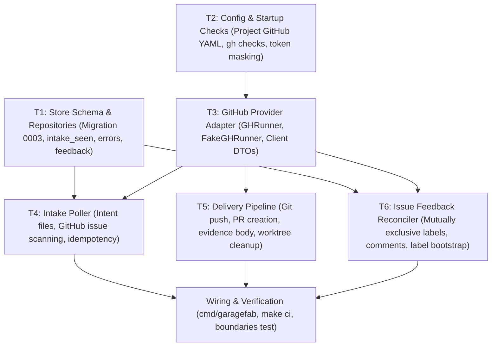

# M6 — GitHub and Delivery

> Status: **Proposed (Full Specification — Planning Gate)**  
> Size: M · Depends on: M4  
> Covers: `INT-2..7`, `GHB-1..5`, `DLV-1..6`, the poller, issue feedback reconciler.

---

## Goal

Jobs enter from GitHub issues and intent files, execute through the SDLC pipeline, and leave as published pull requests with full audit evidence and issue status synchronization.

---

## Architectural Role & Boundaries

In accordance with `AGENTS.md` and Hexagonal / Clean Architecture boundaries:
- **Factory (`internal/factory`):** Defines the outbound ports `PullRequestProvider` (for PR lookup and creation) and extends `WorktreeManager` with `Push`. Orchestrates the delivery step in `StageDone` (`07_Done/queued` → `07_Done/running` → `07_Done/done` or `07_Done/failed`). Factory **never** imports `store`, `worker`, `provider`, or `server`, and never invokes subprocesses or executes SQL directly.
- **Worker (`internal/worker/worktree`):** Implements `Push(ctx, worktreePath, remote, branch)` using system `git`. Worker **never** imports `store` or `provider`.
- **Store (`internal/store`):** Owns SQL migrations (`0003_github_intake.sql`) and repositories for idempotency tracking (`intake_seen`), intake/provider errors (`intake_errors`), and applied issue feedback (`github_feedback`).
- **Provider (`internal/provider/github`):** Driven adapter executing the GitHub CLI (`gh`) via `os/exec` behind a mockable `GHRunner` interface. Returns pure DTOs. It **never** imports `factory`, `store`, `server`, `worker`, or `intake` (Import Rule 6).
- **Intake (`internal/intake`):** Driving adapter running a background poller (every 30s) across all registered projects. Scans `*-intent.md` files (`INT-2`) and queries GitHub issues via `IssueSource` (`INT-3`). Reconciles issue status labels and comments asynchronously via `IssueFeedback` (`GHB-2`).
- **Composition Root (`cmd/garagefab`):** Wires concrete adapters (`ExecGHRunner` → `github.Client` → adapters adapting DTOs to `factory.PullRequestProvider`, `intake.IssueSource`, `intake.IssueFeedback`), executes startup environment and CLI checks (`CLI-7`), and starts the intake poller supervisor.

---

## Dependency Graph



---

## Tasks

### T1 — Store Schema & Repositories (`INT-4`, `INT-5`, `GHB-2`, `GHB-5`, `DLV-1`)

**Requirements:** `INT-4`, `INT-5`, `GHB-2`, `GHB-5`, `DLV-1`  
**Artifacts:**
- `internal/store/migrations/0003_github_intake.sql`
- `internal/store/intake_repo.go`, `internal/store/intake_repo_test.go`
- `internal/store/feedback_repo.go`, `internal/store/feedback_repo_test.go`
- `internal/store/overview_repo.go` (updates for `IntakeErrors`)
- `internal/store/job_repo.go` (add `UpdateJobPR`)

**What to do:**
1. Create Goose migration `0003_github_intake.sql` with three tables:
   ```sql
   CREATE TABLE intake_seen (
       id           INTEGER PRIMARY KEY AUTOINCREMENT,
       project_id   INTEGER NOT NULL REFERENCES projects(id),
       source       TEXT NOT NULL,          -- 'intent_file' | 'github_issue'
       ref          TEXT NOT NULL,          -- relative file path | 'owner/repo#123'
       content_hash TEXT NOT NULL DEFAULT '',
       job_id       INTEGER NOT NULL REFERENCES jobs(id),
       created_at   TEXT NOT NULL,
       UNIQUE (project_id, source, ref)
   );
   CREATE TABLE intake_errors (
       project_id INTEGER NOT NULL REFERENCES projects(id),
       source     TEXT NOT NULL,          -- 'intent_file' | 'github_issue' | 'provider'
       ref        TEXT NOT NULL,          -- file path, issue ref, or project key
       message    TEXT NOT NULL,
       updated_at TEXT NOT NULL,
       PRIMARY KEY (project_id, source, ref)
   );
   CREATE TABLE github_feedback (
       job_id        INTEGER PRIMARY KEY REFERENCES jobs(id),
       applied_state TEXT NOT NULL,       -- e.g. 'in-progress', 'needs-approval', 'delivered'
       updated_at    TEXT NOT NULL
   );
   ```
2. Implement `CreateJobFromIntake(ctx, job, seen)` inside a single database transaction (`store.InTx`):
   - Inserts the `jobs` row.
   - Records the `job.created` event in `events`.
   - Inserts the `intake_seen` row. If `UNIQUE (project_id, source, ref)` conflicts, transaction aborts and returns an error (`INT-4`).
3. Implement `UpsertIntakeError`, `ClearIntakeError`, `ListIntakeErrors` in `internal/store/intake_repo.go`.
4. Update `OverviewRepo.GetOverviewData`: query active errors from `intake_errors` and populate the `IntakeErrors []string` slice (previously hardcoded to empty).
5. Add `GetFeedbackState` and `SetFeedbackState` in `internal/store/feedback_repo.go`.
6. Add `UpdateJobPR(ctx, jobID int64, prURL string)` in `internal/store/job_repo.go` and expose it on `StoreTx`.

**Acceptance Criteria:**
- Re-inserting the same `(project_id, source, ref)` fails with duplicate key error and leaves DB untouched (`INT-4`).
- Migration applies cleanly forward and backward against SQLite in WAL mode.
- Overview query returns real intake errors stored in SQLite.

---

### T2 — Configuration & Startup Validation (`GHB-1`, `GHB-3`, `GHB-4`, `CLI-7`, `PRJ-4`, `LOG-6`, `SEC-6`)

**Requirements:** `GHB-1`, `GHB-3`, `GHB-4`, `CLI-7`, `PRJ-4`, `LOG-6`, `SEC-6`  
**Artifacts:**
- `internal/config/project.go`, `internal/config/project_test.go`
- `internal/config/config.go`, `internal/config/config_test.go`
- `internal/worker/agent/agy.go`, `internal/worker/agent/opencode.go`
- `cmd/garagefab/main.go`

**What to do:**
1. In `internal/config/project.go`, add `ProjectGitHub` schema to `ProjectYAML`:
   ```go
   type ProjectGitHub struct {
       Repo           string `yaml:"repo"`             // "owner/name"
       IntakeLabel    string `yaml:"intake_label"`     // default "garagefab" (P3)
       PRIssueKeyword string `yaml:"pr_issue_keyword"` // "closes" or "refs" (default "closes")
   }
   ```
   Validate: if `repo` is provided, verify `owner/name` format (`strings.Count(repo, "/") == 1`). Validate `pr_issue_keyword` is either `"closes"` or `"refs"`. Set defaults: `intake_label = "garagefab"`, `pr_issue_keyword = "closes"`.
2. Remove global `GitHubConfig` (`TokenEnv`), default `GARAGEFAB_GITHUB_TOKEN`, and `github:` section from default `config.yaml`.
3. In `internal/worker/agent/agy.go` and `opencode.go`, enforce environment sanitization:
   - Ensure `GH_TOKEN` and `GITHUB_TOKEN` are not in the base subprocess allow-list (`SEC-6`).
   - If user adds `GH_TOKEN` or `GITHUB_TOKEN` to `engine.env_passthrough`, reject or filter them out explicitly (`GHB-4`).
4. Update log masking logic (`LOG-6`): if `GH_TOKEN` or `GITHUB_TOKEN` is present in Garagefab's OS environment, register its value in the output sanitizer so it is replaced with `***`.
5. Implement `CLI-7` startup check: if any project in DB has `github.repo` set, execute `gh --version` (pin minimum version `2.0.0`) and `gh auth status`. On failure, log `slog.Warn` and record a provider error in `intake_errors`; **do not exit fatally** (Decision P1).

**Acceptance Criteria:**
- Invalid `github.repo` (e.g. `invalid-repo`) is rejected during `project.yaml` loading with file and key name.
- Child agent processes receive neither `GH_TOKEN` nor `GITHUB_TOKEN`.
- Startup check warns and continues when `gh` is unauthenticated or missing.

---

### T3 — GitHub Provider Adapter (`GHB-1`, `GHB-4`, `DLV-1`, `DLV-2`, `DLV-5`, `INT-3`)

**Requirements:** `GHB-1`, `GHB-4`, `DLV-1`, `DLV-2`, `DLV-5`, `INT-3`  
**Artifacts:**
- `internal/provider/github/runner.go`
- `internal/provider/github/runner_test.go`
- `internal/provider/github/fake_runner.go`
- `internal/provider/github/client.go`
- `internal/provider/github/client_test.go`
- `internal/provider/github/errors.go`

**What to do:**
1. Define the `GHRunner` interface:
   ```go
   type GHRunner interface {
       Run(ctx context.Context, stdin []byte, args ...string) ([]byte, error)
   }
   ```
2. Implement `DefaultGHRunner`:
   - Runs `exec.CommandContext(ctx, "gh", args...)`.
   - Passes `GH_PROMPT_DISABLED=1`, `GH_NO_UPDATE_NOTIFIER=1`, `NO_COLOR=1` in environment.
   - Masks tokens in captured stderr on errors.
   - Pipes `stdin` if non-nil.
3. Implement `FakeGHRunner`:
   - Thread-safe mock storing calls (args, stdin) and matching configured stub responses by prefix/arguments.
4. Implement `Client` methods in `internal/provider/github/client.go`:
   - `ListIssues(ctx, repo, label)`: calls `gh issue list --repo <repo> --label <label> --state open --limit 100 --json number,title,body,labels,url`.
   - `EnsureLabel(ctx, repo, name, color, description)`: calls `gh label create <name> --repo <repo> --color <color> --description <desc> --force` (idempotent).
   - `EditLabels(ctx, repo, issueNum, add, remove)`: calls `gh issue edit <num> --repo <repo> --add-label ... --remove-label ...`.
   - `Comment(ctx, repo, issueNum, body)`: calls `gh issue comment <num> --repo <repo> --body-file -` with body passed via stdin.
   - `FindPR(ctx, repo, head)`: calls `gh pr list --repo <repo> --head <head> --state all --json number,url,state`.
   - `CreatePR(ctx, repo, base, head, title, body)`: calls `gh pr create --repo <repo> --base <base> --head <head> --title <title> --body-file -`.
   - `CheckVersion(ctx)` and `CheckAuth(ctx)`.
5. Map exit codes and error outputs to typed sentinels in `errors.go`:
   - `ErrGHNotInstalled`, `ErrGHNotAuthenticated`, `ErrGHRateLimited`, `ErrGHNotFound`.
6. Enforce `DLV-5`: static test `TestDelivery_NeverMerges_DLV5` confirming no source code in `internal/` issues a `merge` command to `gh`.

**Acceptance Criteria:**
- All client methods pass with `FakeGHRunner` with zero network access and 100% table-driven coverage.
- Rule 6 enforced: `internal/provider/github` imports zero internal packages.

---

### T4 — Intake Poller (`INT-2..7`, `GHB-3`)

**Requirements:** `INT-2..7`, `GHB-3`  
**Artifacts:**
- `internal/intake/poller.go`, `internal/intake/poller_test.go`
- `internal/intake/intent_scanner.go`
- `internal/intake/issue_scanner.go`
- `internal/intake/interfaces.go`

**What to do:**
1. Define consumer-side ports inside `internal/intake`:
   ```go
   type IssueSource interface {
       ListTriggerIssues(ctx context.Context, repo, label string) ([]IssueDTO, error)
   }
   type SchedulerNotifier interface {
       Wake()
   }
   ```
2. Implement Poller loop:
   - Ticker with `poll_interval` (default 30s).
   - Non-overlapping execution guarantee (`INT-6`): single goroutine, skip tick if previous sweep is still executing.
3. For each active project:
   - **Intent files (`INT-2`):** scan `<repo>/.garagefab/intents/*-intent.md`. Parse YAML front matter (`type`, optional `title`). If `type` invalid/missing, upsert `intake_errors`. If valid and path not in `intake_seen`, create job via `store.CreateJobFromIntake`.
   - **GitHub issues (`INT-3`):** if `project.github.repo` is empty, skip (`GHB-3`). Otherwise call `IssueSource.ListTriggerIssues`. For each issue:
     - Check `intake_seen` for `owner/repo#<num>` (`INT-4`).
     - Inspect labels for `type:<work_type>`. Must have exactly one valid type (`bug_fix|feature|refactor|docs`). If missing, unknown, or duplicate, upsert an intake error and **do not create a job or mark seen** (Decision U5).
     - If valid, call `store.CreateJobFromIntake` with `source = "github_issue"`, `source_ref = "owner/repo#<num>"`, title and body. Clear any prior intake error for this ref.
   - On provider network/auth errors, upsert a `provider` intake error and continue next project (`INT-5`).
4. Trigger `scheduler.Wake()` whenever a job is created (`INT-7`).

**Acceptance Criteria:**
- Re-polling sees no duplicate job creation (`INT-4`).
- Issue with missing or invalid `type:` label records error on overview and creates no job; adding label on subsequent poll creates job (`INT-3`).
- Single-cycle failure does not crash the service (`INT-5`).

---

### T5 — Delivery Pipeline (`DLV-1..6`, `WKT-6`)

**Requirements:** `DLV-1..6`, `WKT-6`  
**Artifacts:**
- `internal/factory/types.go` (define `PullRequestProvider`, extend `WorktreeManager`)
- `internal/factory/delivery.go`, `internal/factory/delivery_test.go`
- `internal/factory/pipeline.go` (update `Approve` transition)
- `internal/worker/worktree/manager.go` (implement `Push`)

**What to do:**
1. In `internal/factory/types.go`:
   - Extend `WorktreeManager` with:
     ```go
     Push(ctx context.Context, worktreePath, remote, branch string) error
     ```
   - Define PR structures and outbound port:
     ```go
     type PullRequest struct {
         Number int
         URL    string
         State  string // "OPEN", "CLOSED", "MERGED"
     }
     type PullRequestRequest struct {
         Repo, Base, Head, Title, Body string
     }
     type PullRequestProvider interface {
         FindPullRequest(ctx context.Context, repo, head string) (*PullRequest, error)
         CreatePullRequest(ctx context.Context, req PullRequestRequest) (*PullRequest, error)
     }
     ```
2. Update Final Approval transition in `internal/factory/pipeline.go`:
   - When human approves at `06_Human_Approval_Gate`/`awaiting_approval`, transition job to `07_Done`/`queued` and record approval in `approvals` table.
3. Implement `ExecuteDelivery` step in `internal/factory/delivery.go`:
   - Scheduler claims job: `07_Done`/`running`.
   - Verify `github.repo` is configured. If empty, fail job as `Blocked` with clear diagnostic (`DLV-6`).
   - Determine remote: if `base_ref` has remote prefix (e.g. `origin/main`), remote is `origin`. If local (`main`), remote is `origin` (Decision P2).
   - Execute `wtMgr.Push(ctx, worktreePath, remote, job.BranchName)`. If push fails, fail step with `FailureCategoryBlocked` (`DLV-3`).
   - Query `prs.FindPullRequest(ctx, repo, job.BranchName)` (`DLV-2`):
     - If open PR exists, reuse its URL.
     - If merged or closed PR exists, fail delivery as `FailureCategoryBlocked` (Decision P4).
     - If none, assemble PR body: evidence summary (`evidence.md`), artifact links, plus `Closes #<n>` (or `Refs #<n>`) if job was sourced from an issue. Call `prs.CreatePullRequest`.
   - In a transaction, update job state: `pr_url = pr.URL`, `status = "done"`, emit `job.status_changed`.
   - Clean up worktree: `wtMgr.Remove(..., deleteBranch = false)` (`DLV-4`, `WKT-6`).
   - If any delivery step fails, set `status = "failed"` (`FailureCategoryBlocked`), retain worktree. Clicking Retry on `07_Done/failed` safely re-runs delivery.

**Acceptance Criteria:**
- Approved jobs produce open PR with evidence and correct issue closing keyword (`DLV-1`).
- Delivery retry is idempotent and reuses existing open PR without creating a duplicate (`DLV-2`).
- Worktree is cleaned up on success but preserved on failure (`DLV-4`, `WKT-6`).

---

### T6 — Issue Feedback Reconciler (`GHB-2`, `GHB-5`)

**Requirements:** `GHB-2`, `GHB-5`  
**Artifacts:**
- `internal/intake/feedback.go`, `internal/intake/feedback_test.go`
- `internal/intake/interfaces.go`

**What to do:**
1. Define feedback interface in `internal/intake`:
   ```go
   type IssueFeedback interface {
       EnsureLabels(ctx context.Context, repo string, labels []LabelSpec) error
       SetLabels(ctx context.Context, repo string, issueNum int, add, remove []string) error
       Comment(ctx context.Context, repo string, issueNum int, body string) error
   }
   ```
2. State mapping table:
   | (Stage, Status) | Desired State Label | Comment Trigger |
   |---|---|---|
   | any / `queued`, `running` (01..05, 07 pre-done) | `garagefab:in-progress` | Initial start comment with dashboard link |
   | 02 / `needs_clarification` | `garagefab:needs-clarification` | "Clarification needed — run `garagefab-work <id>`" |
   | 02 / `spec_review` | `garagefab:spec-review` | "Draft spec ready for review in dashboard" |
   | 06 / `awaiting_approval` | `garagefab:needs-approval` | "Final review ready — sign off in dashboard" |
   | any / `failed`, `interrupted` | `garagefab:blocked` | Failure summary and diagnostic |
   | 07 / `done` | `garagefab:delivered` | PR created link |
   | any / `cancelled` | *(remove all)* | "Job cancelled" |
3. Reconcile execution (runs at end of each poll sweep, Decision P5):
   - Lazy bootstrap: execute `EnsureLabels` once per project per daemon run.
   - For all active issue-sourced jobs, compare current desired state vs `github_feedback.applied_state`.
   - If changed: apply atomic `SetLabels` (adds desired label, removes previous labels) and post comment if applicable.
   - Record newly applied state in `github_feedback`.
   - On error: log warning, upsert provider error, and continue (`GHB-5`). Never fail or stall factory jobs.

**Acceptance Criteria:**
- Issue labels accurately reflect SDLC progress within one poll cycle (`GHB-2`).
- GitHub API failures during feedback do not interfere with running jobs (`GHB-5`).

---

## Wiring & Composition (`cmd/garagefab`)

1. Connect `DefaultGHRunner` → `github.Client`.
2. Construct adapter structs bridging `github.Client` to `factory.PullRequestProvider`, `intake.IssueSource`, and `intake.IssueFeedback`.
3. Provide `wtMgr.Push` implementation in `internal/worker/worktree`.
4. Initialize `intake.NewPoller` with store, factory, and intake adapters, and launch it during `garagefab start`.
5. Update `internal/boundaries_test.go` to assert Rule 6.

---

## Testing Strategy & Traceability

All tests run **completely offline** with `FakeGHRunner` and `FakeAgentRunner`.

| Req | Test Function Name | Verification Target |
|:---|:---|:---|
| `INT-2` | `TestIntake_IntentFile_INT2` | Scans intents directory, creates jobs idempotently |
| `INT-3` | `TestIntake_GitHubIssue_INT3` | Polls issues, validates `type:` label, creates jobs |
| `INT-3` | `TestIntake_MissingTypeLabel_INT3` | Missing/invalid `type:` label produces error without job |
| `INT-4` | `TestIntake_Idempotency_INT4` | Duplicate polls cause no redundant jobs |
| `INT-5` | `TestIntake_ErrorResilience_INT5` | Provider errors do not crash poller |
| `GHB-1` | `TestClient_UsesGhOnly_GHB1` | Provider invokes `gh` CLI commands; no PAT in config |
| `GHB-2` | `TestFeedback_StateLabels_GHB2` | Stage transitions map to mutually exclusive state labels |
| `GHB-3` | `TestIntake_NoRepo_GHB3` | Poller cleanly skips projects lacking `github.repo` |
| `GHB-4` | `TestSecurity_GhTokensNotExposed_GHB4` | `GH_TOKEN` stripped from agent environments |
| `GHB-5` | `TestFeedback_ErrorIgnored_GHB5` | Provider comment error never modifies job state |
| `DLV-1` | `TestDelivery_CreatePR_DLV1` | Pushes branch, creates PR with evidence body |
| `DLV-2` | `TestDelivery_ReuseOpenPR_DLV2` | Reuses existing PR if already open |
| `DLV-3` | `TestDelivery_FailureBlocked_DLV3` | Push / auth errors fail as `Blocked`, keep worktree |
| `DLV-4` | `TestDelivery_Cleanup_DLV4` | Cleans worktree on delivery success |
| `DLV-5` | `TestDelivery_NeverMerges_DLV5` | Static assertion verifying no merge calls exist |
| `DLV-6` | `TestDelivery_NoRepo_DLV6` | Delivery fails `Blocked` when `github.repo` is unset |
| `CLI-7` | `TestStartup_GhMissing_CLI7` | Missing `gh` emits warning without fatal exit |
| `PRJ-4` | `TestProjectConfig_GitHub_PRJ4` | Validates `github.repo` and `pr_issue_keyword` |
| `LOG-6` | `TestMasking_GhTokens_LOG6` | Output sanitizer masks `GH_TOKEN` / `GITHUB_TOKEN` |
| Rule 6 | `TestBoundaries_ProviderIsolation` | `provider/github` imports zero internal packages |

---

## Educational Code Comments Standard

Every Go file created or modified in M6 must adhere to the `AGENTS.md` educational commenting guidelines:
1. **File Header:** Explain architectural role in Clean Architecture (Outbound Port, Driven Adapter, Driving Adapter) and provide Java/Spring equivalents (e.g. `provider/github` $\leftrightarrow$ `ProcessBuilder` adapter; `intake.Poller` $\leftrightarrow$ `@Scheduled` service; `feedback.go` $\leftrightarrow$ transactional outbox / reconciler; Flyway migration `0003`).
2. **Go Idiom Bridge:** Explain Go-specific mechanisms (`exec.CommandContext`, consumer-side interface segregation, `sync.Mutex` in fakes, `time.Ticker` with `select` and `ctx.Done()`, error wrapping `%w`).
3. **In-line Rationale:** Explain operational reasons behind non-obvious steps (e.g. why feedback is decoupled from the transaction, why `gh --json` avoids CLI parsing ambiguities, why PR search checks `--state all`).
4. **Preservation:** Retain all existing educational comments and docstrings.

---

## Exit Criteria

- [ ] All unit and integration tests in the traceability table pass offline (`go test ./...`).
- [ ] `make ci` (`golangci-lint`, `go vet`, `go test ./...`, `make build`) passes cleanly with `CGO_ENABLED=0`.
- [ ] Architecture Rule 6 passes in `internal/boundaries_test.go`.
- [ ] Manual check against a real test repository with `gh` authenticated: Scenario 1 end-to-end (issue intake → spec review → coding → approval → PR created with `Closes #n`, state labels updated, worktree removed).
- [ ] Manual check with a real coding agent (`agy` or `opencode`).
