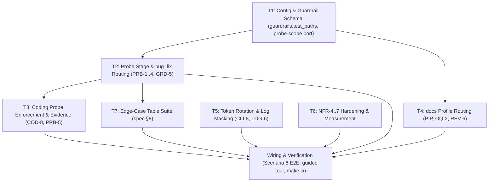

# M7 — Remaining Profiles and Hardening

> Status: **Completed** (branch `m7-remaining-profiles-and-hardening`)
> Size: M · Depends on: M5, M6
> Covers: `PRB-1..5`, `COD-8`, `GRD-5`, the `docs` profile, `LOG-6`, `CLI-8`, edge-case table (spec §8), `NFR-4..7`.

---

## Goal

Complete the last two pipeline profiles (`bug_fix`, `docs`) and raise the robustness bar:
the failing-probe stage for bug fixes, the gate-free `docs` route, API-token rotation, and
performance/memory/durability/concurrency guarantees that satisfy the NFR measures.

---

## Architectural Role & Boundaries

In accordance with `AGENTS.md` and Hexagonal / Clean Architecture boundaries:

- **Factory (`internal/factory`):** Owns the profile routing (`ExecuteJob` dispatch) and the new
  `executeProbeStage` (PRB-1..4). It reads/writes artifacts through the `WorktreeManager` port
  (`ReadArtifact`/`WriteArtifact`) and runs the probe command through the `CommandRunner` port.
  It defines new outbound ports/methods it needs (probe scope guardrail, COD-8 enforcement) and
  **never** imports `store`, `worker`, `provider`, `server`, or `intake`.
- **Worker (`internal/worker/command`):** Owns the guardrail implementations and the process
  runner. GRD-5's probe-scope check and the NFR-5 streaming/memory fix live here. Worker
  **never** imports `store` or `provider`.
- **Config (`internal/config`):** Adds `guardrails.test_paths` to the project schema and
  (re)exposes a `Save` helper used by rotation. It contains no pipeline logic.
- **Store (`internal/store`):** Provides `DeleteAllSessions` (already present) used by token
  rotation. It remains the only package that imports `database/sql`.
- **Server (`internal/server`):** Unchanged except for hardening of list/overview queries it
  delegates to `store` (NFR-4). Contains no pipeline logic.
- **Composition Root (`cmd/garagefab`):** Adds the `token` command, adapts the expanded
  `ProjectGuardrails` into `factory.ProjectGuardrails`, and hosts the Scenario 6 E2E +
  guided walkthrough.

---

## Dependency Graph



---

## Tasks

### T1 — Config & Guardrail Schema Expansion (`GRD-5`, `COD-8`)

**Requirements:** `GRD-5`, `COD-8` (supporting plumbing)
**Artifacts:**
- `internal/config/project.go`, `internal/config/project_test.go`
- `internal/factory/types.go` (`ProjectGuardrails`, `GuardrailRunner` port)
- `internal/worker/command/guardrails.go`, `internal/worker/command/guardrails_test.go`
- `cmd/garagefab/factory_worker_adapters.go`

**What to do:**
1. Add `guardrails.test_paths` to the project schema (default empty = no restriction, per
   spec §6.5):
   ```go
   Guardrails struct {
       ProtectedPaths []string `yaml:"protected_paths"` // GRD-1, default ["**/*_test.go"]
       TestPaths      []string `yaml:"test_paths"`      // GRD-5, default empty
       Commands       []string `yaml:"commands"`        // GRD-3
   }
   ```
   Mirror the field into `factory.ProjectGuardrails` (`internal/factory/types.go`) and map it in
   `cmd/garagefab/factory_worker_adapters.go`.
2. Extend the `GuardrailRunner` port with a probe-scope check:
   ```go
   // CheckProbeScope verifies that a probe step only added/changed files matching testPatterns
   // (GRD-5), plus the probe.json artifact. Empty testPatterns means no restriction.
   CheckProbeScope(ctx context.Context, workDir, stepStartSHA string, testPatterns []string, artifactGlob string) ([]GuardrailViolation, error)
   ```
3. Implement `CheckProbeScope` in `internal/worker/command/guardrails.go` using the same
   `git diff --name-status <stepStartSHA>` primitive as `CheckProtectedPaths`:
   - Compute the changed paths.
   - If `testPatterns` is empty → return no violations (no restriction).
   - A path is allowed when it matches any `testPatterns` glob **or** matches `artifactGlob`
     (the job's `probe.json`, e.g. `.garagefab/jobs/<id>/probe.json`).
   - Any other added/modified/deleted/renamed path is a `GuardrailViolation` listing the file.
4. Wire `CheckProbeScope` through the adapter so `factory.Engine` can call it.

**Acceptance Criteria:**
- `test_paths: ["**/*_test.go"]` + a probe that edits `src/main.go` → violation listing `src/main.go` (`GRD-5`).
- `test_paths` unset + the same edit → no violation (no restriction).
- `probe.json` write is never reported as a violation.

---

### T2 — Probe Stage & `bug_fix` Routing (`PRB-1..4`, `GRD-5`)

**Requirements:** `PRB-1`, `PRB-2`, `PRB-3`, `PRB-4`, `GRD-5`
**Artifacts:**
- `internal/factory/probe.go`, `internal/factory/probe_test.go` (new — `probe.json` validator)
- `internal/factory/pipeline.go` (`ExecuteJob` dispatch + new `executeProbeStage`)
- `internal/factory/types.go` (`ProbeSpec` type, stage helper if needed)
- `internal/factory/pipeline_probe_test.go` (new)

**What to do:**
1. Add `bug_fix` routing to `Engine.ExecuteJob`:
   - Stage `01_Intent` → `02_Clarification_and_Spec` for `feature` **and** `bug_fix`.
   - Stage `03_Failing_Probe` (new branch) for `bug_fix` → `executeProbeStage`.
   - Stage `04_Coding` reached for `bug_fix` after a valid probe (see T3).
2. Implement `parseProbeSpec(data []byte) (*ProbeSpec, error)` validating §6.3:
   - `command` non-empty; `files` non-empty; each file is relative, inside the worktree, and
     does not contain `..`.
   - Missing/invalid JSON or missing fields → validation error.
3. Implement `executeProbeStage` mirroring the shape of `executeCodingStage`'s repair loop
   (PRB-1..4):
   - Render the probe prompt with role `RoleProbe` (`RoleForStage` already maps stage 03 → probe)
     and run the agent with a fresh session.
   - Read `probe.json` via `wtMgr.ReadArtifact(..., "probe.json")`. If missing/invalid → `Flawed`
     and re-run while `attempt < max_repair_attempts` (PRB-1).
   - Run GRD-5 (`CheckProbeScope`) with the step-start SHA; violations are `Flawed` and feed the
     repair prompt (GRD-5, reusing GRD-4 semantics).
   - Execute the probe `command` via the `CommandRunner` in the worktree, as its own `StepRun`
     (kind `command`, name `probe`); record stdout/stderr/exit code as evidence.
   - Require a **non-zero** exit (PRB-2). Exit `0` → `Flawed` with message
     `"probe passed; it must fail"`, re-run with that feedback.
   - After `max_repair_attempts` failed probes → state `03_Failing_Probe`/`failed`, category
     `Manual` (PRB-3).
   - On success → checkpoint commit and transition to `04_Coding`/`queued` (PRB-4).
4. Persist the validated probe spec (and its `description`) so later stages and evidence can read
   it without re-parsing the raw agent file.

**Acceptance Criteria:**
- Probe that passes (`exit 0`) is rejected with `"probe passed; it must fail"` and re-run (`PRB-2`).
- Three passing probes → job `failed`, category Manual, visible in "attention" (`PRB-3`).
- A failing probe moves the job to stage `04` as a checkpoint (`PRB-4`).
- Missing/invalid `probe.json` → `Flawed`, re-run (`PRB-1`).
- Probe step editing a non-test file with `test_paths` set → `Flawed` (`GRD-5`).

---

### T3 — Coding Probe Enforcement & Evidence (`COD-8`, `PRB-5`)

**Requirements:** `COD-8`, `PRB-5`
**Artifacts:**
- `internal/factory/pipeline.go` (`executeCodingStage` COD-8 wiring)
- `internal/factory/evidence.go`, `internal/factory/evidence_test.go` (probe in evidence)
- `internal/factory/prompt.go` (populate the dead `ProbeFiles`/`ProbeResult` fields)
- `internal/factory/pipeline_probe_test.go`

**What to do:**
1. In `executeCodingStage`, for `bug_fix` only:
   - Read the persisted probe spec (T2) and set `PromptData.ProbeFiles` and
     `PromptData.ProbeResult` so the coding prompt knows which files are protected and what the
     probe currently outputs. These fields exist but are currently never populated
     (`internal/factory/prompt.go:58,61`).
   - **Protect probe files:** augment the guardrail pattern set for the coding step with the
     probe's `files` (in addition to `guardrails.protected_paths`), so an edit to a probe file is
     a GRD-1 violation → `Flawed` (`COD-8`).
   - **After** build/test/lint all pass, run the probe `command` again and require exit `0`.
     A still-failing probe → `Flawed` with feedback ("probe still fails after coding") (`COD-8`).
2. Extend the evidence chain (PRB-5):
   - Add a `Probe` section to `EvidenceSummary` (status + command + captured output summary).
   - `BuildEvidence` reads the probe `StepRun` (kind `command`, name `probe`) and renders the
     probe output next to the review report in `evidence.md`.
   - Keep the summary pass/fail-only per OQ-4; the full probe output stays in the drill-down/log.
3. Ensure `GetArtifact`/artifact naming is consistent: the stage writes `probe.json` (matching the
   prompt and schema); drop or correct the unused `"probe" → "probe.md"` mapping
   (`internal/factory/pipeline.go:1543`).

**Acceptance Criteria:**
- Coding that edits a probe file → guardrail violation, `Flawed` (`COD-8`).
- Coding that leaves the probe failing → `Flawed` (`COD-8`).
- Coding that makes the probe pass proceeds to stage `05` (`COD-8`).
- Evidence shows the probe result next to the review (`PRB-5`).
- `coding.md.tmpl` renders a non-empty protected-files list for bug fixes.

---

### T4 — `docs` Profile Routing (`PIP`, `OQ-2`, `REV-6`)

**Requirements:** `PIP-1`, `REV-5`, `REV-6`, `OQ-2`, `OQ-5`, `COD-2/3`
**Artifacts:**
- `internal/factory/pipeline.go` (`ExecuteJob` dispatch, `executeCodingStage` command skip,
  `executeReviewStage` routing)
- `internal/factory/pipeline_docs_test.go` (new)

**What to do:**
1. Route `docs` as `01 → 04 → 05 → 07` (PIP-1): no `02`, no `03`, and normally no `06`.
   - Stage `01` → `04` directly for `docs` (review reference is the intent, OQ-5).
2. In `executeCodingStage`, for `docs` run **only guardrails** (GRD-1/GRD-3); skip
   build/test/lint entirely (per spec PIP profile table "only guardrails run in 04";
   COD-2/COD-3 remain `feature`/`bug_fix`/`refactor` behavior).
3. In `executeReviewStage`, for `docs`:
   - Decision `approve` → proceed directly to `07_Done`/delivery (no approval gate) (OQ-2).
   - Decision `request_changes` → route to `06_Human_Approval_Gate`/`awaiting_approval` instead of
     delivery (REV-6).
4. Confirm `docs` still produces a PR via the existing delivery stage (M6 T5).

**Acceptance Criteria:**
- A `docs` job reaches `07`/`done` with a PR and never enters `02`, `03`, or `06` on approval
  (`PIP-1`).
- A `docs` job whose review returns `request_changes` stops at `06`/`awaiting_approval` (`REV-6`).
- No build/test/lint commands run for a `docs` job (`COD-2`).

---

### T5 — Token Rotation & Log Masking (`CLI-8`, `LOG-6`)

**Requirements:** `CLI-8`, `LOG-6`
**Artifacts:**
- `cmd/garagefab/token.go` (new), `cmd/garagefab/token_test.go` (new)
- `internal/config/config.go` (add exported `Save`), `internal/config/config_test.go`
- `internal/worker/command/mask.go`, `internal/worker/command/mask_test.go`

**What to do:**
1. Add `garagefab token rotate` (new file `cmd/garagefab/token.go`, register in `init()` like
   `install_skills.go`):
   - Load config, generate a new 32-byte hex token (mirror `config.Load` generation), and persist
     it with `config.Save(dataDir, cfg)` at mode `0600` (a `Save` helper must be added; the write
     logic is currently inlined in `Load`).
   - Open the store and call `db.Sessions().DeleteAllSessions(ctx)` to invalidate every session
     (`session_repo.go:77` already exists).
   - Print the new login URL, matching `start`/`open` output conventions.
2. **Decide and implement restart semantics for the bearer token.** The running server holds
   `Server.APIToken` in memory (`internal/server/server.go`), so a rotation does not change the
   accepted bearer token until restart. Proposed decision (record in `architecture.md` §3):
   - `token rotate` requires a stopped daemon. It detects a live instance via the existing
     single-instance lock (RCV-5) and refuses with a clear message unless `--force` is passed.
   - `--force` rotates anyway and warns that a running daemon keeps the old bearer until restart.
   - Document that `garagefab start` must follow rotation for the new bearer token to take effect.
3. `LOG-6` (already satisfied for `GH_TOKEN`/`GITHUB_TOKEN` via `MaskTokens`): add a regression
   test asserting both are masked in agent output, command output, and stored log files, and
   confirm the new API token is **not** printed to logs. Do not extend the mask set to the
   Garagefab API token unless the spec changes (spec §4.17 scopes LOG-6 to `GH_TOKEN`/`GITHUB_TOKEN`).

**Acceptance Criteria:**
- `token rotate` writes a new token to `config.yaml` (mode `0600`) and empties the `sessions`
  table (`CLI-8`).
- After rotation + `garagefab start`, old cookies (deleted rows) and the old bearer token are
  rejected; the new token is accepted (`CLI-8`).
- `token rotate` against a running daemon refuses without `--force` (`CLI-8`).
- Agent/command output containing `GH_TOKEN` shows `***` in stored logs (`LOG-6`).

---

### T6 — NFR-4..7 Hardening & Measurement (`NFR-4..7`)

**Requirements:** `NFR-4`, `NFR-5`, `NFR-6`, `NFR-7`
**Artifacts:**
- `internal/worker/command/runner.go` (+ test) — NFR-5 bounded buffering
- `internal/server/api_job.go`, `internal/store/overview_repo.go`, `internal/store/step_repo.go` (+ tests) — NFR-4
- `internal/store/db_test.go` / `internal/store/nfr_test.go` — NFR-6, NFR-7
- `internal/store/migrations/0004_*.sql` (only if new indexes are needed)

**What to do:**
1. **NFR-5 (memory) — fix kept, heavy threshold test dropped:** the agent path is already
   bounded (64 KiB tail ring buffer, `internal/worker/agent/proc.go:62`), but the command runner
   buffers full stdout/stderr/combined in memory (`internal/worker/command/runner.go:242-302`).
   Stop retaining unbounded output: stream to the log file and the SSE/tail consumer only, and
   cap the in-memory `RunResult` / `CommandResult` to a bounded tail (e.g. 64 KiB, matching the
   agent path). Verify with a **light functional test** that streams a few MB and asserts the
   in-memory result stays bounded and preserves trailing lines — no 500 MB / RSS threshold.
2. **NFR-4 (responsiveness) — fixes kept, heavy threshold test dropped:**
   - Expose the cursor already supported by `JobListFilter`/`ListJobs` through
     `handleListJobs` (`internal/server/api_job.go:48`) and return a next-cursor (as an
     `X-Next-Cursor` response header, keeping the existing array body).
   - Bound the unbounded overview queries: `attention_list`
     (`internal/store/overview_repo.go:108`) and `intake_errors` (`.go:162`) with a sane `LIMIT`.
   - Verify with **light functional tests** on small data: cursor pagination walks pages and the
     overview queries are bounded. No 1 000-job / 20 000-step p95 threshold test.
3. **NFR-6 (durability):** add a real crash test that runs the daemon (or a writer) as a child
   process and `kill -9`s it mid-write, then reopens the DB and asserts committed state is intact
   and the DB passes `PRAGMA integrity_check`. Extends the existing simulated crash
   (`cmd/garagefab/e2e_m2_test.go:251` closes the DB rather than killing the process).
4. **NFR-7 (concurrency):** extend `TestParallelReader_NFR7` (`internal/store/db_test.go:52`) to
   drive 5 concurrent jobs through the repository layer while a second connection reads, asserting
   no "database is locked" errors. Consider `wal_autocheckpoint` / `journal_size_limit` if WAL
   growth is observed.

**Acceptance Criteria:**
- Streaming 500 MB of command output increases RSS by < 100 MB (`NFR-5`).
- List endpoints meet p95 < 200 ms with the seed dataset; overview queries are bounded (`NFR-4`).
- Board (overview + jobs) renders < 1 s and SSE events reach the client < 1 s (`NFR-4`).
- `kill -9` crash test loses no committed state; `integrity_check` passes (`NFR-6`).
- Five concurrent jobs run with a parallel reader without "database is locked" (`NFR-7`).

---

### T7 — Edge-Case Table Suite (spec §8)

**Requirements:** every row of spec §8 maps to a named test (milestone exit criterion)
**Artifacts:**
- `cmd/garagefab/edgecases_test.go` (new) — E2E/API-level edge cases
- package-level tests where the case is backend-only (`internal/worker/...`, `internal/store/...`,
  `internal/intake/...`, `internal/provider/github/...`)
- the coverage matrix below (kept current as tests are cited/added)

**What to do:**
Audit every spec §8 row: cite the existing test in the matrix, or write the missing one. No row
may be left untested or with an unnamed gap. Rows marked **new** are the gaps to implement; rows
marked *verify/cite* already have a plausible test that must be confirmed and named during
implementation.

| §8 row | Test |
|--------|------|
| Agent binary not found | `TestRunProc_MissingBinary_ErrAgentUnavailable` + `TestCategorizeFailure_CommandNotFound_Blocked` |
| Agent exits 0, no valid artifact | `TestEngine_EmptyDiff_Flawed_COD7` + spec-stage invalid-artifact tests (SPC-1) |
| Agent hangs / exceeds timeout | `TestE2E_M5_Timeout_COD10`, `TestRunProc_Timeout_KillsProcessGroup_COD10` |
| Agent ignores SIGTERM → SIGKILL after grace | `TestRunProc_IgnoresSIGTERM_SIGKILL` |
| Command not found / permission denied | `TestCommandRunner_NotFound_ExitCode127`, `TestCategorizeFailure_CommandNotFound_Blocked` |
| No `commands.*` configured | `TestDocsProfile_SkipsGatesAndCommands_PIP1` (evidence shows "not run") |
| Project path moved/deleted | `TestIntake_UnavailableProjectSkipped` (poller skips; worktree failure path is `TestEngine_WorktreeCreateFailure_Blocked`) |
| Poller cycle longer than interval | existing INT-6 non-overlap test (`poller_test.go`) |
| `gh` failure (missing / unauthenticated / rate limit) | `TestRunner_ErrorTranslation` (`provider/github`) + `TestOverviewRepo_GetOverviewData_UI1` (intake errors surfaced) |
| State label missing → created idempotently `--force` | `client_test.go` EnsureLabel `--force` case |
| PR already exists: open reused / merged+closed → Blocked | `TestDelivery_ClosedPR_Blocked_DLV2` + open-PR reuse case in `delivery_test.go` |
| Intent file malformed / invalid type | `TestIntake_IntentFile_INT2` (invalid file → error, no job) |
| Intent file edited after job exists | `TestIntake_IntentFile_INT2` re-poll idempotency (INT-4: no duplicate) |
| Two tabs Approve → second 409 | approve 409 test in `server_test.go` |
| Cancel during running step | `TestEngine_Cancel_TerminatesJob_PIP6` |
| Worktree creation failure → Blocked with git's message | `TestEngine_WorktreeCreateFailure_Blocked` |
| Disk full while writing logs → step Blocked, service alive | `TestRunner_LogOpenFailure_ReturnsError` (log-writer seam) |
| Port in use → exit message; `--port` overrides | `TestCheckPortAvailable_PortInUse` |
| Second instance → exits | `TestCLI_Start_And_SecondInstance_RCV5_CLI1`, `TestLockFile_SecondInstance_RCV5` |
| Database newer than binary → refuses | `TestSchemaVersion_TooNew_CLI7` |
| Very large diff/log → paged/truncated, full downloadable | `api_logs_test.go` offset download case (`?offset=`) |
| Clock change → monotonic durations | `TestFormatTime_WallClockUTC` |

**Notes / seams to confirm during implementation:**
- "Disk full" and "worktree creation failure" need fault-injection points; if none exists at the
  log-writer / worktree-manager boundary, add the minimal seam first (no new dependency).
- "Very large diff/log" may reveal a missing UI truncation path; treat that as a scoped UI/API fix.

**Acceptance Criteria:**
- Every spec §8 row appears in the matrix with a test name; no row is untested or unnamed.
- No `time.Sleep`-based synchronization beyond existing patterns (`R11`).

---

## Wiring & Composition (`cmd/garagefab`)

1. Map `config.ProjectGuardrails.TestPaths` → `factory.ProjectGuardrails.TestPaths` in
   `factory_worker_adapters.go`.
2. Implement/attach the probe-scope guardrail adapter and pass it to `factory.NewEngine`.
3. Register the `token` command on `rootCmd`.
4. Update `internal/boundaries_test.go` if a new package is introduced (none planned — keep
   probe/guardrail logic inside `factory` and `worker/command`).
5. No new Go dependencies are expected; if any is added, record it in `architecture.md` §3.

---

## Testing Strategy & Traceability

All tests run **offline** with `FakeAgentRunner` / `FakeGHRunner` and stub CLIs on `PATH`.

| Req | Test Function Name | Verification Target |
|:---|:---|:---|
| `PRB-1` | `TestProbe_InvalidSpec_Flawed_PRB1` | Missing/invalid `probe.json` is Flawed and re-run |
| `PRB-2` | `TestProbe_PassingProbe_Rejected_PRB2` | Exit 0 → `"probe passed; it must fail"`, re-run |
| `PRB-3` | `TestProbe_ExhaustedAttempts_Manual_PRB3` | Three passing probes → `03`/failed, Manual |
| `PRB-4` | `TestProbe_FailingProbe_MovesToCoding_PRB4` | Failing probe checkpointed → stage `04` |
| `PRB-5` | `TestEvidence_IncludesProbeResult_PRB5` | Probe output rendered next to review in evidence |
| `COD-8` | `TestCoding_ProtectsProbeFiles_COD8` | Editing a probe file → guardrail violation (Flawed) |
| `COD-8` | `TestCoding_ProbeStillFails_COD8` | Probe still failing after coding → Flawed |
| `COD-8` | `TestCoding_ProbePassesAfterCoding_COD8` | Probe passes → job proceeds to `05` |
| `GRD-5` | `TestGuardrail_ProbeScope_GRD5` | Probe editing non-test file (with `test_paths`) → Flawed |
| `GRD-5` | `TestGuardrail_ProbeScope_DefaultNoRestriction_GRD5` | `test_paths` unset → no restriction |
| `PIP-1` | `TestDocsProfile_SkipsGatesAndCommands_PIP1` | `docs`: 01→04→05→07, no 02/03/06, no build/test/lint |
| `REV-6` | `TestDocsProfile_RequestChanges_GoesToGate_REV6` | `request_changes` → `06`/awaiting_approval |
| `OQ-2` | `TestDocsProfile_Approved_CreatesPR_OQ2` | Approval → PR created directly |
| `CLI-8` | `TestTokenRotate_InvalidatesSessionsAndBearer_CLI8` | New token in config; sessions emptied; old auth rejected |
| `CLI-8` | `TestTokenRotate_RefusesWhileRunning_CLI8` | Refuses without `--force` when lock held |
| `LOG-6` | `TestMasking_GhTokens_LOG6` | `GH_TOKEN`/`GITHUB_TOKEN` masked in stored logs |
| `NFR-4` | `TestListEndpoints_Cursor_NFR4` | Cursor pagination walks pages over a small seed |
| `NFR-4` | `TestOverviewQueries_Bounded_NFR4` | Overview attention/intake queries are bounded |
| `NFR-5` | `TestCommandOutput_BoundedMemory_NFR5` | In-memory command output is bounded to a tail; trailing lines preserved |
| `NFR-6` | `TestCrash_Kill9_NoCommittedStateLost_NFR6` | `kill -9` mid-write → committed state intact |
| `NFR-7` | `TestConcurrentJobs_ParallelReader_NFR7` | 5 jobs + external reader, no "database is locked" |
| Scenario 6 | `TestScenario6_BugFixProbe_PRB1_4_COD8` | Full bug-fix E2E (probe → coding → review) |
| Edge §8 | `TestEdge_*` (one per spec §8 row) | See T7 coverage matrix |
| Rule 1/2/3/6 | `TestArchitectureImportBoundaries` | `internal/boundaries_test.go` still passes |

> The canonical spec §8 coverage matrix lives in **T7 — Edge-Case Table Suite**.

---

## Guided E2E Walkthrough

Scenario 6 is a good candidate for a guided, pausable tour because the probe stage has idle
checkpoints worth inspecting (after the probe agent writes files, and at the `05`→`06` gate).
Follow `PROJECT_DOCS/agent-guides/guided-e2e-walkthroughs.md`:

- Write one test `TestScenario6_BugFixProbe_PRB1_4_COD8` in `cmd/garagefab/e2e_m7_test.go`
  (`package main`), reusing `walkthroughEnabled()`, `walkthroughWorkspace(t)`, and `pause(...)`
  from `cmd/garagefab/walkthrough_test.go`, the stub binaries from `e2e_m5_test.go`, and the bare
  `origin` setup from `setupIntentDemoRepo`.
- Insert `pause(...)` checkpoints at the idle points: after a failing probe is checkpointed
  (before coding starts) and at the `05`→`06` gate. Widen any wall-clock deadlines with
  `walkthroughEnabled()`.
- The normal (CI) path must stay fast and unchanged when `E2E_WALKTHROUGH` is unset.

---

## Educational Code Comments Standard

Every Go file created or modified in M7 must adhere to the `AGENTS.md` educational commenting
guidelines:

1. **File Header:** Explain the architectural role in Clean Architecture (Domain Core, Outbound
   Port, Driven Adapter, Composition Root) with Java/Spring equivalents (e.g. `probe.go`
   validator ↔ Bean Validation `@Valid`; the probe-scope guardrail ↔ Spring AOP advice;
   `token rotate` ↔ credential-rotation actuator; the bounded command runner ↔ backpressure via
   `InputStream` without full materialization).
2. **Go Idiom Bridge:** Explain Go-specific mechanisms used (`io.Copy`/streaming vs `bytes.Buffer`,
   bounded ring buffers, `exec.CommandContext`, consumer-side interfaces, `sync.Mutex`, error
   wrapping `%w`).
3. **In-line Rationale:** Explain operational reasons (why the probe must fail before coding, why
   the probe files are protected, why the command path must not buffer the whole output, why
   rotation requires a restart).
4. **Preservation:** Retain all existing educational comments and docstrings; the dead
   `ProbeFiles`/`ProbeResult` fields in `prompt.go` may be kept but must be documented when wired.

---

## Decisions (M7)

- **NFR-4/NFR-5 threshold tests are relaxed** (spec §5 updated): the fixes are kept (cursor
  pagination + bounded overview queries; bounded in-memory command output), but the p95 and RSS
  numeric measures are verified functionally on small data, not gated in CI.
- **Probe spec persistence:** the coding stage re-reads and re-parses the validated `probe.json`
  artifact committed by the probe stage — no DB migration.
- **Probe checkpoint message:** `garagefab(job-<id>): probe`; the probe artifact is `probe.json`
  only (`GetArtifact("probe")` remapped; `probe.md` is never written).
- **`token rotate` requires a stopped server** (RCV-5 lock held ⇒ clear error unless `--force`).
  Old-token invalidation is complete after restart: the bearer compare uses the fresh in-memory
  token, and cookies are deleted rows plus hash-mismatch rejected.
- **`docs` profile:** coding runs guardrails only (no build/test/lint); approval routes straight to
  `07_Done`/delivery (no `06` gate), while `request_changes` routes to `06/awaiting_approval`.
- **GRD-5 semantics:** `test_paths` empty = no restriction; matching applies to changed files with
  **any** git status (including added), exempting the job's `probe.json`.

## Exit Criteria

- [x] Scenario 6 passes in `cmd/garagefab` (`bug_fix` probe → coding → review).
- [x] All four profiles route correctly (PIP-1); `docs` skips `02`/`03`/`06` and its build/test/lint.
- [x] `PRB-1..5`, `COD-8`, `GRD-5` tests pass.
- [x] `CLI-8` (token rotation) and `LOG-6` (token masking) tests pass.
- [x] `NFR-4..7` behaviors are verified by tests: cursor pagination + bounded overview queries,
      in-memory command output bounded to a tail, no lost committed state after `kill -9`,
      5 concurrent jobs without "database is locked". (The NFR-4 p95 and NFR-5 RSS threshold
      measures are relaxed in M7 per spec §5.)
- [x] Every spec §8 edge-case row has a test.
- [x] All unit/integration tests pass offline (`go test ./...`).
- [x] `golangci-lint`, `go vet`, `go test ./...`, and `CGO_ENABLED=0 go build ./...` pass cleanly.
      (The `make build` UI step needs a working Node/`tsc` toolchain and is unrelated to M7 code.)
- [x] `internal/boundaries_test.go` (Rules 1/2/3/6) still passes.
- [x] Status table in `PROJECT_DOCS/04_plan.md` updated.

---

## Risks

| ID | Risk | Mitigation |
|----|------|------------|
| R6 | SQLite write contention under five concurrent jobs | One write connection, short transactions, NFR-7 load test in T6 |
| — | Probe stage duplicates the existing repair loop a third time | Keep the loop shape identical to `executeSpecStage`/`executeCodingStage`; consider extracting a shared helper only if a third copy proves error-prone |
| — | `CLI-8` bearer-token restart semantics surprise users | Decide explicitly in `architecture.md` §3; refuse rotation on a live daemon unless `--force` |
| — | NFR-4/NFR-5 threshold tests are flaky on CI | Use generous CI multipliers; assert bounded buffers rather than absolute RSS where possible |
| — | `docs` profile command-skip could weaken verification silently | Document in the spec/config that `docs` intentionally runs no build/test/lint (PIP profile table) |
