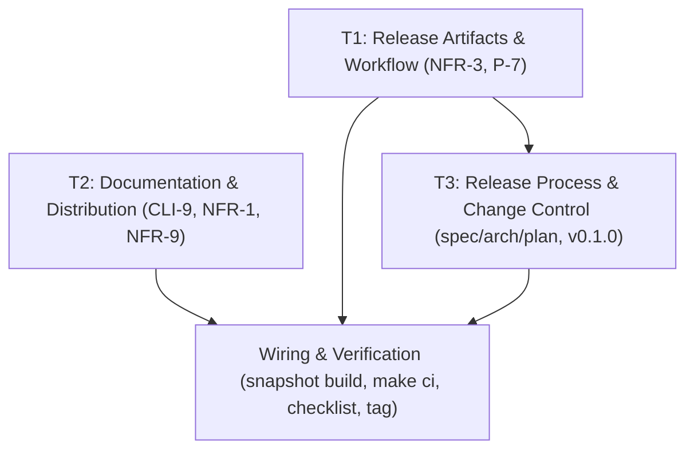

# M8 — Release

> Status: **Completed** (branch `m8-release`, merged) — verified at `v0.1.0` on darwin/arm64; Linux verification deferred (see Decisions)
> Size: S · Depends on: M7
> Covers: `CLI-9`, `NFR-1`, `NFR-3`, `NFR-9`, release artifacts (GoReleaser), README, example
> service files (launchd + systemd), `LICENSE` (present), `CONTRIBUTING.md`, a written clean-machine
> release checklist. `NFR-12` is relaxed (see **Decisions (M8)**).

---

## Goal

Anyone can download and use it: a tagged `v0.1.0` release with four platform binaries, documentation
that lets a new user install and keep Garagefab running (foreground, tmux, launchd, systemd), and a
written procedure that verifies the end-to-end flow with a real agent on a clean machine.

This milestone ships **packaging, documentation, and release process only**. It adds no application
code path and no Go dependency.

---

## Architectural Role & Boundaries

In accordance with `AGENTS.md` and Hexagonal / Clean Architecture boundaries:

- **No new Go packages.** M8 introduces zero source packages and must not change any import
  boundary. `internal/boundaries_test.go` (Rules 1/2/3/6) must continue to pass unchanged.
- **Composition root (`cmd/garagefab`):** untouched. `garagefab start`, `status`, `open`,
  `install-skills`, `token rotate`, and `version` already exist; M8 adds no command.
- **`internal/version`:** remains the single source of build metadata. Release builds inject
  `Version`/`Commit`/`BuildDate` via linker `-ldflags -X` (already wired in the `Makefile`); the
  release tooling must preserve this injection, not replace it.
- **Build & distribution layer (new, non-Go):** `.goreleaser.yaml`, `.github/workflows/release.yml`,
  `Makefile` targets, `examples/` service files, and documentation. These are build-time artifacts;
  they are not imported by application code and have no runtime footprint.
- **Embedding constraint:** `//go:embed all:ui/dist` (`embed.go`) means **the UI must be built before
  the Go linker runs**. The release tooling must therefore build the UI (Node 20) before invoking
  `go build`; a release that skips the UI build produces a binary with a missing dashboard.

---

## Dependency Graph

`T1` and `T2` are independent and may proceed in parallel. `T3` consumes the `T1` artifacts and must
land **after** the design decisions it documents.

---

## Tasks

### T1 — Release Artifacts & Workflow (`NFR-3`, `NFR-2`, P-7)

**Requirements:** `NFR-3`, `NFR-2`
**Artifacts:**
- `.goreleaser.yaml` (new)
- `.github/workflows/release.yml` (new)
- `Makefile` (`release-snapshot` target)

**What to do:**
1. Add `.goreleaser.yaml`:
   - `project_name: garagefab`.
   - A `before` hook that builds the UI (`cd ui && npm ci --include=dev && npm run build`) so the
     embedded `ui/dist` exists before linking (see the embedding constraint above).
   - `builds`: four `goos`/`goarch` pairs — `darwin/arm64`, `darwin/amd64`, `linux/amd64`,
     `linux/arm64` — with `env: [CGO_ENABLED=0]` and
     `ldflags: -s -w -X github.com/garagefab/garagefab/internal/version.Version={{.Version}} -X github.com/garagefab/garagefab/internal/version.Commit={{.Commit}} -X github.com/garagefab/garagefab/internal/version.BuildDate={{.Date}}`.
   - `archives`: `tar.gz` per target; `checksum`: `checksums.txt`.
   - `changelog`: generated from git history; `release`: GitHub.
2. Add `.github/workflows/release.yml`:
   - Trigger on `push` tags matching `v*`; `permissions: contents: write`.
   - Steps: `actions/checkout` (full history for changelog), `actions/setup-go` from `go.mod`,
     `actions/setup-node@v4` (Node 20), `goreleaser/goreleaser-action@v6` with
     `args: release --clean`.
   - No secrets beyond the default `GITHUB_TOKEN`.
3. Add an optional local `Makefile` target `release-snapshot` running
   `goreleaser release --snapshot --clean` (documented as needing a local `goreleaser` install; CI
   does not use it).

**Acceptance Criteria:**
- `goreleaser release --snapshot --clean` builds all four targets and writes `checksums.txt`; each
  binary reports a non-`dev` version (`garagefab version`) driven by the git tag/commit.
- Pushing a `v*` tag publishes a GitHub Release containing the four archives and `checksums.txt`
  (`NFR-3`).
- No entry is added to `go.mod`; `CGO_ENABLED=0 go build ./...` still passes (`NFR-2`).

---

### T2 — Documentation & Distribution (`CLI-9`, `NFR-1`, `NFR-9`)

**Requirements:** `CLI-9`, `NFR-1`, `NFR-9`
**Artifacts:**
- `README.md` (update)
- `examples/launchd/dev.garagefab.garagefab.plist` (user LaunchAgent)
- `examples/launchd/dev.garagefab.garagefab.daemon.plist` (system LaunchDaemon)
- `examples/systemd/garagefab.service` (user unit)
- `examples/systemd/garagefab.system.service` (system unit)
- `CONTRIBUTING.md` (new)
- `PROJECT_DOCS/release-checklist.md` (new — clean-machine verification)

**What to do:**
1. Update `README.md`:
   - **Installation:** download a binary for the machine's OS/arch from GitHub Releases, or build
     from source (`make build`). State prerequisites plainly: only `git` and the chosen agent CLIs
     are required at runtime, plus `gh` when `github.repo` is set (`NFR-1`).
   - **Keeping it running:** copy-paste instructions for three setups — `tmux`, `launchd`
     (user + system), and `systemd` (user + system) — each pointing at the example file and the
     install command (`CLI-9`, `OQ-6`).
   - **Browser support:** latest two versions of Chrome, Firefox, and Safari (`NFR-9`).
   - Cross-link `examples/` and `PROJECT_DOCS/release-checklist.md`.
2. Example service files (both levels, per Decisions):
   - launchd: a user `LaunchAgent` (loads at login) and a system `LaunchDaemon` (boot); both set
     `ProgramArguments` to `garagefab start --no-open`, a `WorkingDirectory`, stdout/stderr paths,
     and `KeepAlive`/`RunAtLoad`.
   - systemd: a user unit (`systemctl --user`) and a system unit; both `ExecStart=garagefab start
     --no-open`, `Restart=on-failure`, and journal logging.
   - Installation commands for each file are included in `README.md`.
3. Add `CONTRIBUTING.md`, derived from `AGENTS.md`: build/test/`make ci`, milestone-branch
   discipline, requirement traceability, commit-message limit (**max 5 lines**, no co-author
   trailers), PR-description limit, and the change-control rule.
4. Add `PROJECT_DOCS/release-checklist.md`: ordered steps to verify a release on a **clean** macOS
   and Linux machine — install `git`, the chosen agent CLI, and (when needed) `gh`; register a
   project; run **Scenario 1** (feature) and **Scenario 2** (clarification) with a **real** agent;
   record the observed result per step.

**Acceptance Criteria:**
- A new user can follow `README.md` to download, start, and keep Garagefab running via all three
  setups; every command is copy-pasteable and names the example file it uses (`CLI-9`).
- Every example file parses: `plutil -lint examples/launchd/*.plist` and
  `systemd-analyze verify examples/systemd/*.service` pass where the tools exist.
- `CONTRIBUTING.md` covers build, test, branching, commit/PR limits, and traceability.
- `release-checklist.md` exists and has been executed once on `darwin/arm64` with a real agent;
  results recorded (`NFR-1`).
- Browser smoke test recorded for the latest two Chrome/Firefox/Safari versions (`NFR-9`).

---

### T3 — Release Process & Change Control (`NFR-12`, P-1/P-7/P-9, `v0.1.0`)

**Requirements:** `NFR-12` (relaxation), plan open items P-1/P-7/P-9
**Artifacts:**
- `PROJECT_DOCS/03_spec.md` (NFR-12 relaxation)
- `PROJECT_DOCS/02_architecture.md` (§3, decision `D25`; §21 if wording changes)
- `PROJECT_DOCS/04_plan.md` (M8 status, open-item closure)
- Git tag `v0.1.0`

**What to do:**
1. **Change control first:** update `spec.md` §5 to relax `NFR-12` — migrations remain
   forward-only and data-preserving (guaranteed by `pressly/goose`), but the "test migrates the
   previous release's database" measure is **deferred to Phase 2** (the first real upgrade); there is
   no previous release at `v0.1.0`. This follows the same relaxation pattern used for `NFR-4`/`NFR-5`
   in M7.
2. Record `D25` in `architecture.md` §3: release tooling is **GoReleaser + GitHub Actions**, four
   targets, user-level and system-level service examples; no Go dependency is added.
3. Update `04_plan.md`: set the M8 status row, close P-1 (MIT `LICENSE` already present), P-7
   (GoReleaser chosen), and P-9 (documents live under `PROJECT_DOCS/`).
4. Tag `v0.1.0` and push it; the `T1` workflow produces the release.

**Acceptance Criteria:**
- `spec.md`, `architecture.md`, and `04_plan.md` agree on the `NFR-12` relaxation and the release
  decision; no document contradicts another.
- `v0.1.0` exists and has a GitHub Release with the four archives and `checksums.txt`.
- `04_plan.md` M8 status is `Completed`; P-1/P-7/P-9 are closed.

---

## Wiring & Composition (`cmd/garagefab`)

1. No wiring changes: no new ports, adapters, or commands. `cmd/garagefab` is untouched.
2. `Makefile` gains only the `release-snapshot` helper; existing `build`/`test`/`lint`/`vet`/`ci`
   behavior is unchanged.
3. `.goreleaser.yaml` must inject version metadata through the **existing**
   `internal/version` variables — do not introduce a second version source.

---

## Testing Strategy & Traceability

M8 adds no unit tests (no application code changes). Verification is build-time and manual, as noted
below.

| Req | Verification | Target |
|:---|:---|:---|
| `NFR-3` | `goreleaser release --snapshot --clean` | Four archives + `checksums.txt` for `darwin/arm64`, `darwin/amd64`, `linux/amd64`, `linux/arm64` |
| `NFR-2` | existing CI step | `CGO_ENABLED=0 go build ./...` passes; `go.mod` unchanged |
| `CLI-9` | manual + tooling | README three setups; `plutil -lint`, `systemd-analyze verify` |
| `NFR-1` | `release-checklist.md` | Clean-machine Scenario 1 + 2 with a real agent |
| `NFR-9` | manual smoke | Latest two Chrome/Firefox/Safari |
| `NFR-12` | none (relaxed) | Guarantee retained; upgrade test deferred (spec updated) |
| Rules 1/2/3/6 | `TestArchitectureImportBoundaries` | `internal/boundaries_test.go` unchanged and passing |

> **Manual vs CI:** CI can build a real-agent-free release (fake agent). The clean-machine
> real-agent verification is **manual** and recorded in `release-checklist.md` (see Decisions).

---

## Guided E2E Walkthrough

Not applicable. M8 adds no pipeline stage or scenario; the existing guided walkthroughs are
unchanged.

---

## Educational Code Comments Standard

M8 adds no Go source files. Documentation and configuration must still meet the `AGENTS.md`
standard:

1. **Language:** all docs, comments, and example files are in English.
2. **`.goreleaser.yaml`:** comments explain *why* the UI build precedes linking (the `embed.go`
   constraint), *why* `CGO_ENABLED=0` is set, and *why* version metadata uses `internal/version`.
3. **Example service files:** inline comments explain `KeepAlive`/`Restart` and the `--no-open`
   choice (no browser on a headless service).
4. **Preservation:** existing README and `AGENTS.md` content is retained; additions only.

---

## Decisions (M8)

- **Release tooling = GoReleaser + GitHub Actions** (closes P-7). A build-time tool with **no Go
  dependency** and no runtime footprint; the GitHub Action downloads it in CI, so no local install is
  required for releasing.
- **Four targets, two manual-verified:** build `darwin/arm64`, `darwin/amd64`, `linux/amd64`,
  `linux/arm64` (per `NFR-3`); run the real-agent clean-machine checklist only on `darwin/arm64` and
  `linux/amd64`. The other two are build-verified.
- **`NFR-12` upgrade test deferred to Phase 2** (relaxed): forward-only, data-preserving migrations
  remain guaranteed; the "previous release DB" test has no meaning before the first release.
- **Service examples at both levels:** user-level (`LaunchAgent`, `systemctl --user`) and
  system-level (`LaunchDaemon`, system unit) are shipped; the README explains when to use each.
- **Clean-machine verification = written checklist** (`PROJECT_DOCS/release-checklist.md`), executed
  once and recorded; CI continues to use the fake agent.
- **`NFR-1` and the plan's platform wording relaxed to one platform:** the checklist was executed
  once on `darwin/arm64` at `v0.1.0` — Scenarios 1 and 2 **PASS**, checksum and version verified.
  Linux verification and the `NFR-9` browser smoke test are deferred. This softens the plan/M8
  exit criterion and `NFR-1` from "clean macOS and Linux" to "at least one supported platform".
- **No `CHANGELOG.md`:** release notes come from GoReleaser/git history at tag time.
- **License:** MIT already present (`LICENSE`, P-1 closed); no change.

---

## Exit Criteria

- [x] `goreleaser release --snapshot --clean` produces four target archives and `checksums.txt`.
- [x] A `v*` tag publishes a GitHub Release with those assets via the release workflow.
- [x] `README.md` documents install and all three run modes (tmux, launchd, systemd) with working
      example files at both levels (`CLI-9`).
- [x] `CONTRIBUTING.md` and `PROJECT_DOCS/release-checklist.md` are present and complete.
- [x] The clean-machine checklist is executed once with a real agent and results are recorded
      (macOS/darwin-arm64 at `v0.1.0`; `NFR-1`).
- [x] `spec.md` `NFR-12` is relaxed and `architecture.md` `D25`, `04_plan.md` M8 status, and P-1/P-7/P-9
      are updated consistently (change control).
- [x] `make ci` is green; `internal/boundaries_test.go` passes; `go.mod` is unchanged.
- [x] `v0.1.0` is tagged and released.

---

## Risks

| ID | Risk | Mitigation |
|----|------|------------|
| R10 | Solo bandwidth; packaging/docs is unglamorous and can stall | Keep `T1`/`T2` small and parallel; no application-code changes to review |
| — | Release binary ships without the embedded UI | The `.goreleaser` `before` hook builds `ui/dist` before linking; verify `garagefab start` serves the dashboard from a snapshot binary |
| — | Example service files drift from real paths/versions | Validate with `plutil -lint` and `systemd-analyze verify`; reference the installed binary path explicitly |
| — | Real-agent verification is not reproducible in CI | Written checklist records the manual run; CI keeps the fake-agent scenarios |
| — | `NFR-12` relaxation is mistaken for removing the guarantee | Spec wording states forward-only migrations remain guaranteed; only the test measure is deferred |
